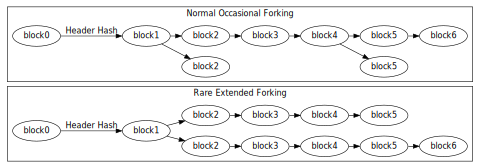

```{eval-rst}
.. meta::
  :title: Block Height and Forking
  :description: In Dimecoin, forks occur when multiple blocks of the same height are produced simultaneously, causing nodes to follow the longest chain. 
```

> ***We put our best effort into covering all topics related to Dimecoin. Each section will cover a different category. Not all documentation may be 100% accurate, if you spot an error, please report it or submit a PR request on GitHub.***
>
> ***REMINDER: This documentation is always evolving. If you have not been here for a while, perhaps check again. Things may have been added or updated since your last visit!***

## Block Height and Chain Forking

Any Dimecoin [miner](../resources/glossary.md#miner) who successfully hashes a [block header](../resources/glossary.md#block-header) to a value below the [target threshold](../resources/glossary.md#target) can add the entire [block](../resources/glossary.md#block) to the [blockchain](../resources/glossary.md#block-chain) (assuming the block is otherwise valid). These blocks are commonly addressed by their [block height](../resources/glossary.md#block-height)---the number of blocks between them and the first Dimecoin block (block 0, most commonly known as the [genesis block](../resources/glossary.md#genesis-block)).



Multiple blocks can all have the same block height, as is common when two or more miners or stakers each produce a block at roughly the same time. This creates a [fork](../resources/glossary.md#fork) in the blockchain, as shown in the illustration above.

When validators produce simultaneous blocks at the end of the blockchain, each [node](../resources/glossary.md#node) individually chooses which block to accept. In the absence of other considerations, discussed below, nodes usually use the first block they see.

Eventually a validator produces another block which attaches to only one of the competing simultaneously-produced blocks. This makes that side of the fork stronger than the other side. Assuming a fork only contains valid blocks, normal [peers](../resources/glossary.md#peer) always follow the most difficult chain to recreate and throw away any [stale block](../resources/glossary.md#stale-block) belonging to shorter forks. (Stale blocks are also sometimes called orphans or orphan blocks, but those terms are also used for true orphan blocks without a known parent block.)

Long-term forks are possible if different validators work at cross-purposes, such as some miners diligently working to extend the blockchain at the same time other miners are attempting a [51 percent attack](../resources/glossary.md#51-percent-attack) to revise transaction history.

Since multiple blocks can have the same height during a blockchain fork, block height should not be used as a globally unique identifier. Instead, blocks are usually referenced by the hash of their header (often with the byte order reversed, and in hexadecimal).

The integration of PoS with PoW in handling forks brings a nuanced approach to achieving consensus and maintaining the blockchain's integrity. It leverages the strengths of both systems to mitigate the impact of forks, ensuring that the blockchain remains secure, decentralized, and resistant to manipulation. This hybrid mechanism enhances the strength of the consensus process, ensuring that Dimecoin's blockchain can efficiently resolve forks and maintain a cohesive, accurate transaction history.
