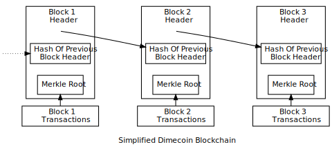
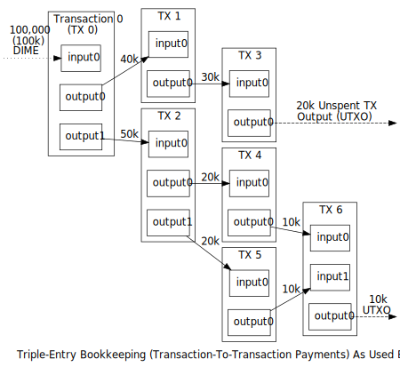

```{eval-rst}
.. meta::
  :title: Blockchain Overview
  :description: Transactions in Dimecoin are collected into blocks, linked by cryptographic hashes to form a secure blockchain. Any attempt to use an output twice constitutes double spending and is rejected. 
```

## Understanding the Dimecoin Blockchain

The blockchain provides Dimecoin's public ledger, an ordered and timestamped record of transactions. This system is used to protect against double spending and modification of previous transaction records.

Each full node in the Dimecoin network independently stores a blockchain containing only blocks validated by that node. When several nodes all have the same blocks in their blockchain, they are considered to be in [consensus](../resources/glossary.md#consensus). The validation rules these nodes follow to maintain consensus are called [consensus rules](../resources/glossary.md#consensus-rules). This section describes many of the consensus rules used by Dimecoin Core.

### Blockchain Overview



The illustration above shows a simplified version of a [blockchain](../resources/glossary.md#blockchain). A [block](../resources/glossary.md#block) of one or more new transactions is collected into the [transaction](../resources/glossary.md#transaction) data part of a block. Copies of each transaction are hashed, and the hashes are then paired, hashed, paired again, and hashed again until a single hash remains, the [merkle root](../resources/glossary.md#merkle-root) of a [merkle tree](../resources/glossary.md#merkle-tree).

The merkle root is stored in the [block header](../resources/glossary.md#block-header). Each block also stores the hash of the previous block's header, chaining the blocks together. This ensures a transaction cannot be modified without modifying the block that records it and all following blocks.

Transactions are also chained together. Dimecoin [wallet](../resources/glossary.md#wallet) software gives the impression that dimecoins are sent from and to wallets, but Dimecoin value really moves from transaction to transaction. Each transaction spends the dimecoins previously received in one or more earlier transactions, so the input of one transaction is the output of a previous transaction.



A single transaction can create multiple [outputs](../resources/glossary.md#output), as would be the case when sending to multiple [addresses](../resources/glossary.md#address), but each output of a particular transaction can only be used as an [input](../resources/glossary.md#input) once in the blockchain. Any subsequent reference is a forbidden double spend---an attempt to spend the same dimecoins twice.

Outputs are tied to [transaction identifiers](../resources/glossary.md#transaction-identifiers) ( TXIDs), which are the hashes of signed transactions.

Because each output of a particular transaction can only be spent once, the outputs of a transaction included in the blockchain can be categorized as either an [unspent transaction output](../resources/glossary.md#unspent-transaction-output) or a spent transaction output. For a payment to be valid, it must only use UTXOs as inputs.

Ignoring coinbase transactions (described later), if the value of a transaction's outputs exceed its inputs, the transaction will be rejected---but if the inputs exceed the value of the outputs, any difference in value may be claimed as a [transaction fee](../resources/glossary.md#transaction-fee) by the Dimecoin [miner](../resources/glossary.md#miner) or staker who creates the block containing that transaction. For example, in the illustration above, each transaction spends 10,000 mDIME fewer than it receives from its combined inputs, effectively paying a 10,000 mDIME transaction fee.
