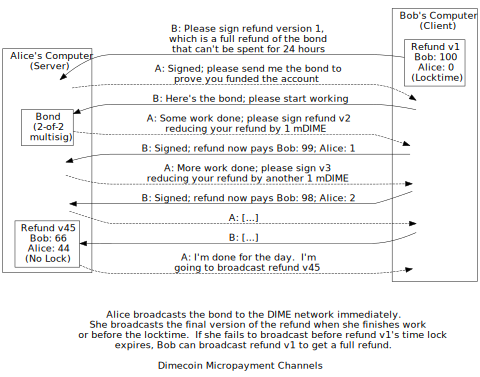

```{eval-rst}
.. meta::
  :title: Micropayment Channel
  :description: A micropayment channel allows two parties to exchange cryptocurrency off-chain, bypassing blockchain interactions.
```

> ***We put our best effort into covering all topics related to Dimecoin. Each section will cover a different category. Not all documentation may be 100% accurate, if you spot an error, please report it or submit a PR request on GitHub.***
>
> ***REMINDER: This documentation is always evolving. If you have not been here for a while, perhaps check again. Things may have been added or updated since your last visit!***

## Micropayment Channel

Alice also works part-time moderating forum posts for Bob. Every time someone posts to Bob's busy forum, Alice skims the post to make sure it isn't offensive or spam. Alas, Bob often forgets to pay her, so Alice demands to be paid immediately after each post she approves or rejects. Bob says he can't do that because hundreds of small payments will cost him thousands of dimecoins in transaction fees, so Alice suggests they use a micropayment channel.

Bob asks Alice for her [public key](../reference/glossary.md#public-key) and then creates two [transactions](../reference/glossary.md#transaction). The first transaction pays 100 millidime to a P2SH output whose 2-of-2 multisig [redeem script](../reference/glossary.md#redeem-script) requires [signatures](../reference/glossary.md#signature) from both Alice and Bob. This is the bond transaction. Broadcasting this transaction would let Alice hold the millidime hostage, so Bob keeps this transaction private for now and creates a second transaction.

The second transaction spends all of the first transaction's millidime (minus a transaction fee) back to Bob after a 24 hour delay enforced by locktime. This is the refund transaction. Bob can't sign the refund transaction by himself, so he gives it to Alice to sign, as shown in the illustration below.



Alice checks that the refund transaction's locktime is 24 hours in the future, signs it, and gives a copy of it back to Bob. She then asks Bob for the bond transaction and checks that the refund transaction spends the output of the bond transaction. She can now broadcast the bond transaction to the network to ensure Bob has to wait for the time lock to expire before further spending his millidime. Bob hasn't actually spent anything so far, except possibly a small [transaction fee](../reference/glossary.md#transaction-fee), and he'll be able to broadcast the refund transaction in 24 hours for a full refund.

Now, when Alice does some work worth 1 millidime, she asks Bob to create and sign a new version of the refund transaction.  Version two of the transaction spends 1 millidime to Alice and the other 99 back to Bob; it does not have a locktime, so Alice can sign it and spend it whenever she wants.  (But she doesn't do that immediately.)

Alice and Bob repeat these work-and-pay steps until Alice finishes for the day, or until the time lock is about to expire.  Alice signs the final version of the refund transaction and broadcasts it, paying herself and refunding any remaining balance to Bob.  The next day, when Alice starts work, they create a new micropayment channel.

If Alice fails to broadcast a version of the refund transaction before its time lock expires, Bob can broadcast the first version and receive a full refund. This is one reason micropayment channels are best suited to small payments---if Alice's Internet service goes out for a few hours near the time lock expiry, she could be cheated out of her payment.

Transaction malleability, discussed in the previous [Transactions section](../guide/transactions-transaction-malleability.md), is another reason to limit the value of micropayment channels. If someone uses transaction malleability to break the link between the two transactions, Alice could hold Bob's 100 millidime hostage even if she hadn't done any work.

For larger payments, DIME transaction fees are very low as a percentage of the total transaction value, so it makes more sense to protect payments with immediately-broadcast separate transactions.
