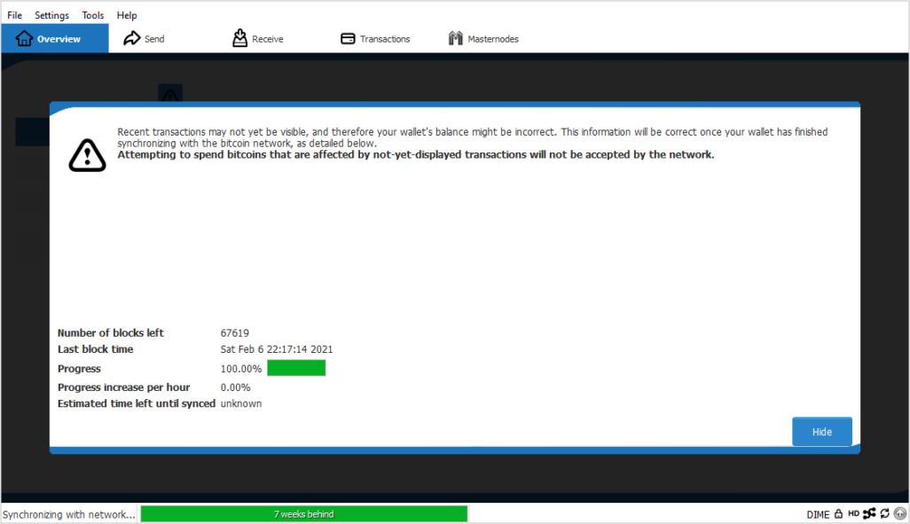
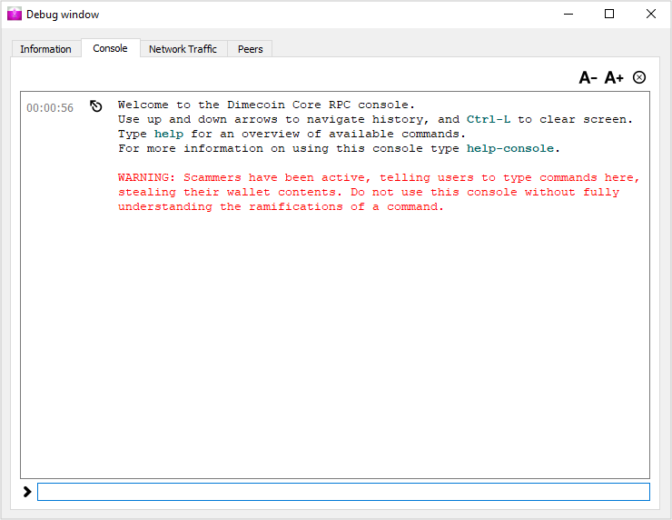
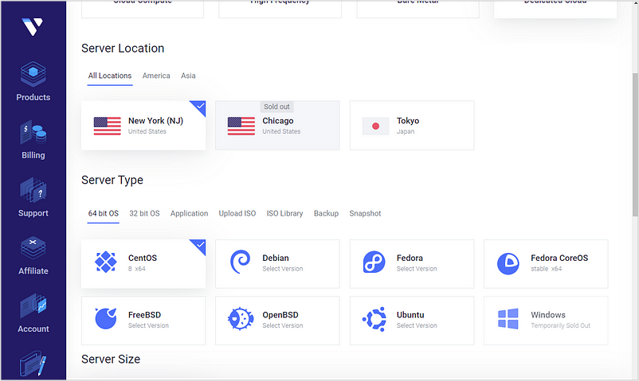
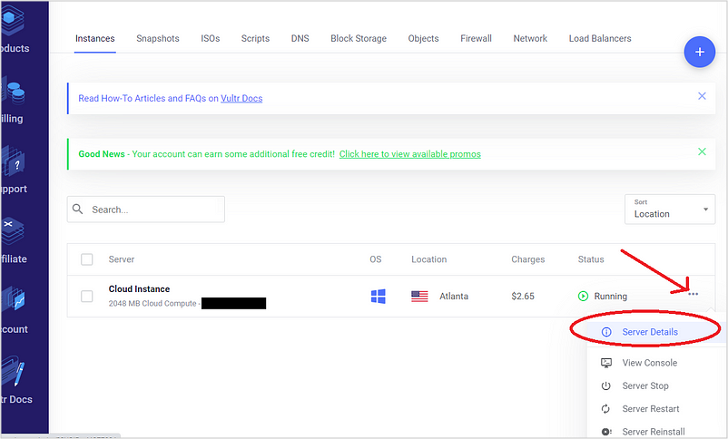
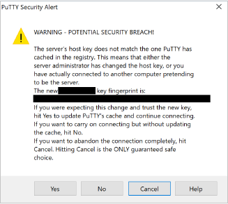
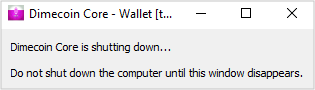
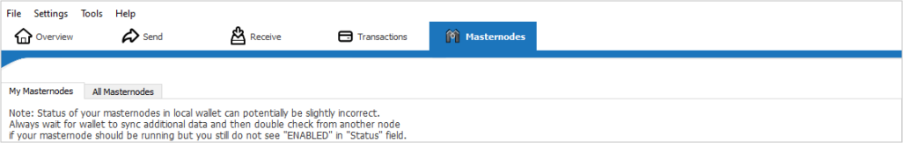

```{eval-rst}
.. meta::
  :title: Dimecoin Masternodes
  :description: Explanation of hardware and network requirements and setup instructions for running a masternode
  :keywords: dimecoin, masternodes, hardware, linux, payments, instantsend, governance, quorum, mining, staking, consensus, PoSe
```

> ***We put our best effort into covering all topics related to Dimecoin. Each section will cover a different category. Not all documentation may be 100% accurate, if you spot an error, please report it or submit a PR request on GitHub.***
>
> ***REMINDER: This documentation is always evolving. If you have not been here for a while, perhaps check again. Things may have been added or updated since your last visit!***

## Requirements

* Collateral/Bond: 500,000,000 DIME
* Server or VPS Running Linux
* Dedicated IP Address: Standard with VPS or Server

Hardware Requirements

|| **Minimum** | **Recommended** |
|----|---------|------------|
|CPU| 1 x 1 Ghz | 1 x 2 Ghz|
|RAM| 4GB | 8GB|
|Disk| 10GB | 25GB |
|Bandwidth| 400 GB/mth | 800 GB/mth|

## Setup

In order to setup a [masternode](../resources/glossary.md#masternode), it is recommended that users have a basic understanding of Linux and [blockchain](../resources/glossary.md#blockchain) technology. However, if you are able to follow instructions closely, you should be able to setup a masternode with zero issue. Keep in mind, additional maintenance and security checks will be required.

### Getting Started

This guide will make a few assumptions — mainly that you are setting up a masternode for the first time on a new server. These instructions are not intended to be used as a how-to for updating your masternode. If you are looking to update your masternode, see [updating masternode]. When finished with this guide, you will have successfully set up a masternode using a local controller wallet on your PC for your coins’ [cold storage](../resources/glossary.md#cold-storage); and a hot wallet as your masternode on your Virtual Private Server (VPS).

This guide will be using a 64-bit Windows machine for the controller/cold wallet (local wallet) and an Ubuntu Linux VPS running the masternode daemon (hot wallet).

The local wallet will be where you keep your collateral and coins safe, giving you the ability to retain complete control of your private keys. Once your masternode is fully configured and enabled, you can take the local wallet offline for cold storage.

The masternode daemon (hot wallet) will be running on your VPS and will not physically hold any [private keys](../resources/glossary.md#private-key).

While you may be able to use a minimal hardware setup to successfully run a masternode, be aware that it can make the masternode unstable, which can cause the node to crash or perform poorly. If this happens, the node risks being kicked off the masternode list, causing the masternode to lose payments.

This documentation describes the commands as if they were entered in the Dimecoin Core GUI by opening the console from `Tools > Debug console`. The same result can be achieved on a masternode by entering the same commands and adding the prefix `~/.dimecoin/dimecoin-cli` to each command.

### Creating a Reference File

**Step 1.** Create a reference file in Notepad on your local PC.

This reference document will make it easier to generate your configuration files required for setup based on the corresponding keys and data sets later on.


### Local Wallet Setup (Cold/Controller Wallet)

#### Wallet Installation & Initial Setup

**Step 2.** Download a wallet for your local computer.

If you are not already running a wallet on your home PC, please download the appropriate binary for your platform from this link: [Dimecoin Core Releases](https://github.com/dime-coin/dimecoin/releases/latest)

**Step 3.** Install the software.

Install the wallet you downloaded from the previous step by *double clicking* on the exe installer. Windows Firewall may bring up a prompt about accepting connections on private and open networks, if this occurs click *Allow*.

You will also be prompted to choose the location for the Dimecoin data directory, choose *default*. You are free to choose any location you desire; however, this guide will assume you choose the default directory location during installation.

#### Sync

**Step 4.** Sync the blockchain.

Once the client starts, let it sync to the network. You need to let he blockchain fully download. This can take anywhere from 45 minutes to a few hours. Let it fully sync before proceeding to the next steps.



#### Secure Wallet

**Step 5.** Secure your funds and backup your wallet.

Start by encrypting the wallet by selecting `Settings > Encrypt Wallet` from the top bar menu of the client. It is highly encouraged to use a unique and strong passphrase.

```{important}
Please make sure to remember this passphrase, write it down, and keep it in a secure location. If you lose your passphrase, there is no means of recovering your funds! 
```

Next, backup your wallet by selecting `File > Backup Wallet` from the top bar menu of the client. Choose a secure file location to store your backup. It would be best to store this separate from your PC where your coins are being stored (i.e., on a flash drive or similar external device). If something were to happen to your computer, this would be the only way to recover your funds.

#### Access Debug Console

**Step 6**. Access the debug console.

Next, enter the `Debug Console`. On the top bar menu select `Tools > Debug Console`. Debug window will pop up on your screen. Now click on the `Console` tab.



#### Generate Masternode Private Key

**Step 7.** Generate the Masternode Private Key.

In the `Debug Console`, enter the command:

```bash
masternode genkey
```
This generates the masternode private key. `Copy` and `Paste` the output into your reference file.

#### Generate Receiving Address

**Step 8.** Generate a new address.

Enter the following command:

```bash
getnewaddress label
```

`Copy` this newly generated address and place it in the reference file that was created in step 1 for easy reference.


#### Collateral

You will need to send the **EXACT** amount needed for collateral (500,000,000). An address with a single unspent transaction output (UTXO) will be required to run a masternode. Once this transaction has been sent, you will be able to extract the various bits of info that are needed for entry in the configuration file.

#### Sending the Collateral

**Step 9.** Sending the collateral

Make sure your wallet is fully synced. If it is not fully synced with the network, wait for it to do so. It should look like this when ready:


Now, send **exactly** 500,000,000 Dimecoin in a single transaction to the new address you generated in *step 8*. Do not subtract any fees from the amount being sent. The transaction may be sent from another wallet, or from funds already being held in your current wallet. You will need *15 confirmations* before you can register the masternode, but you can continue with the next step of this guide as you wait for enough confirmations.

```{warning}
Please triple check the address you are sending the collateral. IF YOU SEND THE COLLATERAL TO THE WRONG ADDRESS IT IS LOST FOREVER.
```

**Step 10.** Obtain collateral_output_txid and collateral_output_index

To obtain the transaction out (txOUT) data, the proof that the masternode has the correct collateral, go to the `Debug Console` and enter the following command:

```bash
masternode outputs
```
`Copy` the *collateral_output_txid* (long string between quotes) and the *collateral_output_index* (typically 1 or 0) that is generated and paste it into your Notepad reference file.

```{note}
The output_txid and output_index can be obtained by viewing the output’s transaction details .
```


### VPS Server Setup

A virtual private server (VPS) runs its own copy of an operating system (OS), and users may have superuser-level access to that operating system instance, so they can install almost any software that runs on that OS. For many purposes, they are functionally equivalent to a dedicated physical server, and being software-defined, are considered easier to customize and configure.

A VPS is ideal for hosting a Dimecoin masternode. A VPS guarantees a high percentage of uptime, hardware redundancy in the case of failure, and a static IP address. A static IP address is required to ensure you remain in queue and connected the the network. Technically, you can run a masternode from home on a desktop PC, typically it will require some extra steps to ensure you have an IP which is static. By default, most service providers allocate dynamic IP addresses for home use.

Vultr will be the hosting provider that is used as an example throughout this guide. However, you are free to use the provider of your choosing.

As of December 2023, StakeCube, offers hot and cold masternode hosting services. For those who are not as technically inclined or do not want the hassle of MN configuration and setup, [StakeCube](https://stakecube.net/) provides these services.

```{caution}
Keeping Dimecoin (DIME) or any cryptocurrency on deposit with a third-party in a custodial connection has inherent risks. These risks can include security breaches and risk of loss. Participants should be aware of the dangers associated with third-party custodianship (hot wallet MN in the example above) of their property for any reason.
```
**Step 11.** Create an account.

If you do not already have one, register and then login.

**Step 12.** Deploy Server.

From the **Products Page**, click on `Deploy New Server`. Click the circle with the `+` sign.


**Step 13.** Choose server location.

This will bring up the a screen for you to choose your server location. Choose a Server Location. The closer to your location the better.



**Step 14.** Select OS.

Select Ubuntu 22.04 x64 as the server type. It is recommended to use the LTS release of Ubuntu, instead of the latest version. LTS releases are supported with security updates for 5 years, instead of 9 months.

Select a server size. You will want at least 1 CPU with 2GB of RAM memory and 400 GB/month of bandwidth. (1000MB = 1GB). See the [minimum hardware requirement](#requirements) chart at the beginning of this guide.

**Step 15.** Name/Label your server.

To help identify the VPS your Masternode is being deployed. Useful if running multiple Masternodes, but not necessary. Once your server is named and you click `deploy now`, Vultr will install your server. This process may take a few minutes.

**Step 16.** Obtain server details.

When your installation is complete, click on the `Products` page. Locate your server in the list and goto your server details. Make a note of the IP address, username, and password in your Notepad reference file from step 1.



#### Setting up your OS

**Step 17.** Connecting to your VPS for the first time.'

You will need to connect to your newly deployed server. You can do this by using the console provided in the Vultr dashboard or through the use of a service like PuTTY. We will use PuTTY as our example during this part of the setup. If you would like to use PuTTY, go to their download page and choose your system’s corresponding installer. 

Alternatively, Mac, Windows 10, or Linux give you the option to ssh directly into your VPS from the terminal. Just type `ssh root@<server_ip>` without the angle brackets. Enter your password when prompted. You will not see any characters showing up on the screen when you input your password — that is by design and a security feature!


**Step 18.** Install PuTTY.

Once the file is downloaded, double-click on it to install PuTTY. Once installed, run the app. Enter the IP address of your VPS server in the **Host Name** field, then click `Open`.

Generally, you will be prompted with a certificate warning. This is normal since this is the first time you are connecting to your server. Click `Yes` so the program knows to trust your server in the future.



You are now connected to your server and should be able to see a terminal window. Begin by **logging** in to your server. Use `root` as the user and input the password supplied by your hosting provider that you made note of above in step 15.

**Step 19.** Change your default password.

It is highly recommended to change your password, immediately, the first time you connect to your server. If you do so, make sure to store it in a safe place for security. You can **copy** and **paste** any of the commands noted in here by simply pressing `Ctrl + C`. Then paste them directly into PuTTY by right-clicking in the window and selecting paste.

```{hint}
Text pastes at the cursor location and will not be visible.
```

`Copy` the following and paste it into the PuTTY terminal:

```bash
passwd root
```

You will be prompted to enter and confirm a new password. Be sure to follow standard practice for creating strong passwords.

**Step 20.** Creating a new user.

It is highly recommend to create a new user and avoid using the root login for working on the server. Use the following command (replace **username** with a username of your choosing):

```bash
adduser <username>
```

You will be prompted to input a password. Use a password that is different from the server’s root password (store it in a safe place). You will also be prompted to input user information, you can leave it blank. Hit enter for each field. Once the user has been created, you will need to add the user to the sudo group in order to perform commands as root:

```bash
usermod -aG sudo <username>
```
**Step 21.** Update the system.

While you are still logged in as root, update the system from the Ubuntu repository:

```bash
apt update
apt upgrade
```

Your system will display a list of upgrade-able packages. Pressing `Y and Enter` will install the packages. 

#### Install Packages

**Step 22.** Install packages.

Now install a firewall, plus additional packages for later use.

```bash
apt install ufw python virtualenv git unzip pv
```

Input `Y`, then hit `Enter` to confirm

#### Configure UFW

`Copy` and `Paste` the following line by line:

```bash
ufw allow ssh/tcp
ufw limit ssh/tcp
ufw allow 9999/tcp
ufw allow 11931/tcp
ufw allow 8332/tcp
ufw allow 8333/tcp
ufw logging on
ufw enable
```

Input `Y` then hit `Enter` to confirm after each command.

When finished, the following message should display:

```text
Firewall is active and enabled on system startup
```

Now, reboot the server to apply the necessary kernel update. Once rebooted, login as the new user.

#### Add Swap Memory

**Step 23**. Add swap memory

```bash
sudo swapon --show
sudo swapoff -a
sudo fallocate -l 4G /swapfile
sudo chmod 600 /swapfile
sudo mkswap /swapfile
sudo swapon /swapfile
sudo nano /etc/fstab
```

Add the following line at the end of the file (press tab to separate each word/number), Press `Ctrl + X` to close the editor then `Y and Enter` to save the file.

```bash
/swapfile none swap sw 0 0
```

#### Additional VPS Security (Optional)

These steps (24-25) are optional but highly recommended. The packages provided are only basic steps that can be used to protect your server; additional steps can be taken to secure your setup. However, since you will not be storing any of your Dimecoin private keys on the server hosting the masternode, these additional steps are considered outside the framework of this guide. However, it is encouraged to enable automatic security updates on your server.

**Step 24.** Install fail2ban.

Prevents brute force hacking of your password.

```bash
apt install fail2ban
```

Create the config file using the nano editor:

```bash
nano /etc/fail2ban/jail.local
```

Paste the following configuration in the file:

```bash
[sshd]
enabled = true
port = 22
filter = sshd
logpath = /var/log/auth.log
maxretry = 3
```

Press `Ctrl + X` to close the editor, then `Y and Enter` to save the file.

Restart your server to enable fail2ban:

```bash
systemctl restart fail2ban
systemctl enable fail2ban
```

**Step 25.** Disable root login.

Confirm you can login to your VPS using the new user you created in step 19. Then, open your SSH configuration file to disable root login:

```bash
nano /etc/ssh/sshd_config
```

Find the line PermitRootLogin yes and change it to PermitRootLogin no. Below this, add the following line: AllowUsers **username**, replacing **username** with the username you created in step 9. Press `Ctrl + X` to close the editor, then `Y and Enter` to save the file. Reboot the server.

```bash
reboot now
```

PuTTY or your terminal will become disconnected when the server reboots.

#### Installing the Core Wallet

Dimecoin Core is the software behind both the Dimecoin Core GUI wallet and Dimecoin masternodes. If you are not using a GUI, it will run as a headless daemon on your server `dimecoind`. The dimecoind daemon is controlled by a simple command interface `dimecoin-cli`. Similar to Bitcoin, it uses RPC commands to interact with the daemon and change various settings

**Step 26.** Login to your VPS

Using PuTTY, or the terminal of your choosing, login using your non-root username and password.

**Step 27.** Manually install the components of your Dimecoin masternode.

Visit our Github page and `Copy` the link to the latest Linux binary. Go into your PuTTY terminal window and enter the following.

```bash
cd /tmp
wget https://github.com/dime-coin/dimecoin/releases/download/2.3.0.0/dimecoin-qt-v2.3.0.0-ubuntu22.04.tar.gz
```

**Step 28.** Create a working directory for Dimecoin.

Extract the compressed archive and copy the necessary files to the directory:

```bash
mkdir ~/.dimecoin
tar -xvf https://github.com/dime-coin/dimecoin/releases/download/2.3.0.0/dimecoin-qt-v2.3.0.0-ubuntu22.04.tar.gz
cp -f dimecoin-2.3.0.0/bin/dimecoind ~/.dimecoin/
cp -f dimecoin-2.3.0.0/bin/dimecoin-cli ~/.dimecoin/
```

#### Create the Dimecoin Configuration File

**Step 29.** Create the configuration file:

```bash
nano ~/.dimecoin/dimecoin.conf
```

An editor window will appear. **Copy** and **Paste** the following to get started, then replace the variables specific to your configuration:

```bash
#Dimecoin_conf
rpcuser=XXXXX 
rpcpassword=XXXXX 
rpcallowip=127.0.0.1
listen=1
server=1
daemon=1
logtimestamps=1
maxconnections=256
masternode=1
externalip=VPS_IP
bind=VPS_IP
masternodeaddr=VPS_IP:11931
masternodeprivkey=YOUR_MASTERNODE_KEY
```

Replace the fields as follows:

* rpcuser and rpcpassword = can be any alphanumeric combination (no symbols or spaces).
* VPS_IP = Replace all three occurrences of VPS_IP with the static IP obtained from your Vultr VPS.
* bind=VPS_IP.
* masternodeaddr=VPS_IP:11931
* masternodeprivkey= obtained from step #7
  
After finishing editing the configuration file with all your details, Press `Ctrl + X` to close the editor, then `Y and Enter` to save the file.

#### Start the Daemon

**Step 30.** Start the daemon.

You can now start running dimecoind to begin synchronization with the blockchain:

```bash
~/.dimecoin/dimecoind
```

You will see a message reading: dimecoind starting

The Dimecoin client will start downloading the blockchain and synchronizing to the network. It will need time to sync. In the interim, we will continue with the final configuration of the local wallet on Windows.

### Starting the Masternode

The data in the the `masternode.conf` on the Windows wallet must be supplied with the correct data for controlling the masternode daemon (hot wallet).

#### Create the Masternode Configuration File

**Step 31:** Creating the masternode.conf File.

From top bar menu of your local Windows wallet, click on `Tools`. Then choose `Open Masternode Configuration File`.

A notepad file should appear containing your existing masternode configuration. Using your reference file, input the appropriate data which pertains to your setup.


Breakdown of config parameters:

* alias — any name you want
* IP: Your VPS and port for the coin (11931 for Dimecoin mainnet)
xxx.xxx.xxx.xxx:11931
* masternodeprivkey — paste from notepad reference file. Obtained from step 7.
* collateral_output_txid — first part of masternode output. Obtained from step 10.
* collateral_ouput_index — second part of masternode output (typically 1 or 0) Obtained from step 10
  
Make sure the variables above are in a single line with a single space between. Press `Ctrl + X` to close the editor then `Y and Enter` to save the file.

**Step 32.** Restart the node.

You must restart the wallet for this change to take effect. Exit out. Make sure to let the wallet fully close out on its own (until the shutting down message disappears).



#### Check Masternode Status on VPS

The masternode wallet has to be fully synced and up to date before proceeding.

Switch over to your VPS and use the following command to check its status:

```bash
~/.dimecoin/dimecoin-cli mnsync status

```

The output should look like this:

```json
{
"AssetID": 999,
"AssetName": "MASTERNODE_SYNC_FINISHED",
"Attempt": 0,
"IsBlockchainSynced": true,
"IsMasternodeListSynced": true,
"IsWinnersListSynced": true,
"IsSynced": true,
"IsFailed": false
}
```

#### Starting Your Masternode

**Step 33.** Starting your masternode.

In order to activate the masternode, switch back to the Windows wallet. Click on the `Masternodes` tab.



Your masternode should now appear under the `My Masternodes` tab. Locate your masternode on the list, right click on it and choose `Start Alias`.

The status of your masternode will say `PRE-ENABLED` if everything is configured correctly. After roughly 10-15 minutes, the status will automatically change to `ENABLED`. You may want to wait for 1-2 hours for your masternode to sync with another nodes on the network before starting.

Congrats! You just have setup a masternode.
