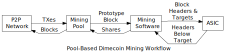
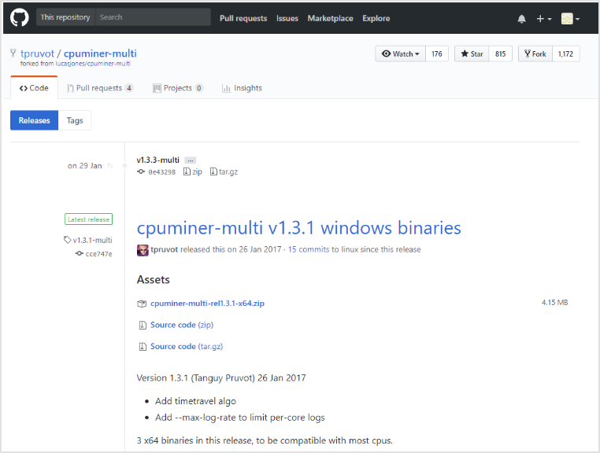
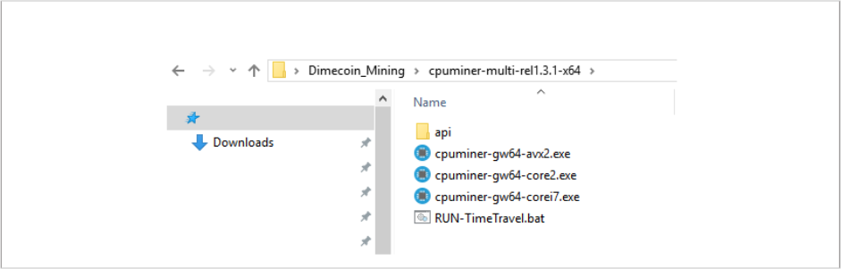
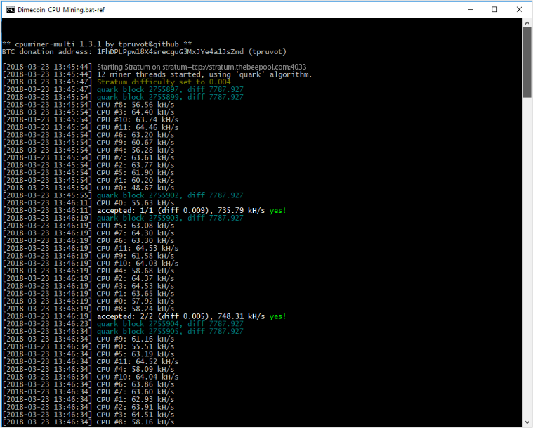
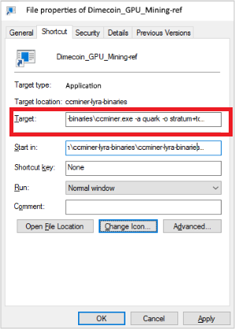
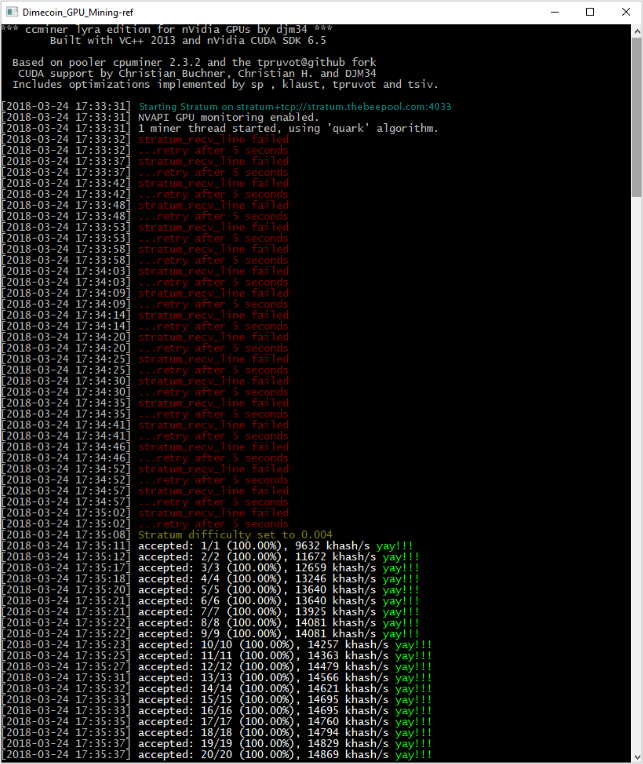

```{eval-rst}
.. meta::
  :title: Dimecoin Pool Mining
  :description: A mining pool is a collective effort by miners to combine processing power, distribute rewards evenly based on work contributed, and increase chances of finding a block. 
```

> ***We put our best effort into covering all topics related to Dimecoin. Each section will cover a different category. Not all documentation may be 100% accurate, if you spot an error, please report it or submit a PR request on GitHub.***
>
> ***REMINDER: This documentation is always evolving. If you have not been here for a while, perhaps check again. Things may have been added or updated since your last visit!***

## Pool Mining

Pool miners follow a similar workflow, illustrated below, which allows mining pool operators to pay miners based on their share of the work done. The mining pool gets new [transactions](../reference/glossary.md#transaction) from the network using `dimecoind`. Using one of the methods discussed later, each miner's mining software connects to the pool and requests the information it needs to construct block headers.



In pooled mining, the mining pool sets the [target threshold](../reference/glossary.md#target) a few orders of magnitude higher (less difficult) than the network difficulty. This causes the mining hardware to return many block headers which don't hash to a value eligible for inclusion on the [blockchain](../reference/glossary.md#blockchain) but which do hash below the pool's target, proving (on average) that the miner checked a percentage of the possible hash values.

The [miner](../reference/glossary.md#miner) then sends to the pool a copy of the information the pool needs to validate that the header will hash below the target and that the block of transactions referred to by the header [merkle root](../reference/glossary.md#merkle-root) field is valid for the pool's purposes. (This usually means that the [coinbase transaction](../reference/glossary.md#coinbase-transaction) must pay the pool.)

The information the miner sends to the pool is called a share because it proves the miner did a share of the work. By chance, some shares the pool receives will also be below the network target---the mining pool sends these to the network to be added to the block chain.

The [block reward](../reference/glossary.md#block-reward) and transaction fees that come from mining that block are paid to the mining pool. The mining pool pays out a portion of these proceeds to individual miners based on how many shares they generated. For example, if the mining pool's target threshold is 100 times lower than the network target threshold, 100 shares will need to be generated on average to create a successful block, so the mining pool can pay 1/100th of its payout for each share received.  Different mining pools use different reward distribution systems based on this basic share system.

### Mining Pools & Mining Stats

There are multiple mining pools which allow you to mine Dimecoin. Our example will utilize [TheBeePool](https://thebeepool.com/). However, here is a link to [Mining Pool Stats](https://miningpoolstats.stream/dimecoin) which details mining stats on the network and a list of current pools currently mining Dimecoin. Feel free to use any one of them.

### Example: CPU Pool Mining via TheBeePool

This guide will explain how to mine Dimecoin using a Windows operating system and the CPU on your computer. It is important to note that GPU and ASIC miners dominate the hashing power on Dimecoin’s network. What does this mean? If you are trying to mine with CPU, you will not be very likely to realize many block rewards.

```{note}
Please note that the examples provided below are mainly for informational purposes only. CPU mining is not relevant to the network currently. This guide will utilize TheBeePool coupled with using tpruvot’s CPUMiner Multi. No registration is required for TheBeePool, however, some mining pools will require you to register.
```

**CPUMiner Multi Setup**

```{admonition} Please Note
CPUMiner Multi by tpruvot is no longer maintained. More optimized mining software does exist. If you are interested in exploring software which is actively maintained, check out cpuminer-opt by JayDDee: https://github.com/JayDDee/cpuminer-opt
```

**Step 1:** Download Software: You will need software in order to utilize your CPU to mine Dimecoin. Grab a copy of [CPUMiner Multi](https://github.com/tpruvot/cpuminer-multi/releases)



Make sure you grab the latest release. The version of CPUMiner Multi shown in this guide, may be outdated. Make sure to choose `latest release`. To download the software, click on `cpuminer-multi-relx.x.x-x64.zip`.

```{note}
This software is only designed to run on 64bit Windows.
```

**Step 2:** Unzip Download: You can use the built-in zip capabilities in Windows to unzip this file (right click on the file to see these options) or you can use a zip software program such as [7-Zip](https://www.7-zip.org/).

**Step 3:** Install: Move the newly unzipped folder (cut and paste) to your desired location on Windows. For example, place it on your Desktop or create a desktop folder with the name `Dimecoin Mining`. Place the unzipped contents inside that folder. Open the new folder location that contains the unzipped files. It should look like this:



**Step 4:** Create A Batch File: Create a new text file inside this folder and rename it to Dimecoin_CPU_Mining.bat, for example. It is important to use the .bat file extension, the file name can be anything you choose.

**Step 5:** Create Shortcut to Batch File: Now create a Windows file shortcut for the file named Dimecoin_CPU_Mining.bat from our example in step 4. `Right click` the .bat file you made, then click `Create Shortcut`.

**Step 6:** Edit Batch File: Edit the file Dimecoin_CPU_Mining.bat with your desired text editor, such as Windows Notepad. Right click on the .bat file and choose Edit. We suggest Notepad++. If you need a better text editor grab a copy here: [NotePad ++](https://notepad-plus-plus.org/). Once you choose your editor, copy the following text into the text editor window:

```{bash}
cpuminer-sse2 -a quark -o stratum+tcp://stratum.thebeepool.com:4033 -u 7AihhXXXXXXXXXXXXXXXXXXXXBJiWMSLdN -p c=DIME

pause
```

```{important}
Make sure to replace the dummy address `7AihhXXXXXXXXXXXXXXXXXXXXBJiWMSLdN` above in the text above with your own dimecoin receiving address! Your wallet address must be valid for you to be able to successfully mine. The password above is case sensitive!
```

Visit this [link](https://en.wikipedia.org/wiki/Advanced_Vector_Extensions#CPUs_with_AVX2) for a list of CPUs supporting AVX2.

```{note}
If you have an Intel Core 2 processor in your computer, please change the command line from cpuminer-gw-64-corei7 to cpuminer-gw64-core2. The same applies if you have a CPU which has the Advanced Vector Extensions 2 (AVX2) CPU extension. In this case use cpuminer-gw64-avx2.
```

If you are running a Linux, MAC or FreeBSD operating system, you need to download the source code [here](https://github.com/tpruvot/cpuminer-multi).

Once it is downloaded, you will need to compile it on your local machine.

***Step 7:** Connecting to TheBeePool: Now double click on the file shortcut we had just created, step 6. It may take a a few minutes to establish a connection. Monitor the screen for successful connection or if you encounter any errors.



**Step 8:** Check Your Rewards: As stated earlier, your shares will be fairly limited due to GPU and CPU mining on the network. After some time, you will receive rewards to your Dimecoin address when there is a pool payout.

Congratulations, you now are an essential part of the Dimecoin community!

```{hint}
The anti-virus software program on your computer may block the execution of CPUMiner Multi if the file protection option is “ON” in the settings of your anti-virus program. You can find the files that were removed under your quarantine settings. If this happens, add an exception for the folder where you created the .bat file. Once the exception is created, rerun your .bat file.
```

### Example GPU Pool Mining via TheBeePool

Like CPU mining, a range of software exists that allows you to utilize the GPU on your computer to mine Dimecoin. GPU mining will generate quite a bit more hashing power when compared to CPU mining; however, it will not generate near the amount an ASIC miner will produce. Given the nature of today’s higher-end GPUs, you may successfully mine Dimecoin at a decent rate.

```{admonition} Please Note
The examples provided below are mainly for informational purposes only. GPU hardware and software are constantly evolving. However, through this guide, you should be able to configure your setup and optimize your settings based upon your hardware and software requirements. The fundamental principles this guide offers will still apply. This guide will utilize AikaPool coupled with using CCMiner by djm34 to mine with an NVIDIA GPU.
```

There are multiple mining pools which allow you to mine Dimecoin. Our example will utilize TheBeePool. See the link above in the CPU mining section for additional mining pool stats and pools. Feel free to use any one of them.

```{note}
The version of CCMiner in this guide may not be the most recent. More optimized mining software does exist. If you are interested in exploring software which is actively maintained, or for different graphics card setups, check out the following:

**AMD**

* https://github.com/nicehash/sgminer/releases

**NVIDIA**

* https://github.com/tpruvot/ccminer/releases
* https://github.com/sp-hash/ccminer/releases
* https://github.com/KlausT/ccminer/releases
```

**Step 1:** Downloadd and Unzip CCMiner: Please visit the following link to download the software used in this tutorial: [CCMiner](https://github.com/djm34/ccminer-lyra/releases/)

```{admonition} Update
The version CCMiner in this tutorial is no longer maintained. More optimized mining software does exist. Feel free to use any newer version found on GitHub that may be more conducive for running based on your hardware configuration. However, make sure the version of CCMiner you use can mine the Quark algorithm since that is the hashing logic Dimecoin utilizes.
```

**Step 2:** Installation: Move the newly unzipped folder (cut and paste) to your desired location on Windows. For example, place it on your Desktop or create a desktop folder with the name Dimecoin Mining and place the unzipped contents inside that folder.

**Step 3:** Create Batch File: Now open the new folder location that contains the unzipped folder. Create a new text file inside this folder and rename it to `Dimecoin_CPU_Mining.bat` for example. It is important to use the .bat file extension, the file name can be anything you choose.

**Step 4:** Create Shortcut: Now create a Windows file shortcut of the file named `Dimecoin_CPU_Mining.bat` from our example in step 3. Right click on the .bat file you made and then click on `Create Shortcut`.

**Step 5:** Configure the Shortcut: Right click on the shortcut you just created and choose Properties. Locate the Target field and replace ccminer.exe with the following:

```{bash}
ccminer.exe -a quark -o stratum+tcp://stratum.thebeepool.com:4033 -u 7AihhXXXXXXXXXXXXXXXXXXXXBJiWMSLdN -p c=DIME
```



```{important}
Make sure to replace the dummy address `7AihhXXXXXXXXXXXXXXXXXXXXBJiWMSLdN` above in the text above with your own dimecoin receiving address! Your wallet address must be valid for you to be able to successfully mine. The password above is case sensitive!
```

If you are running a Linux, MAC or FreeBSD operating system, you need to download the [source code here](https://github.com/djm34/ccminer-lyra/releases)

**Step 6:** Connecting to TheBeePool: Now double click on the file shortcut we had just created, step 5. It may take a a few minutes to establish a connection.



**Step 7:** Monitor Your Connection and check for rewards: You will receive you rewards to the dimecoin receiving address you used in step 4.

Congratulations, you now are an essential part of the Dimecoin community!

```{hint}
The anti-virus software program on your computer may block the execution of CPUMiner Multi if the file protection option is “ON” in the settings of your anti-virus program. You can find the files that were removed under your quarantine settings. If this happens, add an exception for the folder where you created the .bat file. Once the exception is created, rerun your .bat file.
```
