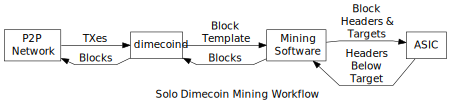

```{eval-rst}
.. meta::
  :title: Dimecoin Mining
  :description: Mining adds new blocks to the blockchain, making transaction history hard to modify. Mining takes on two forms – Solo Mining and Pool Mining. 
```

> ***We put our best effort into covering all topics related to Dimecoin. Each section will cover a different category. Not all documentation may be 100% accurate, if you spot an error, please report it or submit a PR request on GitHub.***
>
> ***REMINDER: This documentation is always evolving. If you have not been here for a while, perhaps check again. Things may have been added or updated since your last visit!***

## Mining

Mining adds new [blocks](../resources/glossary.md#block) to the [blockchain](../resources/glossary.md#blockchain), making transaction history hard to modify.  Mining today takes on two forms:

* Solo mining, where the [miner](../resources/glossary.md#miner) attempts to generate new blocks on his own, with the proceeds from the [block reward](../resources/glossary.md#block-reward) and transaction fees going entirely to himself, allowing him to receive the full block reward with a higher variance (longer time between payments)

* Pooled mining, where the miner pools resources with other miners to find blocks more often, with the proceeds being shared among the pool miners in rough correlation to the amount of hashing power they each contributed, allowing the miner to receive small payments with a lower variance (shorter time between payments).

## Block Prototypes

In both solo and pool mining, the mining software needs to get the information necessary to construct block headers. This subsection describes, in a linear way, how that information is transmitted and used. However, in actual implementations, parallel threads and queuing are used to keep ASIC hashers working at maximum capacity,

### getwork RPC

The simplest and earliest method was the now-deprecated Dimecoin Core `getwork` RPC, which constructed a [header](../resources/glossary.md#header) for the miner directly. Since a header only contains a single 4-byte nonce good for about 4 gigahashes, many modern miners need to make dozens or hundreds of `getwork` requests a second.

### getblocktemplate RPC

An improved method is the Dimecoin Core [`getblocktemplate` RPC](../api/rpc-mining.md#getblocktemplate). This provides the mining software with much more information:

1. The information necessary to construct a [coinbase transaction](../resources/glossary.md#coinbase-transaction) paying the pool or the solo miner's `dimecoind` wallet.

2. A complete dump of the [transactions](../resources/glossary.md#transaction) `dimecoind` or the mining pool suggests including in the block, allowing the mining software to inspect the transactions, optionally add additional transactions, and optionally remove non-required transactions.

3. Other information necessary to construct a [block header](../resources/glossary.md#block-header) for the next [block](../resources/glossary.md#block): the block version, previous block hash, and bits (target).

4. The mining pool's current [target threshold](../resources/glossary.md#target) for accepting shares. (For solo miners, this is the network target.)

Using the transactions received, the mining software adds a nonce to the coinbase extra nonce field and then converts all the transactions into a [merkle tree](../resources/glossary.md#merkle-tree) to derive a [merkle root](../resources/glossary.md#merkle-root) it can use in a block header. Whenever the extra nonce field needs to be changed, the mining software rebuilds the necessary parts of the merkle tree and updates the time and merkle root fields in the block header.

Like all `dimecoind` RPCs, `getblocktemplate` is sent over HTTP. To ensure they get the most recent work, most miners use [HTTP longpoll](https://en.wikipedia.org/wiki/Push_technology#Long_polling) to leave a `getblocktemplate` request open at all times. This allows the mining pool to push a new `getblocktemplate` to the miner as soon as any [miner](../resources/glossary.md#miner) on the peer-to-peer [network](../resources/glossary.md#network) publishes a new block or the pool wants to send more transactions to the mining software.

### Stratum

A widely used alternative to `getblocktemplate` is the [Stratum mining protocol](http://mining.bitcoin.cz/stratum-mining). Stratum focuses on giving miners the minimal information they need to construct block headers on their own:

1. The information necessary to construct a coinbase transaction paying the pool.

2. The parts of the merkle tree which need to be re-hashed to create a new merkle root when the coinbase transaction is updated with a new extra nonce. The other parts of the merkle tree, if any, are not sent, effectively limiting the amount of data which needs to be sent to (at most) about a kilobyte at current transaction volume.

3. All of the other non-merkle root information necessary to construct a block header for the next block.

4. The mining pool's current target threshold for accepting shares.

Using the coinbase transaction received, the mining software adds a nonce to the coinbase extra nonce field, hashes the coinbase transaction, and adds the hash to the received parts of the merkle tree. The tree is hashed as necessary to create a merkle root, which is added to the block header information received. Whenever the extra nonce field needs to be changed, the mining software updates and re-hashes the coinbase transaction, rebuilds the merkle root, and updates the header merkle root field.

Unlike `getblocktemplate`, miners using Stratum cannot inspect or add transactions to the block they're currently mining. Also unlike `getblocktemplate`, the Stratum protocol uses a two-way TCP socket directly, so miners don't need to use HTTP longpoll to ensure they receive immediate updates from mining pools when a new block is broadcast to the peer-to-peer network.

## Solo Mining

As illustrated below, solo miners typically use `dimecoind` to get new [transactions](../resources/glossary.md#transaction) from the [network](../resources/glossary.md#network). Their mining software periodically polls `dimecoind` for new transactions using the [`getblocktemplate` RPC](../api/rpc-mining.md#getblocktemplate), which provides the list of new transactions plus the [public key](../resources/glossary.md#public-key) to which the [coinbase transaction](../resources/glossary.md#coinbase-transaction) should be sent.



The mining software constructs a block using the template (described below) and creates a [block header](../resources/glossary.md#block-header). It then sends the 80-byte block header to its mining hardware (an ASIC) along with a [target threshold](../resources/glossary.md#target) (difficulty setting). The mining hardware iterates through every possible value for the block header nonce and generates the corresponding hash.

If none of the hashes are below the threshold, the mining hardware gets an updated block header with a new [merkle root](../resources/glossary.md#merkle-root) from the mining software; this new block header is created by adding extra nonce data to the coinbase field of the coinbase transaction.

On the other hand, if a hash is found below the target threshold, the mining hardware returns the block header with the successful nonce to the mining software. The mining software combines the header with the block and sends the completed block to `dimecoind` to be broadcast to the network for addition to the blockchain.

## Pool Mining

Pool miners follow a similar workflow, illustrated below, which allows mining pool operators to pay miners based on their share of the work done. The mining pool gets new [transactions](../resources/glossary.md#transaction) from the network using `dimecoind`. Using one of the methods discussed later, each miner's mining software connects to the pool and requests the information it needs to construct block headers.


In pooled mining, the mining pool sets the [target threshold](../resources/glossary.md#target) a few orders of magnitude higher (less difficult) than the network difficulty. This causes the mining hardware to return many block headers which don't hash to a value eligible for inclusion on the [blockchain](../resources/glossary.md#blockchain) but which do hash below the pool's target, proving (on average) that the miner checked a percentage of the possible hash values.

The [miner](../resources/glossary.md#miner) then sends to the pool a copy of the information the pool needs to validate that the header will hash below the target and that the block of transactions referred to by the header [merkle root](../resources/glossary.md#merkle-root) field is valid for the pool's purposes. (This usually means that the [coinbase transaction](../resources/glossary.md#coinbase-transaction) must pay the pool.)

The information the miner sends to the pool is called a share because it proves the miner did a share of the work. By chance, some shares the pool receives will also be below the network target---the mining pool sends these to the network to be added to the block chain.

The [block reward](../resources/glossary.md#block-reward) and transaction fees that come from mining that block are paid to the mining pool. The mining pool pays out a portion of these proceeds to individual miners based on how many shares they generated. For example, if the mining pool's target threshold is 100 times lower than the network target threshold, 100 shares will need to be generated on average to create a successful block, so the mining pool can pay 1/100th of its payout for each share received.  Different mining pools use different reward distribution systems based on this basic share system.

```{admonition} Resources
* [CCMiner](https://github.com/djm34/ccminer-lyra/releases/) mining software
* [Yiimp](https://github.com/tpruvot/yiimp) mining pool software are widely-used among Dimecoin miners and pools. 
* The [libblkmaker](https://github.com/bitcoin/libblkmaker) C library and 
* [python-blkmaker](https://gitorious.org/bitcoin/python-blkmaker) library, both MIT licensed, can interpret GetBlockTemplate for your programs.
* [Mining Guide]() 
```
