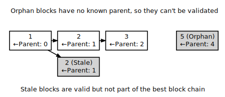

```{eval-rst}
.. meta::
  :title: Dimecoin Block Broadcasting
  :description: When a miner discovers a new block, it broadcasts the new block to its peers using either Unsolicited Block Push or Standard Block Relay.
```

> ***We put our best effort into covering all topics related to Dimecoin. Each section will cover a different category. Not all documentation may be 100% accurate, if you spot an error, please report it or submit a PR request on GitHub.***
>
> ***REMINDER: This documentation is always evolving. If you have not been here for a while, perhaps check again. Things may have been added or updated since your last visit!***

## Block Broadcasting

When a [miner](../resources/glossary.md#miner) or staker discovers a new [block](../resources/glossary.md#block), it broadcasts the new block to its [peers](../resources/glossary.md#peer) using one of the following methods:

* **[Unsolicited Block Push](../resources/glossary.md#unsolicited-block-push):**
  The validator sends a [`block` message](../reference/p2p-network.md#block) to each of its full node peers with the new block. The miner or staker can reasonably bypass the standard relay method in this way because it knows none of its peers already have the just-discovered block.

* **[Standard Block Relay](../resources/glossary.md#standard-block-relay):**
  The miner or staker, acting as a standard relay node, sends an [`inv` message](../reference/p2p-network.md#inv) to each of its peers (both full node and SPV) with an inventory referring to the new block. The most common responses are:

  * Each [blocks-first](../resources/glossary.md#blocks-first-sync) (BF) peer that wants the block replies with a [`getdata` message](../reference/p2p-network.md#getdata) requesting the full block.

  * Each [headers-first](../resources/glossary.md#headers-first-sync) (HF) peer that wants the block replies with a [`getheaders` message](../reference/p2p-network.md#getheaders) containing the header hash of the highest-height header on its best header chain, and likely also some headers further back on the best header chain to allow [fork](../resources/glossary.md#fork) detection. That message is immediately followed by a [`getdata` message](../reference/p2p-network.md#getdata) requesting the full block. By requesting headers first, a headers-first peer can refuse [orphan blocks](../resources/glossary.md#orphan-block) as described in the subsection below.

  * Each [Simplified Payment Verification](../resources/glossary.md#simplified-payment-verification) (SPV) client that wants the block replies with a [`getdata` message](../reference/p2p-network.md#getdata) typically requesting a [merkle block](../resources/glossary.md#merkle-block).

   The miner or staker replies to each request accordingly by sending the block in a [`block` message](../reference/p2p-network.md#block), one or more headers in a [`headers` message](../reference/p2p-network.md#headers), or the merkle block and transactions relative to the SPV client's [bloom filter](../resources/glossary.md#bloom-filter) in a [`merkleblock` message](../reference/p2p-network.md#merkleblock) followed by zero or more [`tx` messages](../reference/p2p-network.md#tx).

By default, Dimecoin Core broadcasts blocks using [standard block relay](../resources/glossary.md#standard-block-relay), but it will accept blocks sent using either of the methods described above.

Full nodes validate the received block and then advertise it to their peers using the standard block relay method described above.  The condensed table below highlights the operation of the messages described above (Relay, BF, HF, and SPV refer to the relay node, a [blocks-first](../resources/glossary.md#blocks-first-sync) node, a [headers-first](../resources/glossary.md#headers-first-sync) node, and an [SPV](../resources/glossary.md#simplified-payment-verification) client; *any* refers to a node using any block retrieval method.)

| **Message** | [inv message](../reference/p2p-network.md#inv)                                   | [getdata message](../reference/p2p-network.md#getdata)               | [getheaders message](../reference/p2p-network.md#getheaders)                                     | [headers message](../reference/p2p-network.md#headers) |
| --- | --- | --- | --- | --- |
| **From→To** | Relay→*Any*                                           | BF→Relay                                   | HF→Relay                                                               | Relay→HF                                   |
| **Payload** | The inventory of the new block                         | The inventory of the new block             | One or more header hashes on the HF node's best header chain (BHC)     | Up to 2,000 headers connecting HF node's BHC to relay node's BHC |
| **Message** | [`block` message](../reference/p2p-network.md#block)                               | [`merkleblock` message](../reference/p2p-network.md#merkleblock)       | [`tx` message](../reference/p2p-network.md#tx)                                                     | |
| **From→To** | Relay→BF/HF                                            | Relay→SPV                                  | Relay→SPV                                                              |   |
| **Payload** | The new block in [serialized format](../reference/block-chain-serialized-blocks.md) | The new block filtered into a merkle block | Serialized transactions from the new block that match the bloom filter | |

### Orphan Blocks

Blocks-first nodes may download [orphan blocks](../resources/glossary.md#orphan-block)---blocks whose previous [block header](../resources/glossary.md#block-header) hash field refers to a block header this node hasn't seen yet. In other words, orphan blocks have no known parent (unlike [stale blocks](../resources/glossary.md#stale-block), which have known parents but which aren't part of the best [blockchain](../resources/glossary.md#blockchain)).



When a [blocks-first](../resources/glossary.md#blocks-first-sync) node downloads an orphan block, it will not validate it. Instead, it will send a [`getblocks` message](../reference/p2p-network.md#getblocks) to the node which sent the orphan block; the broadcasting node will respond with an [`inv` message](../reference/p2p-network.md#inv) containing [inventories](../resources/glossary.md#inventory) of any blocks the downloading node is missing (up to 500); the downloading node will request those blocks with a [`getdata` message](../reference/p2p-network.md#getdata); and the broadcasting node will send those blocks with a [`block` message](../reference/p2p-network.md#block). The downloading node will validate those blocks, and once the parent of the former orphan block has been validated, it will validate the former orphan block.

Headers-first nodes avoid some of this complexity by always requesting block headers with the [`getheaders` message](../reference/p2p-network.md#getheaders) before requesting a block with the [`getdata` message](../reference/p2p-network.md#getdata). The broadcasting node will send a [`headers` message](../reference/p2p-network.md#headers) containing all the block headers (up to 2,000) it thinks the downloading node needs to reach the tip of the best header chain; each of those headers will point to its parent, so when the downloading node receives the [`block` message](../reference/p2p-network.md#block), the block shouldn't be an orphan block---all of its parents should be known (even if they haven't been validated yet). If, despite this, the block received in the [`block` message](../reference/p2p-network.md#block) is an orphan block, a headers-first node will discard it immediately.

```{note}
Orphan discarding does mean that headers-first nodes will ignore orphan blocks sent by miners in an unsolicited block push.
```
