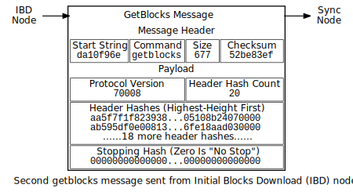

```{eval-rst}
.. meta::
  :title: Initial Block Download
  :description: Initial block download (IBD) is the process where a full node downloads and validates all Dimecoin blocks from the genesis block to the latest one to confirm transactions and recent blocks.
```

> ***We put our best effort into covering all topics related to Dimecoin. Each section will cover a different category. Not all documentation may be 100% accurate, if you spot an error, please report it or submit a PR request on GitHub.***
>
> ***REMINDER: This documentation is always evolving. If you have not been here for a while, perhaps check again. Things may have been added or updated since your last visit!***

## Initial Block Download

Before a full [node](../reference/glossary.md#node) can validate unconfirmed transactions and recently-mined [blocks](../reference/glossary.md#block), it must download and validate all blocks from block 1 (the block after the hardcoded [genesis block](../reference/glossary.md#genesis-block)) to the current tip of the best [blockchain](../reference/glossary.md#blockchain). This is the [initial block download](../reference/glossary.md#initial-block-download) (IBD) or initial sync.

Although the word "initial" implies this method is only used once, it can also be used any time a large number of blocks need to be downloaded, such as when a previously-caught-up node has been offline for a long time. In this case, a node can use the IBD method to download all the blocks which were produced since the last time it was online.

Dimecoin Core uses the IBD method any time the last block on its local best blockchain has a [block header](../reference/glossary.md#block-header) time more than 24 hours in the past. Dimecoin Core will also perform IBD if its local best blockchain is more than 144 blocks lower than its local best [header chain](../reference/glossary.md#header-chain) (that is, the local blockchain is more than about 6 hours in the past).

### Blocks-First

Dimecoin Core (up until version 2.0.0.0) uses a simple initial block download (IBD) method we'll call *blocks-first*. The goal is to download the blocks from the best blockchain in sequence.


The first time a node is started, it only has a single block in its local best blockchain---the hardcoded genesis block (block 0).  This node chooses a remote [peer](../reference/glossary.md#peer), called a sync node, and sends it the [`getblocks` message](../reference/p2p-network.md#getblocks) illustrated below.


In the header hashes field of the [`getblocks` message](../reference/p2p-network.md#getblocks), this new node sends the header hash of the only block it has, the genesis block (`da10f96...0000` in [internal byte order](../reference/glossary.md#internal-byte-order)).  It also sets the stop hash field to all zeroes to request a maximum-size response.

Upon receipt of the [`getblocks` message](../reference/p2p-network.md#getblocks), the sync node takes the first (and only) header hash and searches its local best blockchain for a block with that header hash. It finds that block 0 matches, so it replies with 500 block [inventories](../reference/glossary.md#inventory) (the maximum response to a [`getblocks` message](../reference/p2p-network.md#getblocks)) starting from block 1. It sends these inventories in the [`inv` message](../reference/p2p-network.md#inv) illustrated below.


Inventories are unique identifiers for information on the [network](../reference/glossary.md#network). Each inventory contains a type field and the unique identifier for an instance of the object. For blocks, the unique identifier is a hash of the block's header.

The block inventories appear in the [`inv` message](../reference/p2p-network.md#inv) in the same order they appear in the blockchain, so this first [`inv` message](../reference/p2p-network.md#inv) contains inventories for blocks 1 through 501. (For example, the hash of block 1 is `4343...0000` in the illustration above.)

The IBD node uses the received inventories to request 128 blocks from the sync node in the [`getdata` message](../reference/p2p-network.md#getdata) illustrated below.


It's important to [blocks-first](../reference/glossary.md#blocks-first-sync) nodes that the blocks be requested and sent in order because each block header references the header hash of the preceding block. That means the IBD node can't fully validate a block until its parent block has been received. Blocks that can't be validated because their parents haven't been received are called [orphan blocks](../reference/glossary.md#orphan-block); a subsection below describes them in more detail.

Upon receipt of the [`getdata` message](../reference/p2p-network.md#getdata), the sync node replies with each of the blocks requested. Each block is put into [serialized block](../reference/glossary.md#serialized-block) format and sent in a separate [`block` message](../reference/p2p-network.md#block). The first [`block` message](../reference/p2p-network.md#block) sent (for block 1) is illustrated below.


The IBD node downloads each block, validates it, and then requests the next block it hasn't requested yet, maintaining a queue of up to 128 blocks to download. When it has requested every block for which it has an inventory, it sends another [`getblocks` message](../reference/p2p-network.md#getblocks) to the sync node requesting the inventories of up to 500 more blocks. This second [`getblocks` message](../reference/p2p-network.md#getblocks) contains multiple header hashes as illustrated below:



Upon receipt of the second [`getblocks` message](../reference/p2p-network.md#getblocks), the sync node searches its local best blockchain for a block that matches one of the header hashes in the message, trying each hash in the order they were received. If it finds a matching hash, it replies with 500 block inventories starting with the next block from that point. But if there is no matching hash (besides the stopping hash), it assumes the only block the two nodes have in common is block 0 and so it sends an `inv` starting with block 1 (the same [`inv` message](../reference/p2p-network.md#inv) seen several illustrations above).

This repeated search allows the sync node to send useful inventories even if the IBD node's local blockchain forked from the sync node's local blockchain. This [fork](../reference/glossary.md#fork) detection becomes increasingly useful the closer the IBD node gets to the tip of the blockchain.

When the IBD node receives the second [`inv` message](../reference/p2p-network.md#inv), it will request those blocks using [`getdata` messages](../reference/p2p-network.md#getdata).  The sync node will respond with [`block` messages](../reference/p2p-network.md#block). Then the IBD node will request more inventories with another [`getblocks` message](../reference/p2p-network.md#getblocks)---and the cycle will repeat until the IBD node is synced to the tip of the blockchain.  At that point, the node will accept blocks sent through the regular block broadcasting described in a later subsection.

#### Blocks-First Advantages & Disadvantages

The primary advantage of [blocks-first](../reference/glossary.md#blocks-first-sync) [IBD](../reference/glossary.md#initial-block-download) is its simplicity. The primary disadvantage is that the IBD node relies on a single sync node for all of its downloading. This has several implications:

* **Speed Limits:** All requests are made to the sync node, so if the sync node has limited upload bandwidth, the IBD node will have slow download speeds.  Note: if the sync node goes offline, Dimecoin Core will continue downloading from another node---but it will still only download from a single sync node at a time.

* **Download Restarts:** The sync node can send a non-best (but otherwise valid) blockchain to the IBD node. The IBD node won't be able to identify it as non-best until the initial block download nears completion, forcing the IBD node to restart its blockchain download over again from a different node. Dimecoin Core ships with several blockchain checkpoints at various block heights selected by developers to help an IBD node detect that it is being fed an alternative blockchain history---allowing the IBD node to restart its download earlier in the process.

* **Disk Fill Attacks:** Closely related to the download restarts, if the sync node sends a non-best (but otherwise valid) blockchain, the chain will be stored on disk, wasting space and possibly filling up the disk drive with useless data.

* **High Memory Use:** Whether maliciously or by accident, the sync node can send blocks out of order, creating orphan blocks which can't be validated until their parents have been received and validated. Orphan blocks are stored in memory while they await validation, which may lead to high memory use.

All of these problems are addressed in part or in full by the headers-first IBD method used since Dimecoin Core 2.0.0.0.

```{admonitoin} Resources
The table below summarizes the messages mentioned throughout this subsection. The links in the message field will take you to the reference page for that message.

| **Message** | [getblocks message](../reference/p2p-network.md#getblocks) | [inv message](../reference/p2p-network.md#inv)                             | [getdata message](../reference/p2p-network.md#getdata)  | [block message](../reference/p2p-network.md#block)
| --- | --- | --- | --- | --- |
| **From→To** | IBD→Sync                         | Sync→IBD                                         | IBD→Sync                      | Sync→IBD
| **Payload** | One or more header hashes        | Up to 500 block inventories (unique identifiers) | One or more block inventories | One serialized block
```

### Headers-First

Dimecoin Core 2.0.0.0+ uses an [initial block download](../reference/glossary.md#initial-block-download) (IBD) method called *[headers-first](../reference/glossary.md#headers-first-sync)*. The goal is to download the [headers](../reference/glossary.md#header) for the best [header chain](../reference/glossary.md#header-chain), partially validate them as best as possible, and then download the corresponding [blocks](../reference/glossary.md#block) in parallel.  This solves several problems with the older [blocks-first](../reference/glossary.md#blocks-first-sync) IBD method.


The first time a node is started, it only has a single block in its local best blockchain---the hardcoded [genesis block](../reference/glossary.md#genesis-block) (block 0).  The node chooses a remote [peer](../reference/glossary.md#peer), which we'll call the sync node, and sends it the [`getheaders` message](../reference/p2p-network.md#getheaders) illustrated below.


In the header hashes field of the [`getheaders` message](../reference/p2p-network.md#getheaders), the new node sends the header hash of the only block it has, the genesis block (`da10f9...0000` in internal byte order).  It also sets the stop hash field to all zeroes to request a maximum-size response.

Upon receipt of the [`getheaders` message](../reference/p2p-network.md#getheaders), the sync node takes the first (and only) header hash and searches its local best blockchain for a block with that header hash. It finds that block 0 matches, so it replies with 2,000 header (the maximum response) starting from block 1. It sends these header hashes in the [`headers` message](../reference/p2p-network.md#headers) illustrated below.


The [IBD](../reference/glossary.md#initial-block-download) [node](../reference/glossary.md#node) can partially validate these block headers by ensuring that all fields follow [consensus rules](../reference/glossary.md#consensus-rules) and that the hash of the header is below the [target threshold](../reference/glossary.md#target) according to the nBits field.  (Full validation still requires all transactions from the corresponding block.)

After the IBD node has partially validated the block headers, it can do two things in parallel:

1. **Download More Headers:** the IBD node can send another [`getheaders` message](../reference/p2p-network.md#getheaders) to the sync node to request the next 2,000 headers on the best header chain. Those headers can be immediately validated and another batch requested repeatedly until a [`headers` message](../reference/p2p-network.md#headers) is received from the sync node with fewer than 2,000 headers, indicating that it has no more headers to offer. A [headers](../reference/glossary.md#header) sync for 1 million blocks can be completed in 500 round trips, or about 80 MB of downloaded data.

    Once the IBD node receives a [`headers` message](../reference/p2p-network.md#headers) with fewer than 2,000 headers from the sync node, it sends a [`getheaders` message](../reference/p2p-network.md#getheaders) to each of its outbound peers to get their view of best header chain. By comparing the responses, it can easily determine if the headers it has downloaded belong to the best header chain reported by any of its outbound peers. This means a dishonest sync node will quickly be discovered even if checkpoints aren't used (as long as the IBD node connects to at least one honest peer; Dimecoin Core will continue to provide checkpoints in case honest peers can't be found).

2. **Download Blocks:** While the IBD node continues downloading headers, and after the headers finish downloading, the IBD node will request and download each [block](../reference/glossary.md#block). The IBD node can use the block header hashes it computed from the header chain to create [`getdata` messages](../reference/p2p-network.md#getdata) that request the blocks it needs by their [inventory](../reference/glossary.md#inventory). It doesn't need to request these from the sync node---it can request them from any of its full node [peers](../reference/glossary.md#peer). (Although not all full nodes may store all blocks.) This allows it to fetch blocks in parallel and avoid having its download speed constrained to the upload speed of a single sync node.

    To spread the load between multiple peers, Dimecoin Core will only request up to 16 blocks at a time from a single peer. Combined with its maximum of 8 outbound connections, this means Dimecoin Core using headers-first will request a maximum of 128 blocks simultaneously during IBD (the same maximum number that blocks-first Dimecoin Core requested from its sync node).


Dimecoin Core's headers-first mode uses a 1,024-block moving download window to maximize download speed. The lowest-height block in the window is the next block to be validated; if the block hasn't arrived by the time Dimecoin Core is ready to validate it, Dimecoin Core will wait a minimum of two more seconds for the stalling node to send the block. If the block still hasn't arrived, Dimecoin Core will disconnect from the stalling node and attempt to connect to another node. For example, in the illustration above, Node A will be disconnected if it doesn't send block 3 within at least two seconds.

Once the IBD node is synced to the tip of the blockchain, it will accept blocks sent through the regular block broadcasting described in a later subsection.

```{admonitoin} Resources
The table below summarizes the messages mentioned throughout this subsection. The links in the message field will take you to the reference page for that message.

| **Message** | [getheaders message](../reference/p2p-network.md#getheaders) | [headers message](../reference/p2p-network.md#headers) | [getdata message](../reference/p2p-network.md#getdata)                             | [block message](../reference/p2p-network.md#block)
| --- | --- | --- | --- | --- |
| **From→To** | IBD→Sync                           | Sync→IBD                     | IBD→*Many*                                               | *Many*→IBD
| **Payload** | One or more header hashes          | Up to 2,000 block headers    | One or more block inventories derived from header hashes | One serialized block
```
