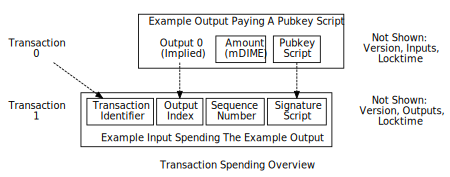
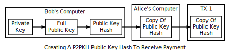
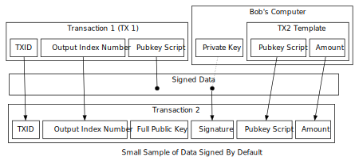

```{eval-rst}
.. meta::
  :title: Dimecoin Transactions
  :description: Transactions in Dimecoin facilitate the transfer of dimecoins or DIME, allowing for either straightforward payments or more complex operations.
```

> ***We put our best effort into covering all topics related to Dimecoin. Each section will cover a different category. Not all documentation may be 100% accurate, if you spot an error, please report it or submit a PR request on GitHub.***
>
> ***REMINDER: This documentation is always evolving. If you have not been here for a while, perhaps check again. Things may have been added or updated since your last visit!***

## Transactions

Transactions let users spend dimecoins. Each [transaction](../reference/glossary.md#transaction) is constructed out of several parts which enable both simple direct payments and complex transactions. This section will describe each part and demonstrate how to use them together to build complete transactions.

To keep things simple, this section pretends coinbase transactions do not exist. Coinbase transactions can only be created by Dimecoin validators and they're an exception to many of the rules listed below. Instead of pointing out the coinbase exception to each rule, we invite you to read about coinbase transactions in the [blockchain](../reference/glossary.md#blockchain) [section](../guide/blockchain-overview.md) of this guide.


The figure above shows the main parts of a Dimecoin transaction. Each transaction has at least one [input](../reference/glossary.md#input) and one [output](../reference/glossary.md#output). Each [input](../reference/glossary.md#input) spends the dimecoins paid to a previous output. Each [output](../reference/glossary.md#output) remains as an Unspent Transaction Output (UTXO) until it is utilized by a future input. When your Dimecoin wallet tells you that you have a 10,000 DIME balance, it really means that you have 10,000 DIME waiting in one or more UTXOs.

Each transaction is prefixed by a four-byte [transaction version number](../reference/glossary.md#transaction-version-number), which tells Dimecoin [peers](../reference/glossary.md#peer) and validators which set of rules to use to validate it. This lets developers create new rules for future transactions without invalidating previous transactions.



An output has an implied [index](../reference/glossary.md#index) number based on its location in the transaction---the index of the first output is zero. The output also has an amount in dimecoins which it pays to a conditional [pubkey script](../reference/glossary.md#pubkey-script). Anyone who can satisfy the conditions of that pubkey script can spend up to the amount of dimecoins paid to it.

An input uses a transaction identifier ([TXID](../reference/glossary.md#transaction-identifiers)) and an output index number (often called "vout" for output vector) to identify a particular output to be spent. It also has a signature script which allows it to provide data parameters that satisfy the conditionals in the pubkey script. (The sequence number and locktime are related and will be covered together in a later subsection.)

The diagrams below demonstrate the utilization of these features through a workflow example, where Alice sends a transaction to Bob, and later, Bob uses that transaction. Both Alice and Bob will use the most common form of the standard Pay-To-Public-Key-Hash (P2PKH) transaction type. [P2PKH](../reference/glossary.md#pay-to-pubkey-hash) lets Alice spend dimecoins to a typical DIME [address](../reference/glossary.md#address), and then lets Bob further spend those dimecoins using a simple cryptographic key pair.



Bob must first generate a private/public [key pair](../reference/glossary.md#key-pair) before Alice can create the first transaction. Dimecoin uses the Elliptic Curve Digital Signature Algorithm (ECDSA) with the secp256k1 curve; secp256k1 [private keys](../reference/glossary.md#private-key) are 256 bits of random data. A copy of that data is deterministically transformed into an secp256k1 [public key](../reference/glossary.md#public-key). Since the transformation can be consistently replicated later, there's no need to store the public key.

The [public key](../reference/glossary.md#public-key) (pubkey) is then cryptographically hashed. This pubkey hash can also be reliably repeated later, so it also does not need to be stored. The hash shortens and obfuscates the public key, making manual transcription easier and providing security against unanticipated problems which might allow reconstruction of [private keys](../reference/glossary.md#private-key) from public key data at some later point.

Bob provides the pubkey hash to Alice. Pubkey hashes are almost always sent encoded as a DIME [address](../reference/glossary.md#address), which is a [base58](../reference/glossary.md#base58)-encoded string containing an address version number, the hash, and an error-detection checksum to catch typos. The address can be shared via any communication channel, even through one-way mediums that don't allow the sender to communicate back with the recipient. Additionally, it can be converted into different formats, like a QR code embedding a dimecoin: URI.

Once Alice has the address and decodes it back into a standard hash, she can create the first transaction. She creates a standard [P2PKH](../reference/glossary.md#pay-to-pubkey-hash) transaction output containing instructions which allow anyone to spend that output if they can prove they control the private key corresponding to Bob's hashed public key. These instructions are called the [pubkey script](../reference/glossary.md#pubkey-script)
or scriptPubKey.

Alice broadcasts the transaction and it is added to the blockchain. The [network](../reference/glossary.md#network) categorizes it as an Unspent Transaction Output (UTXO), and Bob's wallet software displays it as a spendable balance.

When, some time later, Bob decides to spend the UTXO, he must create an input which references the transaction Alice created by its hash, called a Transaction Identifier (txid), and the specific output she used by its index number ([output index](../reference/glossary.md#output-index)). He must then create a [signature script](../reference/glossary.md#signature-script)---a collection of data parameters which satisfy the conditions Alice placed in the previous output's pubkey script.  [Signature scripts](../reference/glossary.md#signature-script) are also called scriptSigs.

Pubkey scripts and signature scripts combine secp256k1 pubkeys and [signatures](../reference/glossary.md#signature) with conditional logic, creating a programmable authorization mechanism.


For a P2PKH-style output, Bob's signature script will contain the following two pieces of data:

1. His full (unhashed) public key, so the pubkey script can check that it hashes to the same value as the pubkey hash provided by Alice.

2. An secp256k1 [signature](../reference/glossary.md#signature) made by using the ECDSA cryptographic formula to combine certain transaction data (described below) with Bob's private key. This lets the pubkey script verify that Bob owns the private key which created the public key.

Bob's secp256k1 signature doesn't just prove Bob controls his private key; it also makes the non-signature-script parts of his transaction tamper-proof so Bob can safely broadcast them over the peer-to-peer network.



As illustrated in the figure above, the data Bob signs includes the txid and output index of the previous transaction, the previous output's pubkey script, the pubkey script Bob creates which will let the next recipient spend this transaction's output, and the amount of dimecoins to spend to the next recipient. In essence, the entire transaction is signed except for any signature scripts, which hold the full public keys and secp256k1 signatures.

After putting his signature and public key in the signature script, Bob broadcasts the transaction to Dimecion validators through the peer-to-peer network. Each peer and miner/staker independently validates the transaction before broadcasting it further or attempting to include it in a new block of transactions.
