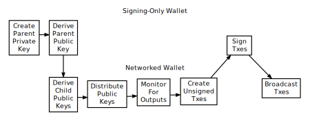
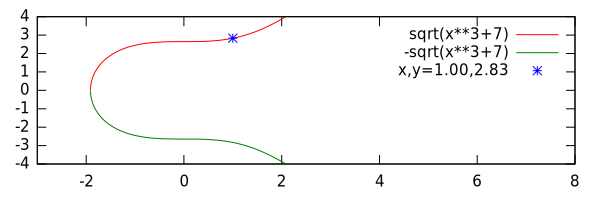
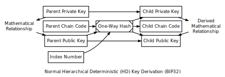
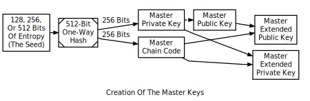
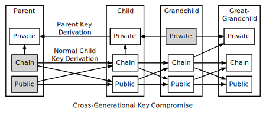
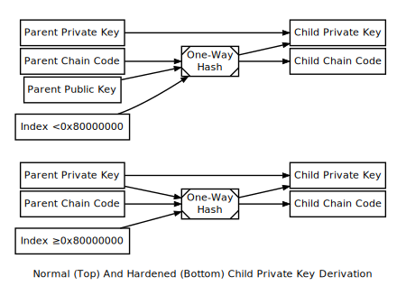

```{eval-rst}
.. meta::
  :title: Dimecoin Wallets
  :description: Dimecoin wallet refers to either a wallet program or a wallet file used for creating and managing public and private keys for Dimecoin transactions.
```

> ***We put our best effort into covering all topics related to Dimecoin. Each section will cover a different category. Not all documentation may be 100% accurate, if you spot an error, please report it or submit a PR request on GitHub.***
>
> ***REMINDER: This documentation is always evolving. If you have not been here for a while, perhaps check again. Things may have been added or updated since your last visit!***

## Wallets

A Dimecoin [wallet](../resources/glossary.md#wallet) can refer to either a wallet program or a wallet file. Wallet programs create [public keys](../resources/glossary.md#public-key) to receive dimecoins and use the corresponding [private keys](../resources/glossary.md#private-key) to spend those dimecoins. Wallet files store private keys and (optionally) other information related to [transactions](../resources/glossary.md#transaction) for the wallet program.

Wallet programs and wallet files are addressed below in separate subsections, and this document attempts to always make it clear whether we're talking about wallet programs or wallet files.

## Wallet Programs

Permitting receiving and spending of [dimecoins](../resources/glossary.md#dimecoins) is the only essential feature of [wallet](../resources/glossary.md#wallet) software---but a particular wallet program doesn't need to do both things.  Two wallet programs can work together, one program distributing [public keys](../resources/glossary.md#public-key) in order to receive dimecoins and another program signing [transactions](../resources/glossary.md#transaction) spending those dimecoins.

Wallet programs also need to interact with the peer-to-peer [network](../resources/glossary.md#network) to get information from the [blockchain](../resources/glossary.md#blockchain) and to broadcast new transactions. However, the programs which distribute public keys or sign transactions don't need to interact with the peer-to-peer network themselves.

This leaves us with three necessary, but separable, parts of a wallet system: a public key distribution program, a signing program, and a networked program.  In the subsections below, we will describe common combinations of these parts.

```{note}
We speak about distributing public keys generically. In many cases, P2PKH or P2SH hashes will be distributed instead of public keys, with the actual public keys only being distributed when the outputs they control are spent.a
```

### Full-Service Wallets

The simplest wallet is a program which performs all three functions: it generates [private keys](../resources/glossary.md#private-key), derives the corresponding [public keys](../resources/glossary.md#public-key), helps distribute those public keys as necessary, monitors for outputs spent to those public keys, creates and signs transactions spending those outputs, and broadcasts the signed transactions.


As of this writing, almost all popular wallets can be used as full-service wallets.

The main advantage of full-service wallets is that they are easy to use. A single program does everything the user needs to receive and spend dimecoins.

The main disadvantage of full-service wallets is that they store the private keys on a device connected to the Internet. The compromise of such devices is common, and an Internet connection makes it easy to transmit private keys from a compromised device to an attacker.

Many wallet programs offer users the option of encrypting the wallet files containing the private keys to help protect against theft. This protects the private keys when they aren't being used, but it cannot protect against an attack designed to capture the encryption key or read the decrypted keys from memory.

### Signing-Only Wallets

To increase security, private keys can be generated and stored by a separate wallet program operating in a more secure environment. These signing-only wallets work with a networked wallet that interacts with the peer-to-peer network.

Signing-only wallets programs typically use deterministic key creation (described in a [later subsection](../guide/wallets-wallet-files.md#hierarchical-deterministic-key-creation)) to create parent private and public keys which can create child private and public keys.



When first run, the signing-only wallet creates a [parent private key](../resources/glossary.md#parent-private-key) and transfers the corresponding [parent public key](../resources/glossary.md#parent-public-key) to the networked wallet.

The networked wallet uses the parent public key to derive each [child public key](../resources/glossary.md#child-public-key), optionally helps distribute them, monitors for outputs spent to those public keys, creates unsigned transactions spending those outputs, and transfers the unsigned transactions to the signing-only wallet.

Often, users are given a chance to review the unsigned transactions' details (particularly the output details) using the signing-only wallet.

After the optional review step, the signing-only wallet uses the parent private key to derive each appropriate [child private key](../resources/glossary.md#child-private-key) and signs the transactions, giving the signed transactions back to the networked wallet.

The networked wallet then broadcasts the signed transactions to the peer-to-peer [network](../resources/glossary.md#network).

The following subsections describe the two most common variants of signing-only wallets: offline wallets and hardware wallets.

#### Offline Wallets

Several full-service wallet programs will also operate as two separate wallets: one program instance acting as a signing-only wallet (often called an "offline wallet") and the other program instance acting as the networked wallet (often called an "online wallet" or "watching-only wallet").

The offline wallet is so named because it is intended to be run on a device that does not connect to any network, significantly reducing the number of attack vectors. If this is the case, it is usually up to the user to handle all data transfers using removable media such as USB drives. The user's workflow is something like:

1. (Offline) Turn off all network connections on a device and install the wallet software. Start the wallet software offline to create the parent private and public keys. Copy the parent public key to removable media.

2. (Online) Install the wallet software on another device connected to the Internet and import the parent public key from the removable media. As you would with a full-service wallet, distribute public keys to receive payment. When ready to spend dimecoins, fill in the output details and save the unsigned transaction generated by the wallet to removable media.

3. (Offline) Open the unsigned transaction in the offline instance, review the output details, and make sure the user spent the correct amount to the correct address. This prevents malware on the online wallet from tricking the user into signing a transaction that pays an attacker. After review, sign the transaction and save it to removable media.

4. (Online) Open the signed transaction in the online instance so it can broadcast it to the peer-to-peer network.

The primary advantage of offline wallets is their possibility for greatly improved security over full-service wallets. If the offline wallet is not compromised (or flawed) and the user reviews all outgoing transactions before signing, the user's dimecoins are safe even if the online wallet is compromised.

The primary disadvantage of offline wallets is hassle. They require the user to dedicate a device to only offline tasks for maximum security. The offline device must be booted up whenever funds are to be spent, and the user must physically copy data from the online device to the offline device and back.

#### Hardware Wallets

Hardware wallets are devices dedicated to running a signing-only wallet. Their dedication lets them eliminate many of the vulnerabilities in operating systems designed for general use, allowing them to safely communicate directly with other devices so users don't need to transfer data manually. The user's workflow is something like:

1. (Hardware) Create parent private and public keys. Connect hardware wallet to a networked device so it can get the parent public key.

2. (Networked) Distribute public keys to receive payment as you would with a full-service wallet. When ready to spend dimecoins, fill in the transaction details, connect the hardware wallet, and click Spend. The networked wallet will automatically send the transaction details to the hardware wallet.

3. (Hardware) Review the transaction details on the hardware wallet's screen. Some hardware wallets may prompt for a passphrase or PIN. The hardware wallet signs the transaction and uploads it to the networked wallet.

4. (Networked) The networked wallet receives the signed transaction from the hardware wallet and broadcasts it to the network.

The primary advantage of hardware wallets is their possibility for greatly improved security over full-service wallets with much less hassle than offline wallets.

The primary disadvantage of hardware wallets is their hassle. Even though the hassle is less than that of offline wallets, the user must still purchase a hardware wallet device and carry it with them whenever they need to make a transaction using the signing-only wallet. An additional disadvantage is that not all wallet programs support hardware wallets.

### Distributing-Only Wallets

Wallet programs that run in difficult-to-secure environments, such as web servers, can be designed to distribute public keys (including P2PKH or P2SH addresses) and nothing more.  There are two common ways to design these minimalist wallets:


* Pre-populate a database with a number of public keys or addresses, and then distribute on request a pubkey script or address using one of the database entries. To [avoid key reuse](../guide/transactions-avoiding-key-reuse.md), webservers should keep track of used keys and never run out of public keys. This can be made easier by using parent public keys as suggested in the next method.

* Use a parent public key to create child public keys. To avoid key reuse, a method must be used to ensure the same public key is distributed only once. This can be a database entry for each key distributed or an incrementing pointer to the key index number.

Neither method adds significant overhead, mainly if a database associates each incoming payment with a separate public key for payment tracking.

## Wallet Files

Dimecoin wallets at their core are a collection of [private keys](../resources/glossary.md#private-key). These collections are stored digitally in a file, or can even be physically stored on pieces of paper.

### Private Key Formats

Private keys are what are used to unlock [dimecoins](../resources/glossary.md#dimecoins) from a particular [address](../resources/glossary.md#address). In Dimecoin, a private key in standard format is simply a 256-bit number, between the values:

`0x01` and `0xFFFF FFFF FFFF FFFF FFFF FFFF FFFF FFFE BAAE DCE6 AF48 A03B BFD2 5E8C D036 4140`, representing nearly the entire range of 2<sup>256</sup>-1 values. The range is governed by the secp256k1 ECDSA encryption standard used by Dimecoin.

#### Wallet Import Format (WIF)

In order to make copying of private keys less prone to error, [Wallet Import Format](../resources/glossary.md#wallet-import-format) may be utilized. WIF uses [base58check](../resources/glossary.md#base58check) encoding on a private key, greatly decreasing the chance of copying error, much like standard Dimecoin [addresses](../resources/glossary.md#address).

1. Take a private key.

2. Add a `0xCC` byte in front of it for [mainnet](../resources/glossary.md#mainnet) addresses or `0xEF` for [testnet](../resources/glossary.md#testnet) addresses.

3. Append a `0x01` byte after it if it should be used with compressed public keys (described in a later subsection). Nothing is appended if it is used with uncompressed public keys.

4. Perform a SHA-256 hash on the [extended key](../resources/glossary.md#extended-key).

5. Perform a SHA-256 hash on result of SHA-256 hash.

6. Take the first four bytes of the second SHA-256 hash; this is the checksum.

7. Add the four checksum bytes from point 5 at the end of the extended key from point 2.

8. Convert the result from a byte string into a Base58 string using Base58Check encoding.

The process is easily reversible, using the Base58 decoding function, and removing the padding.

#### Mini Private Key Format

Mini private key format is a method for encoding a private key in under 30 characters, enabling keys to be embedded in a small physical space and more damage-resistant QR codes.

1. The first character of mini keys is '`S`'.

2. In order to determine if a mini private key is well-formatted, a question mark is added to the private key.

3. The SHA256 hash is calculated. If the first byte produced is a `00`, it is well-formatted. This key restriction acts as a typo-checking mechanism. A user brute forces the process using random numbers until a well-formatted mini private key is produced.

4. In order to derive the full private key, the user simply takes a single SHA256 hash of the original mini private key. This process is one-way: it is intractable to compute the mini private key format from the derived key.

Many implementations disallow the character '1' in the mini private key due to its visual similarity to 'l'.

```{admonition} Resource
A common tool to create and redeem these keys is the [Casascius Bitcoin Address Utility](https://github.com/casascius/Bitcoin-Address-Utility). Note: this tool is no longer actively developed.
```

### Public Key Formats

Dimecoin ECDSA public keys represent a point on a particular Elliptic Curve (EC) defined in secp256k1. In their traditional uncompressed form, public keys contain an identification byte, a 32-byte X coordinate, and a 32-byte Y coordinate. The extremely simplified illustration below shows such a point on the elliptic curve used by Dimecoin, y<sup>2</sup>&nbsp;=&nbsp;x<sup>3</sup>&nbsp;+&nbsp;7, over a field of contiguous numbers.



(Secp256k1 actually modulos coordinates by a large prime, which produces a field of non-contiguous integers and a significantly less clear plot, although the principles are the same.)

An almost 50% reduction in [public key](../resources/glossary.md#public-key) size can be realized without changing any fundamentals by dropping the Y coordinate. This is possible because only two points along the curve share any particular X coordinate, so the 32-byte Y coordinate can be replaced with a single bit indicating whether the point is on what appears in the illustration as the "top" side or the "bottom" side.

No data is lost by creating a [compressed public key](../resources/glossary.md#compressed-public-key)---only a small amount of CPU is necessary to reconstruct the Y coordinate and access the uncompressed public key. Both uncompressed and compressed public keys are described in official secp256k1 documentation and supported by default in the widely-used OpenSSL library.

Since they are easy to use, and because they reduce almost by half the [blockchain](../resources/glossary.md#block-chain) space used to store public keys for every spent [output](../resources/glossary.md#output), compressed public keys are the default in Dimecoin Core and are the recommended default for all Dimecoin software.

However, Bitcoin Core prior to 0.6 used uncompressed keys.  This creates a few complications, as the hashed form of an uncompressed key is different than the hashed form of a compressed key, so the same key works with two different [P2PKH](../resources/glossary.md#pay-to-pubkey-hash) addresses. This also means that the key must be submitted in the correct format in the [signature script](../resources/glossary.md#signature-script) so it matches the hash in the previous output's pubkey script.

For this reason, Bitcoin Core (and Dimecoin Core) uses several different identifier bytes to help programs identify how keys should be used:

* Private keys meant to be used with compressed public keys have 0x01 appended to them before being Base-58 encoded. (See the private key encoding section above.)

* Uncompressed public keys start with 0x04; compressed public keys begin with 0x03 or 0x02 depending on whether they're greater or less than the midpoint of the curve.  These prefix bytes are all used in official secp256k1 documentation.

### Hierarchical Deterministic Key Creation

The hierarchical deterministic key creation and transfer protocol ([HD protocol](../resources/glossary.md#bip32)) greatly simplifies wallet backups, eliminates the need for repeated communication between multiple programs using the same wallet, permits the creation of child accounts which can operate independently, gives each parent account the ability to monitor or control its children even if the child account is compromised, and divides each account into full-access and restricted-access parts so untrusted users or programs can be allowed to receive or monitor payments without being able to spend them.

The HD protocol takes advantage of the ECDSA public key creation function, [point()](../resources/glossary.md#point-function), which takes a large integer (the private key) and turns it into a graph point (the public key):

```text
point(private_key) == public_key
```

Due to the way `point()` works, it's possible to create a [child public key](../resources/glossary.md#child-public-key) by combining an existing [parent public key](../resources/glossary.md#parent-public-key) with another public key created from any integer (*i*) value. This child public key is the same public key which would be created by the `point()` function if you added the *i* value to the original (parent) private key and then found the remainder of that sum divided by a global constant used by all Dimecoin software (*p*):

```text
point( (parent_private_key + i) % p ) == parent_public_key + point(i)
```

This means that two or more independent programs which agree on a sequence of integers can create a series of unique [child key](../resources/glossary.md#child-key) pairs from a single [parent key](../resources/glossary.md#parent-key) pair without any further communication. Moreover, the program which distributes new public keys for receiving payment can do so without any access to the private keys, allowing the public key distribution program to run on a possibly-insecure platform such as a public web server.

Child public keys can also create their own child public keys (grandchild public keys) by repeating the child key derivation operations:

```text
point( (child_private_key + i) % p ) == child_public_key + point(i)
```

Whether creating child public keys or further-descended public keys, a predictable sequence of integer values would be no better than using a single public key for all transactions, as anyone who knew one child public key could find all of the other child public keys created from the same parent public key. Instead, a random seed can be used to deterministically generate the sequence of integer values so that the relationship between the child public keys is invisible to anyone without that seed.

The HD protocol uses a single [root seed](../resources/glossary.md#root-seed) to create a hierarchy of child, grandchild, and other descended keys with unlinkable deterministically-generated integer values. Each child key also gets a deterministically-generated seed from its parent, called a [chain code](../resources/glossary.md#chain-code), so the compromising of one chain code doesn't necessarily compromise the integer sequence for the whole hierarchy, allowing the [master chain code](../resources/glossary.md#master-chain-code-and-private-key) to continue being useful even if, for example, a web-based public key distribution program gets hacked.



As illustrated above, HD key derivation takes four inputs:

* The *[parent private key](../resources/glossary.md#parent-private-key)* and *[parent public key](../resources/glossary.md#parent-public-key)* are regular uncompressed 256-bit ECDSA keys.

* The [parent chain code](../resources/glossary.md#parent-chain-code) is 256 bits of seemingly-random data.

* The [index](../resources/glossary.md#index) number is a 32-bit integer specified by the program.

In the normal form shown in the above illustration, the [parent chain code](../resources/glossary.md#parent-chain-code), the parent public key, and the index number are fed into a one-way cryptographic hash ([HMAC-SHA512](https://en.wikipedia.org/wiki/HMAC)) to produce 512 bits of deterministically-generated-but-seemingly-random data. The seemingly-random 256 bits on the right-hand side of the hash output are used as a new child chain code. The seemingly-random 256 bits on the left-hand side of the hash output are used as the integer value to be combined with either the parent private key or parent public key to, respectively, create either a child private key or child public key:

```text
child_private_key == (parent_private_key + lefthand_hash_output) % G 
child_public_key == point( (parent_private_key + lefthand_hash_output) % G ) 
child_public_key == point(child_private_key) == parent_public_key + point(lefthand_hash_output)
```

Specifying different index numbers will create different unlinkable child keys from the same parent keys.  Repeating the procedure for the child keys using the child chain code will create unlinkable grandchild keys.

Since creating child keys requires both a key and a chain code, the key and chain code together are called the [extended key](../resources/glossary.md#extended-key). An [extended private key](../resources/glossary.md#extended-private-key) and its corresponding [extended public key](../resources/glossary.md#extended-public-key) have the same chain code. The (top-level parent) [master private key](../resources/glossary.md#master-private-key) and master chain code are derived from random data, as illustrated below.



A [root seed](../resources/glossary.md#root-seed) is created from either 128 bits, 256 bits, or 512 bits of random data. This root seed of as little as 128 bits is the the only data the user needs to backup in order to derive every key created by a particular wallet program using particular settings.

```{admonitoin} HD Wallet Compatibility Warning
HD wallet programs are not always fully compatible, so users must only use the same HD wallet program with the same HD-related settings for a particular root seed.
```

The root seed is hashed to create 512 bits of seemingly-random data, from which the master private key and master chain code are created (together, the master extended private key). The master public key is derived from the master private key using `point()`, which, together with the master chain code, is the master extended public key. The master extended keys are functionally equivalent to other extended keys; it is only their location at the top of the hierarchy which makes them special.

#### Hardened Keys

Hardened extended keys fix a potential problem with normal extended keys. If an attacker gets a normal parent chain code and parent public key, he can brute-force all chain codes deriving from it. If the attacker also obtains a child, grandchild, or further-descended private key, he can use the chain code to generate all of the extended private keys descending from that private key, as shown in the grandchild and great-grandchild generations of the illustration below.



Perhaps worse, the attacker can reverse the normal [child private key](../resources/glossary.md#child-private-key) derivation formula and subtract a [parent chain code](../resources/glossary.md#parent-chain-code) from a child private key to recover the [parent private key](../resources/glossary.md#parent-private-key), as shown in the child and parent generations of the illustration above.  This means an attacker who acquires an [extended public key](../resources/glossary.md#extended-public-key) and any private key descended from it can recover that public key's private key and all keys descended from it.

For this reason, the [chain code](../resources/glossary.md#chain-code) part of an extended public key should be better secured than standard public keys and users should be advised against exporting even non-extended private keys to possibly-untrustworthy environments.

This can be fixed, with some tradeoffs, by replacing the the normal key derivation formula with a hardened key derivation formula.

The normal key derivation formula, described in the section above, combines together the index number, the parent chain code, and the parent public key to create the child chain code and the integer value which is combined with the parent private key to create the child private key.



The hardened formula, illustrated above, combines together the index number, the parent chain code, and the parent private key to create the data used to generate the child chain code and child private key. This formula makes it impossible to create child public keys without knowing the parent private key. In other words, parent extended public keys can't create hardened child public keys.

As a result, a [hardened extended private key](../resources/glossary.md#hardened-extended-private-key) is much less helpful than a regular extended private key---however, hardened extended private keys create a firewall through which multi-level key derivation compromises cannot happen. Since hardened child-extended public keys cannot generate grandchild chain codes on their own, the compromise of a parent-extended public key cannot be combined with the compromise of a grandchild private key to create great-grandchild extended private keys.

The HD protocol uses different index numbers to indicate whether a normal or hardened key should be generated. Index numbers from `0x00` to `0x7fffffff` (0 to 2<sup>31</sup>-1) will generate a normal key; index numbers from `0x80000000` to `0xffffffff` will generate a hardened key. To make descriptions easy, many developers use the [prime symbol](https://en.wikipedia.org/wiki/Prime_%28symbol%29) to indicate hardened keys, so the first normal key (0x00) is 0 and the first hardened key (0x80000000) is 0´.

```{note}
Dimecoin developers typically use the ASCII apostrophe rather than the unicode prime symbol, a convention we will henceforth follow.
```

This compact description is further combined with slashes prefixed by *m* or *M* to indicate hierarchy and key type, with *m* being a private key and *M* being a public key. For example, m/0'/0/122' refers to the 123rd hardened private child (by index number) of the first normal child (by index) of the first hardened child (by index) of the master private key. The following hierarchy illustrates prime notation and hardened key firewalls.


Wallets following the [BIP32](../resources/glossary.md#bip32) [HD protocol](../resources/glossary.md#bip32) only create hardened children of the master private key (*m*) to prevent a compromised child key from compromising the master key. As there are no normal children for the master keys, the master public key is not used in HD wallets. All other keys can have normal children, so the corresponding extended public keys may be used instead.

The HD protocol also describes a serialization format for extended public keys and extended private keys.  For details, please see the [wallet section in the developer reference](../reference/wallets.md) or [BIP32](https://github.com/bitcoin/bips/blob/master/bip-0032.mediawiki) for the full HD protocol specification.

#### Storing Root Seeds

Root seeds in the HD protocol are 128, 256, or 512 bits of random data which must be backed up precisely. To make it more convenient to use non-digital backup methods, such as memorization or hand-copying, [BIP39](https://github.com/bitcoin/bips/blob/master/bip-0039.mediawiki) defines a method for creating a 512-bit root seed from a pseudo-sentence (mnemonic) of common natural-language words which was itself created from 128 to 256 bits of entropy and optionally protected by a password.

The number of words generated correlates to the amount of entropy used:

| Entropy Bits |  Words |
| --- | --- |
|  128         |    12  |
|  160         |    15  |
|  192         |    18  |
|  224         |    21  |
|  256         |    24  |

The passphrase can be of any length. It is simply appended to the mnemonic pseudo-sentence, and then both the mnemonic and password are hashed 2,048 times using HMAC-SHA512, resulting in a seemingly-random 512-bit seed. Since any input to the hash function creates a seemingly-random 512-bit seed, there is no fundamental way to prove the user entered the correct password, possibly allowing the user to protect a seed even when under duress.

For implementation details, please see [BIP39](https://github.com/bitcoin/bips/blob/master/bip-0039.mediawiki).

### Loose-Key Wallets

Loose-Key wallets, also called "Just a Bunch Of Keys (JBOK)", are a form of wallet that originated from the Bitcoin Core client wallet. The Dimecoin Core client wallet creates 1000 private key/public key pairs automatically via a Pseudo-Random-Number Generator (PRNG) for later use.

These unused private keys are stored in a virtual "key pool", with new keys being generated whenever a previously-generated key was used, ensuring the pool maintained 1000 unused keys. (If the wallet is encrypted, new keys are only generated while the wallet is unlocked.)

This creates considerable difficulty in backing up one’s keys, considering backups have to be run manually to save the newly-generated private keys. If a new key pair set is generated, used, and then lost prior to a backup, the stored dimecoins are likely lost forever. Many older-style mobile wallets followed a similar format, but only generated a new private key upon user demand.

This wallet type is being actively phased out and discouraged from being used due to the backup hassle.
