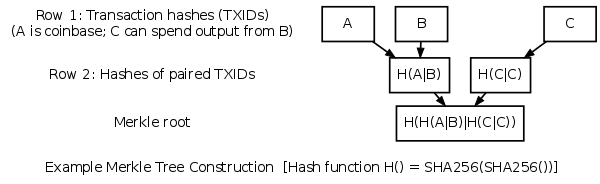

# Blockchain

The following subsections briefly document Dimecoin's blockchain arhitecture. 

<div class="custom-spacing"></div>

<div class="custom-spacing"></div>

**[Block Headers](blockchain.md#block-headers)**
This section covers the structure of block headers and their significance in the blockchain. Subtopics include:
- [Versions](blockchain.md#block-versions): Overview of Dimecoin releases.
- [Merkle Trees](blockchain.md#merkle-trees): Explore how Merkle trees ensure secure and efficient transaction verification in blockchain technology.
- [Target nBits](blockchain.md#target-nbits): Discover the role of Target nBits in defining the difficulty level for blockchain mining operations.

**[Serialized Blocks](blockchain.md#serialized-blocks)**
Focuses on the serialization of blocks within the blockchain, a crucial process for block propagation and storage. See:
- [Coinbase](blockchain.md#coinbase): Learn about the coinbase transaction, the first transaction in a block that awards miners & stakers with new Dimecoin.
- [Supply](blockchain.md#supply): Learn about how Dimecoin's supply works
- [Treasury](blockchain.md#treasury): 

```{eval-rst}
.. meta::
  :title: Dimecoin Block Headers
  :description: Describes the structure of Dimecoin block headers and provides related details on block versions, merkle trees, and mining difficulty.
```

### Block Headers

[Block headers](../resources/glossary.md#block-header) are serialized in the 80-byte format described below and then hashed as part of the proof-of-work algorithm, making the serialized header format part of the [consensus rules](../resources/glossary.md#consensus-rules).

| Bytes | Name                | Data Type | Description
|-------|---------------------|-----------|----------------
| 4     | version             |  int32_t  | The [block](../resources/glossary.md#block) version number indicates which set of block validation rules to follow. See the list of block versions below.
| 32    | previous block header hash | char[32]  | An X11() hash in internal byte order of the previous block's header.  This ensures no previous block can be changed without also changing this block's header.
| 32    | merkle root hash    | char[32]  | A SHA256(SHA256()) hash in internal byte order. The merkle root is derived from the hashes of all transactions included in this block, ensuring that none of those transactions can be modified without modifying the header.  See the [merkle trees section](#merkle-trees) below.
| 4     | time                | uint32_t  | The block time is a Unix epoch time when the miner started hashing the header (according to the miner).  Must be strictly greater than the median time of the previous 11 blocks.  Full nodes will not accept blocks with headers more than two hours in the future according to their clock.
| 4     | nBits               | uint32_t  | An encoded version of the target threshold this block's header hash must be less than or equal to.  See the nBits format described below.
| 4     | nonce               | uint32_t  | An arbitrary number miners change to modify the header hash in order to produce a hash less than or equal to the target threshold.  If all 32-bit values are tested, the time can be updated or the coinbase transaction can be changed and the merkle root updated.

The hashes are in [internal byte order](../resources/glossary.md#internal-byte-order); the other values are all in little-endian order.

An example [header](../resources/glossary.md#header) in hex:

``` text
01000000 ........................... Block version: 1

7f3e8b1a2b9e5a3c4d6f7a8b9cb2a1f4
e6d5c4b3a2f19876e5d4c3b2a1f0e9d8 ... Hash of previous block's header
3c2d1e0f1a2b3c4d5e6f7a8b9cb2a1f4
e6d5c4b3a2f19876e5d4c3b2a1f0e9d8 ... Merkle root

5a3c2d1e ........................... Unix time: 1609459200
18b1a2c3 ........................... Target: 0x1a2b3c * 256**(0x1e-3)
87654321 ........................... Nonce
```

### Block Versions

* **Version X.X** was used by Dimecoin for the [genesis block](../resources/glossary.md#genesis-block) only.

* **Version X.X** blocks were introduced in Dimecoin Core 0.11.2 (March 2015) as a
  soft fork (Block 244,834 was the first version 3 block).

  When the [fork](../resources/glossary.md#fork) reached full enforcement, it required strict [DER encoding](https://en.wikipedia.org/wiki/X.690#DER_encoding) of all [ECDSA signatures](../resources/glossary.md#ecdsa-signatures) in new blocks as described in [BIP66](https://github.com/bitcoin/bips/blob/master/bip-0066.mediawiki). Transactions that do not use strict DER encoding had previously been non-standard since Dimecoin Core 0.8.0.

* **Version X.X** blocks specified in [BIP65](https://github.com/bitcoin/bips/blob/master/bip-0065.mediawiki) and introduced in Bitcoin Core 0.11.2 (November 2015) as a [soft fork](../resources/glossary.md#soft-fork) became active in December 2015.  These blocks now support the new `OP_CHECKLOCKTIMEVERIFY` [opcode](../resources/glossary.md#opcode) described in that BIP.

The mechanism used for the version 2, 3, and 4 upgrades is commonly called IsSuperMajority() after the function added to Dimecoin Core to manage those soft forking changes. See [BIP34](https://github.com/bitcoin/bips/blob/master/bip-0034.mediawiki) for a full description of this method.

As of this writing, a newer method called *version bits* is being designed to manage future soft forking changes, although it's not known whether version 4 will be the last soft fork to use the IsSuperMajority() function. Draft [BIP9](https://github.com/bitcoin/bips/blob/master/bip-0009.mediawiki) describes the version bits design as of this writing, although it is still being actively edited and may substantially change while in the draft state.

### Merkle Trees

The [merkle root](../resources/glossary.md#merkle-root) is constructed using all the [TXIDs](../resources/glossary.md#transaction-identifiers) of transactions in this block, but first the TXIDs are placed in order as required by the [consensus rules](../resources/glossary.md#consensus-rules):

* The [coinbase transaction](../resources/glossary.md#coinbase-transaction)'s [TXID](../resources/glossary.md#transaction-identifiers) is always placed first.

* Any [input](../resources/glossary.md#input) within this block can spend an [output](../resources/glossary.md#output) which also appears in this block (assuming the spend is otherwise valid). However, the TXID corresponding to the output must be placed at some point before the TXID corresponding to the input. This ensures that any program parsing block chain transactions linearly will encounter each output before it is used as an input.

If a [block](../resources/glossary.md#block) only has a coinbase transaction, the coinbase TXID is used as the merkle root hash.

If a block only has a coinbase transaction and one other transaction, the TXIDs of those two transactions are placed in order, concatenated as 64 raw bytes, and then SHA256(SHA256()) hashed together to form the merkle root.

If a block has three or more transactions, intermediate [merkle tree](../resources/glossary.md#merkle-tree) rows are formed. The TXIDs are placed in order and paired, starting with the coinbase transaction's TXID. Each pair is concatenated together as 64 raw bytes and SHA256(SHA256()) hashed to form a second row of hashes. If there are an odd (non-even) number of TXIDs, the last TXID is concatenated with a copy of itself and hashed. If there are more than two hashes in the second row, the process is repeated to create a third row (and, if necessary, repeated further to create additional rows). Once a row is obtained with only two hashes, those hashes are concatenated and hashed to produce the merkle root.



TXIDs and intermediate hashes are always in [internal byte order](../resources/glossary.md#internal-byte-order) when they're concatenated, and the resulting merkle root is also in internal byte order when it's placed in the [block header](../resources/glossary.md#block-header).

### Target nBits

The [target threshold](../resources/glossary.md#target) is a 256-bit unsigned integer which a [header](../resources/glossary.md#header) hash must be equal to or below in order for that header to be a valid part of the [block chain](../resources/glossary.md#block-chain). However, the header field *[nBits](../resources/glossary.md#nbits)* provides only 32 bits of space, so the [target](../resources/glossary.md#target) number uses a less precise format called "compact" which works like a base-256 version of scientific notation:


As a base-256 number, nBits can be quickly parsed as bytes the same way you might parse a decimal number in base-10 scientific notation:


The target threshold was initially intended to be an unsigned integer, yet the original nBits implementation derived characteristics from a signed data class. This peculiarity permits the target threshold to assume negative values if the high bit of the significand is activated. However, this scenario is impractical as the header hash operates as an unsigned number, making it impossible to match or fall below a negative target threshold. Dimecoin Core addresses this inconsistency through two approaches:

* In processing nBits, Dimecoin Core transforms any negative target threshold into a zero target, theoretically allowing the header hash to achieve equality with it..

* When generating a value for nBits, Dimecoin Core evaluates whether it will result in an nBits perceived as negative. If this is the case, it adjusts by dividing the significand by 256 and incrementing the exponent by one, thereby encoding the same number differently.

Some examples taken from the Dimecoin Core test cases:

| nBits      |  Target          | Notes
|------------|------------------|----------------
| 0x01003456 | &nbsp;0x00       |
| 0x01123456 | &nbsp;0x12       |
| 0x02008000 | &nbsp;0x80       |
| 0x05009234 | &nbsp;0x92340000 |
| 0x04923456 | -0x12345600      | High bit set (0x80 in 0x92).
| 0x04123456 | &nbsp;0x12345600 | Inverse of above; no high bit.

Difficulty 1, the minimum allowed [difficulty](../resources/glossary.md#difficulty), is represented on [mainnet](../resources/glossary.md#mainnet) and the current [testnet](../resources/glossary.md#testnet) by the nBits value 0x1e0ffff0. Regtest mode uses a different difficulty 1 value---0x207fffff, the highest possible value below uint32_max which can be encoded; this allows near-instant building of blocks in [regression test mode](../resources/glossary.md#regression-test-mode).

# Serialized Blocks

Under current [consensus rules](../resources/glossary.md#consensus-rules), a
[block](../resources/glossary.md#block) is not valid unless its serialized size is less than or
equal to 1 MB. All fields described below are counted towards the serialized size.

| Bytes    | Name         | Data Type        | Description |
| - | - | - | - |
| 80       | block header | block_header     | The [block header](../resources/glossary.md#block-header) in the format described in the [block header section](../reference/block-chain-block-headers.md).
| *Varies* | txn_count    | [compactSize uint](../resources/glossary.md#compactsize) | The total number of transactions in this block, including the coinbase transaction.
| *Varies* | txns         | [raw transaction](../resources/glossary.md#raw-transaction)  | Every transaction in this block, one after another, in raw transaction format.  Transactions must appear in the data stream in the same order their TXIDs appeared in the first row of the merkle tree.  See the [merkle tree section](../reference/block-chain-block-headers.md#merkle-trees) for details.

### Coinbase

The first transaction in a block must be a [coinbase
transaction](../resources/glossary.md#coinbase-transaction) which should collect and spend any
[transaction fee](../resources/glossary.md#transaction-fee) paid by transactions included in this
block.

### Supply

Dimecoin's supply is inflationary until about the year 2346. As of the consensus updates in October 2023, the rate is set at about 1.4% for the first year, with a transitioning to a daily decay that results in an effective annual reduction of 8% in block rewards. By 2348, the supply will approximately cap, adding an estimated 104,709,968,124.82 coins from December 2024 to 2346. These estimates may fluctuate due to changes in mining difficulty, daily block averages, and other variables.


### Treasury

In October of 2023, a hybrid consensus mechanism was implemented successfully. Here is a breakdown of block subsidy allocation.

| Subsidy allocation | Purpose |
|-|-|
| 45% | Mining / Staking Reward |
| 45% | Masternode Reward       |
| 10% | Foundation Pay          |

### Block Reward

Together, the transaction fees and block subsidy are called the [block
reward](../resources/glossary.md#block-reward). A coinbase transaction is invalid if it tries to
spend more value than is available from the block reward.

The block reward is divided into three main parts: [miner/staker](../resources/glossary.md#miner),
[masternode](../resources/glossary.md#masternode), and
[foundation](../resources/glossary.md#superblock). The miner/staker and masternode portions add up to 90%
of the block subsidy with the remainder allocated to the Dimecoin Foundation.

The following table details how the block subsidy and fees are allocated between miners/stakers, masternodes, and the foundation pays.

| Payee | Block subsidy | Transaction fees | Description |
| ----- | :-----: | :-------: | -|
| Foundation | 10% | - | Payment for maintenance/expansion of the ecosystem (Core development, marketing, integration, etc.)
| Miner/Staker | 45% |- | Payment for creating new blocks
| Masternode | 45% | -% | Payment for masternode services
