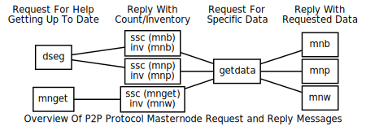

```{eval-rst}
.. meta::
  :title: Masternode Messages
  :description: The following network messages enable the masternode features built in to Dimecoin.
```

> ***We put our best effort into covering all topics related to Dimecoin. Each section will cover a different category. Not all documentation may be 100% accurate, if you spot an error, please report it or submit a PR request on GitHub.***
>
> ***REMINDER: This documentation is always evolving. If you have not been here for a while, perhaps check again. Things may have been added or updated since your last visit!***

## Masternode Messages

The following network messages enable the [masternode](../reference/glossary.md#masternode) features built in to Dimecoin.



For additional details, refer to the Developer Guide [Masternode Sync](../guide/dime-features-masternode-sync.md) and [Masternode Payment](../guide/dime-features-masternode-payment.md) sections.

### ssc

The [`ssc` message](../reference/p2p-network.md#ssc) is used to track the sync status of masternode objects. This message is sent in response to sync requests for the list of governance objects (`govsync` message), and governance object votes (`govsync` message).

| Bytes | Name | Data type | Required | Description
| ---------- | ----------- | --------- | -------- | --------
| 4 | nItemID | int | Required | Masternode Sync Item ID
| 4 | nCount | int | Required | Number of items to sync

Sync Item IDs

| ID | Description | Response To
|------|--------------|---------------
| 10 | MASTERNODE_SYNC_GOVOBJ | `govsync`message
| 11 | MASTERNODE_SYNC_GOVOBJ_VOTE | `govsync` message with non-zero hash

The following annotated hexdump shows a [`ssc` message](../reference/p2p-network.md#ssc). (The message header has been omitted.)

``` text
02000000 ................................... Item ID: MASTERNODE_SYNC_LIST (2)
bf110000 ................................... Count: 47
```
