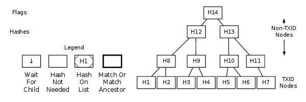

```{eval-rst}
.. meta::
  :title: P2P Networks
  :description: This section provides an overview of the Dimecoin P2P network protocol (not a specification).
```

> ***We put our best effort into covering all topics related to Dimecoin. Each section will cover a different category. Not all documentation may be 100% accurate, if you spot an error, please report it or submit a PR request on GitHub.***
>
> ***REMINDER: This documentation is always evolving. If you have not been here for a while, perhaps check again. Things may have been added or updated since your last visit!***

## P2P Networks

This section describes the Dimecoin P2P network protocol (but it is not a [specification](index.md#specification-disclaimer)). It does not describe the [BIP70 payment protocol](../resources/glossary.md#bip70-payment-protocol), the [GetBlockTemplate mining protocol](../guide/mining-block-prototypes.md#getblocktemplate-rpc), or any network protocol never implemented in an official version of Dimecoin Core.

All peer-to-peer communication occurs entirely over TCP.

**Note**: Unless their description says otherwise, all multi-byte integers mentioned in this section are transmitted in little-endian order.

## Constants and Defaults

The following constants and defaults are taken from Dimecoin Core's [chainparams.cpp](https://github.com/dime-coin/dimecoin/blob/master/src/chainparams.cpp) source code file.

| Network | Default Port | Magic Value | [Start String](../resources/glossary.md#start-string)
|---------|--------------|-----------------------------------------------|---------------
| Mainnet | 11931        | 0xdd03a5fe  | 0xfea503dd
| Testnet | 21931        | 0x39309278  | 0x78923039
| Regtest | 31931        | 0x39923078  | 0x78309239

Note: the testnet start string above are for testnet3; the original testnet used a different string with less difficult nBits.

Command line parameters can change what port a [node](../resources/glossary.md#node) listens on (see `-help`). Start strings are hardcoded constants that appear at the start of all messages sent on the Dimecoin [network](../resources/glossary.md#network); they may also appear in data files such as Dimecoin Core's block database. The Magic Value and [nBits](../resources/glossary.md#nbits) displayed above are in big-endian order; they're sent over the network in little-endian order. The [Start String](../resources/glossary.md#start-string) is simply the endian reversed Magic Value.

Dimecoin Core's [chainparams.cpp](https://github.com/dime-coin/dimecoin/blob/master/src/chainparams.cpp) also includes other constants useful to programs, such as the hash of the [genesis block](../resources/glossary.md#genesis-block) blocks for the different networks.

## Dimecoin Protocol Versions

The table below lists some notable versions of the P2P network protocol, with the most recent versions listed first.

As of Dimecoin Core 2.3.0.0, the most recent protocol version is 70008.

| Version | Initial Release                    | Major Changes
|---------|------------------------------------|--------------
| 70008 | [Dimecoin Core 2.3.0.0](https://github.com/dime-coin/dimecoin/blob/master/doc/dimecoin-release-notes/release-notes-2.3.0.0.md) <br> (Sept 2023) | • Sync optimization and fixes to selection during the staking process. • Coin Control refactor<br>• Patch Qt for limits
| 70007 | [Dimecoin Core 2.2.0.0](https://github.com/dime-coin/dimecoin/blob/master/doc/dimecoin-release-notes/release-notes-2.2.0.0.md) <br> (Nov 2022) | • Peer connectivity optimization<br>• Refactored input tests<br>• Additonal checks added to ensure outputs are signed correctly<br>• Correct MN pay split<br>• added getchaintips RPC function
| 70006 (unchanged) | [Dimecoin Core 2.1.0.0](https://github.com/dime-coin/dimecoin/blob/master/doc/dimecoin-release-notes/release-notes-2.1.0.0.md) <br> (Aug 2022) | • Switched to dual-diff retargeting algorithm<br>• correct maxfee<br>• remove peer disconnect after full-sync
| 70006 | [Dimecoin Core 2.1.0.0](https://github.com/dime-coin/dimecoin/blob/master/doc/dimecoin-release-notes/release-notes-2.0.0.0.md) <br> (Jun 2022) | • Implement hybrid POW/POS consensus and masternodes, rebased over bitcoin .17
| 70005 (unchanged) | Dimecoin Core 1.10.0.1 <br> (Jan 2019) | • Fix to LWMA-3 to combat hash related vulnerabilites
| 70005 | Dimecoin Core 1.10.0.0 <br> (Dec 2018) | • Implement LWMA-3 difficult adjustement algorightm<br>• New reward distribution to stabilize block reward allocation

## Bitcoin Protocol Versions

Historical Bitcoin protocol versions shown below since Dimecoin is a [fork](../resources/glossary.md#fork) of Bitcoin Core. Versions prior to Dimecoin's fork listed below.

| Version | Initial Release                    | Major Changes
|---------|------------------------------------|--------------
| 70001   | Bitcoin Core 0.8.0 <br>(Feb 2013)  | • Added [`notfound` message](docs/reference/p2p-network.md#notfound). <br><br>[BIP37](https://github.com/bitcoin/bips/blob/master/bip-0137.mediawiki): <br>• Added [`filterload` message](docs/reference/p2p-network-control-messages.md#filterload). <br>• Added [`filteradd` message](docs/reference/p2p-network-control-messages.md#filteradd). <br>• Added [`filterclear` message](docs/reference/p2p-network-control-messages.md#filterclear). <br>• Added [`merkleblock` message](docs/reference/p2p-network.md#merkleblock). <br>• Added relay field to [`version` message](docs/reference/p2p-network-control-messages.md#version) <br>• Added `MSG_FILTERED_BLOCK` inventory type to [`getdata` message](docs/reference/p2p-network.md#getdata).
| 60002   | Bitcoin Core 0.7.0 <br>(Sep 2012)  | [BIP35](https://github.com/bitcoin/bips/blob/master/bip-0035.mediawiki): <br>• Added [`mempool` message](docs/reference/p2p-network.md#mempool). <br>• Extended [`getdata` message](docs/reference/p2p-network.md#getdata) to allow download of memory pool transactions
| 60001   | Bitcoin Core 0.6.1 <br>(May 2012)  | [BIP31](https://github.com/bitcoin/bips/blob/master/bip-0031.mediawiki): <br>• Added nonce field to [`ping` message](docs/reference/p2p-network-control-messages.md#ping) <br>• Added [`pong` message](docs/reference/p2p-network-control-messages.md#pong)
| 60000   | Bitcoin Core 0.6.0 <br>(Mar 2012)  | [BIP14](https://github.com/bitcoin/bips/blob/master/bip-0014.mediawiki): <br>• Separated protocol version from Bitcoin Core version
| 31800   | Bitcoin Core 0.3.18 <br>(Dec 2010) | • Added [`getheaders` message](docs/reference/p2p-network.md#getheaders) and [`headers` message](docs/reference/p2p-network.md#headers).
| 31402   | Bitcoin Core 0.3.15 <br>(Oct 2010) | • Added time field to [`addr` message](docs/reference/p2p-network-control-messages.md#addr).
| 311     | Bitcoin Core 0.3.11 <br>(Aug 2010) | • Added `alert` message.
| 209     | Bitcoin Core 0.2.9 <br>(May 2010)  | • Added checksum field to message headers.
| 106     | Bitcoin Core 0.1.6 <br>(Oct 2009)  | • Added receive IP address fields to [`version` message](docs/reference/p2p-network-control-messages.md#version).

## Message Headers

All messages in the network protocol use the same container format, which provides a required multi-field [message header](../resources/glossary.md#message-header) and an optional payload. The message header format is:

| Bytes | Name         | Data Type | Description
| :-------: |--------------|-----------|-------------
| 4     | start string | char[4]   | Magic bytes indicating the originating network; used to seek to next message when stream state is unknown.
| 12    | command name | char[12]  | ASCII string which identifies what message type is contained in the payload.  Followed by nulls (0x00) to pad out byte count; for example: `version\0\0\0\0\0`.
| 4     | payload size | uint32_t  | Number of bytes in payload.  The current maximum number of bytes ([`MAX_SIZE`](https://github.com/dime-coin/dimecoin/blob/272dbe4974e09eca6a928ce13b42941b1c28aca2/src/serialize.h#L29)) allowed in the payload by Dimecoin Core is 32 MiB---messages with a payload size larger than this will be dropped or rejected.
| 4     | checksum     | char[4]   | First 4 bytes of SHA256(SHA256(payload)) in internal byte order.<br /><br /> If payload is empty, as in `verack` and [`getaddr` messages](docs/reference/p2p-network.md#getaddr), the checksum is always 0x5df6e0e2 (SHA256(SHA256(<empty string>))).

### Example

The following example is an annotated hex dump of a [mainnet](../resources/glossary.md#mainnet) message header from a [`verack` message](docs/reference/p2p-network-control-messages.md#verack) which has no payload.

``` text
bf0c6bbd ................... Start string: Mainnet
76657261636b000000000000 ... Command name: verack + null padding
00000000 ................... Byte count: 0
5df6e0e2 ................... Checksum: SHA256(SHA256(<empty>))
```

## Data Messages

The following network messages all request or provide data related to transactions and blocks.


Many of the data messages use [inventories](../resources/glossary.md#inventory) as unique identifiers for [transactions](../resources/glossary.md#transaction) and [blocks](../resources/glossary.md#block).  Inventories have a simple 36-byte structure:

| Bytes | Name            | Data Type | Description
|-------|-----------------|-----------|-------------
| 4     | type identifier | uint32_t  | The type of object which was hashed.  See list of type identifiers below.
| 32    | hash            | char[32]  | SHA256(SHA256()) hash of the object in internal byte order.

The currently-available type identifiers are:

| Type Identifier | Name                                                                          | Description
|-----------------|-------------------------------------------------------------------------------|---------------
| 1               | MSG_TX                                     | The hash is a TXID.
| 2               | MSG_BLOCK                            | The hash is of a block header.
| 3               | MSG_FILTERED_BLOCK | The hash is of a block header; identical to `MSG_BLOCK`. When used in a [`getdata` message](docs/reference/p2p-network.md#getdata), this indicates the response should be a [`merkleblock` message](docs/reference/p2p-network.md#merkleblock) rather than a [`block` message](docs/reference/p2p-network.md#block) (but this only works if a bloom filter was previously configured).  **Only for use in [`getdata` messages](docs/reference/p2p-network.md#getdata).**
| 6               | MSG_SPORK                            | The hash is Spork ID.
| 20               | MSG_CMPCT_BLOCK                                     | The hash is of a block header; identical to `MSG_BLOCK`. When used in a [`getdata` message](docs/reference/p2p-network.md#getdata), this indicates the response should be a [`cmpctblock` message](docs/reference/p2p-network.md#cmpctblock). **Only for use in [`getdata` messages](docs/reference/p2p-network.md#getdata).**

### block

The [`block` message](docs/reference/p2p-network.md#block) transmits a single [serialized block](../resources/glossary.md#serialized-block) in the format described in the [serialized blocks section](docs/reference/block-chain-serialized-blocks.md). See that section for an example hexdump.  It can be sent for two different reasons:

1. **GetData Response:** Nodes will always send it in response to a [`getdata` message](docs/reference/p2p-network.md#getdata) that requests the block with an [inventory](../resources/glossary.md#inventory) type of `MSG_BLOCK` (provided the node has that block available for relay).

2. **Unsolicited:** Some miners will send unsolicited [`block` messages](docs/reference/p2p-network.md#block) broadcasting their newly-mined blocks to all of their [peers](../resources/glossary.md#peer). Many [mining](../resources/glossary.md#mining) pools do the same thing, although some may be misconfigured to send the block from multiple nodes, possibly sending the same block to some peers more than once.

### blocktxn

The [`blocktxn` message](docs/reference/p2p-network.md#blocktxn) sends requested [block](../resources/glossary.md#block) [transactions](../resources/glossary.md#transaction) to a node which previously requested them with a [`getblocktxn` message](docs/reference/p2p-network.md#getblocktxn). It is defined as a message containing a serialized `BlockTransactions` message.

Upon receipt of a properly-formatted requested [`blocktxn` message](docs/reference/p2p-network.md#blocktxn), [nodes](../resources/glossary.md#node) should:

1. Attempt to reconstruct the full block by taking the prefilledtxn transactions from the original [`cmpctblock` message](docs/reference/p2p-network.md#cmpctblock) and placing them in the marked positions
2. For each short transaction ID from the original [`cmpctblock` message](docs/reference/p2p-network.md#cmpctblock), in order, find the corresponding transaction (from either the [`blocktxn` message](docs/reference/p2p-network.md#blocktxn) or from other sources)
3. Place each short transaction ID in the first available position in the block
4. Once the block has been reconstructed, it shall be processed as normal.

**Short transaction IDs are expected to occasionally collide. Nodes must not be penalized for such collisions.**

The structure of `BlockTransactions` is defined below.

| Bytes    | Name                 | Data Type            | Encoding | Description
|----------|----------------------|----------------------|----------|------------
| 32       | blockhash            | Binary blob          | The output from a double-SHA256 of the block header, as used elsewhere | The blockhash of the block which the transactions being provided are in
| 1 or 3   | transactions<br>_length | CompactSize          | As used to encode array lengths elsewhere  The number of transactions provided | NA
| *Varies* | transactions         | List of transactions | As encoded in [`tx` messages](docs/reference/p2p-network.md#tx) in response to `getdata MSG_TX` | The transactions provided

The following annotated hexdump shows a [`blocktxn` message](docs/reference/p2p-network.md#blocktxn).  (The message header has been omitted.)

``` text
182327cb727da7d60541da793831fd0ab0509e79c8cd
3d654cdf3a0100000000 ....................... Block Hash

01 ......................................... Transactions Provided: 1

Transaction(s)
| Transaction 1
| | 01000000 ................................ Transaction Version: 1
| | 01 ...................................... Input count: 1
| |
| | Transaction input #1
| | |
| | | 0952617a516d956e2ecee71a6adc249f
| | | 4bb757adcc409452ab98c8e55c31e62a ..... Outpoint TXID
| | | 00000000 ............................. Outpoint index number: 0
| | |
| | | 6b ................................... Bytes in sig. script: 107
| | | 483045022100d10edf447252e1e69ff1
| | | 77330bb2c889a50be02e00cc5d79c0d0
| | | 79ae56518fc40220245d36905dc950fc
| | | d55694cfde8cde3109dc80b12aca3a6e
| | | 332033802ee36e1b01210272cc6e7660
| | | 2648831d8e80fca8eb24369cd0f23ff0
| | | 79cf20ae9d9beee05de6db ............... Secp256k1 signature
| | |
| | | ffffffff ............................. Sequence number: UINT32_MAX
| |
| | 02 ..................................... Number of outputs: 02
| |
| | Transaction output #1
| | | 0be0f50500000000 ..................... Dimecoins (0.99999755 DIME)
| | |
| | | 19 ................................... Bytes in pubkey script: 25
| | | | 76 ................................. OP_DUP
| | | | a9 ................................. OP_HASH160
| | | | 14 ................................. Push 20 bytes as data
| | | | | 923d91ed359f650eec6ea8b9030b340d
| | | | | ea63d590 ......................... PubKey hash
| | | | 88 ................................. OP_EQUALVERIFY
| | | | ac ................................. OP_CHECKSIG
| |
| | [...] .................................. 1 more tx output omitted
| |
| | 00000000 ............................... locktime: 0 (a block height)
```

### cmpctblock

The [`cmpctblock` message](docs/reference/p2p-network.md#cmpctblock) is a reply to a [`getdata` message](docs/reference/p2p-network.md#getdata) which requested a [block](../resources/glossary.md#block) using the [inventory](../resources/glossary.md#inventory) type `MSG_CMPCT_BLOCK`. If the requested block was recently announced and is close to the tip of the best chain of the receiver and after having sent the requesting [peer](../resources/glossary.md#peer) a [`sendcmpct` message](docs/reference/p2p-network-control-messages.md#sendcmpct), nodes respond with a [`cmpctblock` message](docs/reference/p2p-network.md#cmpctblock) containing data for the block.

**If the requested block is too old, the node responds with a *full non-compact block***

Upon receipt of a [`cmpctblock` message](docs/reference/p2p-network.md#cmpctblock), after sending a [`sendcmpct` message](docs/reference/p2p-network-control-messages.md#sendcmpct), nodes should calculate the short transaction ID for each [unconfirmed transaction](../resources/glossary.md#unconfirmed-transaction) they have available (i.e. in their mempool) and compare each to each short transaction ID in the [`cmpctblock` message](docs/reference/p2p-network.md#cmpctblock). After finding already-available transactions, nodes which do not have all transactions available to reconstruct the full block should request the missing transactions using a [`getblocktxn` message](docs/reference/p2p-network.md#getblocktxn).

A node must not send a [`cmpctblock` message](docs/reference/p2p-network.md#cmpctblock) unless they are able to respond to a [`getblocktxn` message](docs/reference/p2p-network.md#getblocktxn) which requests every transaction in the block. A node must not send a [`cmpctblock` message](docs/reference/p2p-network.md#cmpctblock) without having validated that the [header](../resources/glossary.md#header) properly commits to each transaction in the block, and properly builds on top of the existing, fully-validated chain with a valid proof-of-work either as a part of the current most-work valid chain, or building directly on top of it. A node may send a [`cmpctblock` message](docs/reference/p2p-network.md#cmpctblock) before validating that each transaction in the block validly spends existing UTXO set entries.

The [`cmpctblock` message](docs/reference/p2p-network.md#cmpctblock) contains a vector of `PrefilledTransaction` whose structure is defined below. A `PrefilledTransaction` is used in `HeaderAndShortIDs` to provide a list of a few transactions explicitly.

| Bytes    | Name                 | Data Type            | Encoding | Description
|----------|----------------------|----------------------|----------|------------
| 1 or 3   | index                | CompactSize          | Compact Size, differentially encoded since the last PrefilledTransaction in a list | The index into the block at which this transaction is
| *Varies* | tx                   | Transaction          | As encoded in [`tx` messages](docs/reference/p2p-network.md#tx) sent in response to `getdata MSG_TX` | Transaction which is in the block at index `index`

The [`cmpctblock` message](docs/reference/p2p-network.md#cmpctblock) is compromised of a serialized `HeaderAndShortIDs` structure which is defined below. A `HeaderAndShortIDs` structure is used to relay a block header, the short transactions IDs used for matching already-available transactions, and a select few transactions which we expect a peer may be missing.

| Bytes    | Name                 | Data Type            | Encoding | Description
|----------|----------------------|----------------------|----------|------------
| 80       | header               | Block header         | First 80 bytes of the block as defined by the encoding used by [`block` messages](docs/reference/p2p-network.md#block) | The header of the block being provided
| 8        | nonce                | uint64_t             | Little Endian | A nonce for use in short transaction ID calculations
| 1 or 3   | shortids_<br>length  | CompactSize          | As used to encode array lengths elsewhere | The number of short transaction IDs in `shortids` (i.e. block tx count - `prefilledtxn`<br>`_length`)
| *Varies* | shortids  | List of 6-byte integers | Little Endian | The short transaction IDs calculated from the transactions which were not provided explicitly in `prefilledtxn`
| 1 or 3   | prefilledtxn<br>_length | CompactSize       | As used to encode array lengths elsewhere | The number of prefilled transactions in `prefilledtxn` (i.e. block tx count - `shortids`<br>`_length`)
| *Varies* | prefilledtxn     | List of Prefilled<br>Transactions | As defined by `Prefilled`<br>`Transaction` definition below | Used to provide the coinbase transaction and a select few which we expect a peer may be missing

#### **Short Transaction ID Calculation**

Short transaction IDs are used to represent a transaction without sending a full 256-bit hash. They are calculated as follows,

* A single-SHA256 hashing the [block header](../resources/glossary.md#block-header) with the nonce appended (in little-endian)
* Running SipHash-2-4 with the input being the transaction ID and the keys (k0/k1) set to the first two little-endian 64-bit integers from the above hash, respectively.
* Dropping the 2 most significant bytes from the SipHash output to make it 6 bytes.

The following annotated hexdump shows a [`cmpctblock` message](docs/reference/p2p-network.md#cmpctblock). (The message header has been omitted.)

``` text
00000020981178a4342cec6316296b2ad84c9b7cdf9f
2688e5d0fe1a0003cd0000000000f64870f52a3d0125
1336c9464961216732b25fbf288a51f25a0e81bffb20
e9600194d85a64a50d1cc02b0181 ................ Block Header

3151b67e5b418b9d ............................ Nonce

01 .......................................... Short IDs Length: 1
483edcd3c799 ................................ Short IDs

01 .......................................... Prefilled Transaction Length: 1

Prefilled Transactions
| 00 ........................................ Index: 0
|
| Transaction 1 (Coinbase)
| | 01000000 ................................ Transaction Version: 1
| | 01 ...................................... Input count: 1
| |
| | Transaction input #1
| | |
| | | 00000000000000000000000000000000
| | | 00000000000000000000000000000000 ..... Outpoint TXID
| | | ffffffff ............................. Outpoint index number: UINT32_MAX
| | |
| | | 13 ................................... Bytes in sig. script: 19
| | | 03daaf010e2f5032506f6f6c2d74444153482f Secp256k1 signature
| | |
| | | ffffffff ............................. Sequence number: UINT32_MAX
| |
| | 04 ..................................... Number of outputs: 04
| |
| | Transaction output #1
| | | ffe5654200000000 ..................... Dimecoins (11.13974271 DIME)
| | |
| | | 19 ................................... Bytes in pubkey script: 25
| | | | 76 ................................. OP_DUP
| | | | a9 ................................. OP_HASH160
| | | | 14 ................................. Push 20 bytes as data
| | | | | b885cb21ad12e593c1a46d814df47ccb
| | | | | 450a7d84 ......................... PubKey hash
| | | | 88 ................................. OP_EQUALVERIFY
| | | | ac ................................. OP_CHECKSIG
| |
| | [...] .................................. 3 more tx outputs omitted
| |
| | 00000000 ............................... locktime: 0 (a block height)
```

### getblocks

The [`getblocks` message](docs/reference/p2p-network.md#getblocks) requests an [`inv` message](docs/reference/p2p-network.md#inv) that provides [block header](../resources/glossary.md#block-header) hashes starting from a particular point in the [block chain](../resources/glossary.md#block-chain). It allows a [peer](../resources/glossary.md#peer) which has been disconnected or started for the first time to get the data it needs to request the blocks it hasn't seen.

Peers which have been disconnected may have [stale blocks](../resources/glossary.md#stale-block) in their locally-stored block chain, so the [`getblocks` message](docs/reference/p2p-network.md#getblocks) allows the requesting peer to provide the receiving peer with multiple [header](../resources/glossary.md#header) hashes at heights on their local chain. This allows the receiving peer to find, within that list, the last header hash they had in common and reply with all subsequent header hashes.

**Note:** the receiving peer itself may respond with an [`inv` message](docs/reference/p2p-network.md#inv) containing header hashes of stale blocks.  It is up to the requesting peer to poll all of its peers to find the best block chain.

If the receiving peer does not find a common header hash within the list, it will assume the last common block was the [genesis block](../resources/glossary.md#genesis-block) (block zero), so it will reply with in [`inv` message](docs/reference/p2p-network.md#inv) containing header hashes starting with block one (the first block after the genesis block).

| Bytes    | Name                 | Data Type        | Description
|----------|----------------------|------------------|----------------
| 4        | version              | uint32_t         | The protocol version number; the same as sent in the [`version` message](docs/reference/p2p-network-control-messages.md#version).
| *Varies* | hash count           | compactSize uint | The number of header hashes provided not including the stop hash.  There is no limit except that the byte size of the entire message must be below the [`MAX_SIZE`](https://github.com/dime-coin/dimecoin/blob/272dbe4974e09eca6a928ce13b42941b1c28aca2/src/serialize.h#L29) limit; typically from 1 to 200 hashes are sent.
| *Varies* | block header hashes  | char[32]         | One or more block header hashes (32 bytes each) in internal byte order.  Hashes should be provided in reverse order of block height, so highest-height hashes are listed first and lowest-height hashes are listed last.
| 32       | stop hash            | char[32]         | The header hash of the last header hash being requested; set to all zeroes to request an [`inv` message](docs/reference/p2p-network.md#inv) with all subsequent header hashes (a maximum of 500 will be sent as a reply to this message; if you need more than 500, you will need to send another [`getblocks` message](docs/reference/p2p-network.md#getblocks) with a higher-height header hash as the first entry in block header hash field).

The following annotated hexdump shows a [`getblocks` message](docs/reference/p2p-network.md#getblocks).  (The message header has been omitted.)

``` text
71110100 ........................... Protocol version: 70001
02 ................................. Hash count: 2

d39f608a7775b537729884d4e6633bb2
105e55a16a14d31b0000000000000000 ... Hash #1

5c3e6403d40837110a2e8afb602b1c01
714bda7ce23bea0a0000000000000000 ... Hash #2

00000000000000000000000000000000
00000000000000000000000000000000 ... Stop hash
```

### getblocktxn

The [`getblocktxn` message](docs/reference/p2p-network.md#getblocktxn) requests a [`blocktxn` message](docs/reference/p2p-network.md#blocktxn) for any transactions that it has not seen after a compact block is received. It is defined as a message containing a serialized `BlockTransactionsRequest` message. Upon receipt of a properly-formatted [`getblocktxn` message](docs/reference/p2p-network.md#getblocktxn), [nodes](../resources/glossary.md#node) which recently provided the sender of such a message with a [`cmpctblock` message](docs/reference/p2p-network.md#cmpctblock) for the block hash identified in this message must respond with either an appropriate [`blocktxn` message](docs/reference/p2p-network.md#blocktxn), or a full block message.

A [`blocktxn` message](docs/reference/p2p-network.md#blocktxn) response must contain exactly and only each transaction which is present in the appropriate block at the index specified in the [`getblocktxn` message](docs/reference/p2p-network.md#getblocktxn) indexes list, in the order requested.

The structure of `BlockTransactionsRequest` is defined below.

| Bytes    | Name            | Data Type            |Encoding    | Description
|----------|-----------------|----------------------|------------|------------
| 32       | blockhash       | Binary blob          | The output from a double-SHA256 of the block header, as used elsewhere | The blockhash of the block which the transactions being requested are in
| *Varies* | indexes_length  | CompactSize uint     | As used to encode array lengths elsewhere | The number of transactions requested
| *Varies* | indexes         | CompactSize uint[]   | Differentially encoded | Vector of compactSize containing the indexes of the transactions being requested in the block.

The following annotated hexdump shows a [`getblocktxn` message](docs/reference/p2p-network.md#getblocktxn).  (The message header has been omitted.)

``` text
182327cb727da7d60541da793831fd0a
b0509e79c8cd3d654cdf3a0100000000 ... Block Hash

01 ................................. Index length: 1
01 ................................. Index: 1
```

### getdata

The [`getdata` message](docs/reference/p2p-network.md#getdata) requests one or more data objects from another [node](../resources/glossary.md#node). The objects are requested by an inventory, which the requesting node typically previously received by way of an [`inv` message](docs/reference/p2p-network.md#inv).

The response to a [`getdata` message](docs/reference/p2p-network.md#getdata) can be a [`tx` message](docs/reference/p2p-network.md#tx), [`block` message](docs/reference/p2p-network.md#block), [`merkleblock` message](docs/reference/p2p-network.md#merkleblock), [`dstx` message](docs/reference/p2p-network-privatesend-messages.md#dstx), [`govobj` message](docs/reference/p2p-network-governance-messages.md#govobj), [`govobjvote` message](docs/reference/p2p-network-governance-messages.md#govobjvote), [`notfound` message](docs/reference/p2p-network.md#notfound), [`cmpctblock` message](docs/reference/p2p-network.md#cmpctblock), or any other messages that are exchanged by way of [`inv` messages](docs/reference/p2p-network.md#inv).

This message cannot be used to request arbitrary data, such as historic transactions no longer in the memory pool or relay set. Full nodes may not even be able to provide older [blocks](../resources/glossary.md#block) if they've pruned old transactions from their block database. For this reason, the [`getdata` message](docs/reference/p2p-network.md#getdata) should usually only be used to request data from a node which previously advertised it had that data by sending an [`inv` message](docs/reference/p2p-network.md#inv).

The format and maximum size limitations of the [`getdata` message](docs/reference/p2p-network.md#getdata) are identical to the [`inv` message](docs/reference/p2p-network.md#inv); only the message header differs.

### getheaders

The [`getheaders` message](docs/reference/p2p-network.md#getheaders) requests a [`headers` message](docs/reference/p2p-network.md#headers) that provides block headers starting from a particular point in the [block chain](../resources/glossary.md#block-chain). It allows a [peer](../resources/glossary.md#peer) which has been disconnected or started for the first time to get the [headers](../resources/glossary.md#header) it hasn’t seen yet.

The [`getheaders` message](docs/reference/p2p-network.md#getheaders) is nearly identical to the [`getblocks` message](docs/reference/p2p-network.md#getblocks), with one minor difference: the `inv` reply to the [`getblocks` message](docs/reference/p2p-network.md#getblocks) will include no more than 500 [block header](../resources/glossary.md#block-header) hashes; the `headers` reply to the [`getheaders` message](docs/reference/p2p-network.md#getheaders) will include as many as 2,000 block headers.

| Bytes    | Name                 | Data Type        | Description
|----------|----------------------|------------------|----------------
| 4        | version              | uint32_t         | The protocol version number; the same as sent in the [`version` message](docs/reference/p2p-network-control-messages.md#version).
| *Varies* | hash count           | compactSize uint | The number of header hashes provided not including the stop hash.
| *Varies* | block header hashes  | char[32]         | One or more block header hashes (32 bytes each) in internal byte order.  Hashes should be provided in reverse order of block height, so highest-height hashes are listed first and lowest-height hashes are listed last.
| 32       | stop hash            | char[32]         | The header hash of the last header hash being requested; set to all zeroes to request as many blocks as possible (2000).

### headers

The [`headers` message](docs/reference/p2p-network.md#headers) sends block headers to a [node](../resources/glossary.md#node) which previously requested certain [headers](../resources/glossary.md#header) with a [`getheaders` message](docs/reference/p2p-network.md#getheaders). A headers message can be empty.

| Bytes    | Name    | Data Type        | Description
|----------|---------|------------------|-----------------
| *Varies* | count   | compactSize uint | Number of block headers up to a maximum of 2,000.  Note: headers-first sync assumes the sending node will send the maximum number of headers whenever possible.
| *Varies* | headers | block_header     | Block headers: each 80-byte block header is in the format described in the [block headers section](docs/reference/block-chain-block-headers.md) with an additional 0x00 suffixed.  This 0x00 is called the transaction count, but because the headers message doesn't include any transactions, the transaction count is always zero.

The following annotated hexdump shows a [`headers` message](docs/reference/p2p-network.md#headers).  (The message header has been omitted.)

``` text
01 ................................. Header count: 1

02000000 ........................... Block version: 2
b6ff0b1b1680a2862a30ca44d346d9e8
910d334beb48ca0c0000000000000000 ... Hash of previous block's header
9d10aa52ee949386ca9385695f04ede2
70dda20810decd12bc9b048aaab31471 ... Merkle root
24d95a54 ........................... Unix time: 1415239972
30c31b18 ........................... Target (bits)
fe9f0864 ........................... Nonce

00 ................................. Transaction count (0x00)
```

### inv

The [`inv` message](docs/reference/p2p-network.md#inv) (inventory message) transmits one or more [inventories](../resources/glossary.md#inventory) of objects known to the transmitting [peer](../resources/glossary.md#peer).  It can be sent unsolicited to announce new [transactions](../resources/glossary.md#transaction) or [blocks](../resources/glossary.md#block), or it can be sent in reply to a [`getblocks` message](docs/reference/p2p-network.md#getblocks) or [`mempool` message](docs/reference/p2p-network.md#mempool).

The receiving peer can compare the inventories from an [`inv` message](docs/reference/p2p-network.md#inv) against the inventories it has already seen, and then use a follow-up message to request unseen objects.

| Bytes    | Name      | Data Type             | Description
|----------|-----------|-----------------------|-----------------
| *Varies* | count     | compactSize uint      | The number of inventory entries.
| *Varies* | inventory | inventory             | One or more inventory entries up to a maximum of 50,000 entries.

The following annotated hexdump shows an [`inv` message](docs/reference/p2p-network.md#inv) with two inventory entries.  (The message header has been omitted.)

``` text
02 ................................. Count: 2

0f000000 ........................... Type: MSG_MASTERNODE_PING
dd6cc6c11211793b239c2e311f1496e2
2281b200b35233eaae465d2aa3c9d537 ... Hash (mnp)

05000000 ........................... Type: MSG_TXLOCK_VOTE
afc5b2f418f8c06c477a7d071240f5ee
ab17057f9ce4b50c2aef4fadf3729a2e ... Hash (txlvote)
```

### mempool

The [`mempool` message](docs/reference/p2p-network.md#mempool) requests the [TXIDs](../resources/glossary.md#transaction-identifiers) of transactions that the receiving [node](../resources/glossary.md#node) has verified as valid but which have not yet appeared in a [block](../resources/glossary.md#block). That is, transactions which are in the receiving node's memory pool. The response to the [`mempool` message](docs/reference/p2p-network.md#mempool) is one or more [`inv` messages](docs/reference/p2p-network.md#inv) containing the TXIDs in the usual [inventory](../resources/glossary.md#inventory) format.

Sending the [`mempool` message](docs/reference/p2p-network.md#mempool) is mostly useful when a program first connects to the network. Full nodes can use it to quickly gather most or all of the unconfirmed transactions available on the network; this is especially useful for miners trying to gather transactions for their transaction fees. SPV clients can set a filter before sending a `mempool` to only receive transactions that match that filter; this allows a recently-started client to get most or all unconfirmed transactions related to its wallet.

> 📘 InstantSend and ChainLock Synchronization
>
> Dimecoin Core 2.0.0.0 expanded the mempool message to include syncing of [InstantSend Lock](docs/reference/p2p-network-instantsend-messages.md#islock) inventories. Additionally, nodes now attempt to sync their mempool with peers at startup by default (limited to peers using protocol version 70006 or higher). This allows nodes to more quickly detect any double-spend attempts as well as show InstantSend lock status correctly for transactions received while offline. *Note: InstaSend currently disabled on Dimecoin mainnet.*
>
> Dimecoin Core 2.0.0.0 expanded the mempool message to include syncing of [ChainLock](docs/reference/p2p-network-instantsend-messages.md#clsig) inventories. This allows nodes to more quickly show ChainLock status correctly after being offline.

The `inv` response to the [`mempool` message](docs/reference/p2p-network.md#mempool) is, at best, one node's view of the network---not a complete list of every [unconfirmed transaction](../resources/glossary.md#unconfirmed-transaction) on the network. Here are some additional reasons the list might not be complete:

* The [`mempool` message](docs/reference/p2p-network.md#mempool) is not currently fully compatible with the [`filterload` message](docs/reference/p2p-network-control-messages.md#filterload)'s `BLOOM_UPDATE_ALL` and `BLOOM_UPDATE_P2PUBKEY_ONLY` flags. Mempool transactions are not sorted like in-block transactions, so a transaction (tx2) spending an [output](../resources/glossary.md#output) can appear before the transaction (tx1) containing that output, which means the automatic filter update mechanism won't operate until the second-appearing transaction (tx1) is seen---missing the first-appearing transaction (tx2). It has been proposed in [Bitcoin Core issue #2381](https://github.com/bitcoin/bitcoin/issues/2381) that the transactions should be sorted before being processed by the filter.

There is no payload in a [`mempool` message](docs/reference/p2p-network.md#mempool).  See the [message header section](docs/reference/p2p-network-message-headers.md) for an example of a message without a payload.

### merkleblock

The [`merkleblock` message](docs/reference/p2p-network.md#merkleblock) is a reply to a [`getdata` message](docs/reference/p2p-network.md#getdata) which requested a [block](../resources/glossary.md#block) using the inventory type `MSG_MERKLEBLOCK`.  It is only part of the reply: if any matching transactions are found, they will be sent separately as [`tx` messages](docs/reference/p2p-network.md#tx). As of Dimecoin Core 2.0.0.0 [`islock` messages](docs/reference/p2p-network-instantsend-messages.md#islock) for matching transactions are sent if present.

> 🚧
>
> Note: `islock` messages are currently dropped once a ChainLock is present so in most cases they will not actually be provided in response to a merkleblock request. Future updates may modify this behavior.

If a filter has been previously set with the [`filterload` message](docs/reference/p2p-network-control-messages.md#filterload), the [`merkleblock` message](docs/reference/p2p-network.md#merkleblock) will contain the [TXIDs](../resources/glossary.md#transaction-identifiers) of any transactions in the requested block that matched the filter, as well as any parts of the block's [merkle tree](../resources/glossary.md#merkle-tree) necessary to connect those transactions to the block header's [merkle root](../resources/glossary.md#merkle-root). The message also contains a complete copy of the [block header](../resources/glossary.md#block-header) to allow the client to hash it and confirm its [proof of work](../resources/glossary.md#proof-of-work).

| Bytes    | Name               | Data Type        | Description
|----------|--------------------|------------------|----------------
| 80       | block header       | block_header     | The block header in the format described in the [block header section](docs/reference/block-chain-block-headers.md).
| 4        | transaction count  | uint32_t         | The number of transactions in the block (including ones that don't match the filter).
| *Varies* | hash count         | compactSize uint | The number of hashes in the following field.
| *Varies* | hashes             | char[32]         | One or more hashes of both transactions and merkle nodes in internal byte order.  Each hash is 32 bytes.
| *Varies* | flag byte count    | compactSize uint | The number of flag bytes in the following field.
| *Varies* | flags              | byte[]           | A sequence of bits packed eight in a byte with the least significant bit first.  May be padded to the nearest byte boundary but must not contain any more bits than that.  Used to assign the hashes to particular nodes in the merkle tree as described below.

The annotated hexdump below shows a [`merkleblock` message](docs/reference/p2p-network.md#merkleblock) which corresponds to the examples below.  (The message header has been omitted.)

``` text
01000000 ........................... Block version: 1
82bb869cf3a793432a66e826e05a6fc3
7469f8efb7421dc88067010000000000 ... Hash of previous block's header
7f16c5962e8bd963659c793ce370d95f
093bc7e367117b3c30c1f8fdd0d97287 ... Merkle root
76381b4d ........................... Time: 1293629558
4c86041b ........................... nBits: 0x04864c * 256**(0x1b-3)
554b8529 ........................... Nonce

07000000 ........................... Transaction count: 7
04 ................................. Hash count: 4

3612262624047ee87660be1a707519a4
43b1c1ce3d248cbfc6c15870f6c5daa2 ... Hash #1
019f5b01d4195ecbc9398fbf3c3b1fa9
bb3183301d7a1fb3bd174fcfa40a2b65 ... Hash #2
41ed70551dd7e841883ab8f0b16bf041
76b7d1480e4f0af9f3d4c3595768d068 ... Hash #3
20d2a7bc994987302e5b1ac80fc425fe
25f8b63169ea78e68fbaaefa59379bbf ... Hash #4

01 ................................. Flag bytes: 1
1d ................................. Flags: 1 0 1 1 1 0 0 0
```

Note: when fully decoded, the above [`merkleblock` message](docs/reference/p2p-network.md#merkleblock) provided the TXID for a single transaction that matched the filter. In the [network](../resources/glossary.md#network) traffic dump this output was taken from, the full transaction belonging to that TXID was sent immediately after the [`merkleblock` message](docs/reference/p2p-network.md#merkleblock) as a [`tx` message](docs/reference/p2p-network.md#tx).

#### Parsing A MerkleBlock Message

As seen in the annotated hexdump above, the [`merkleblock` message](docs/reference/p2p-network.md#merkleblock) provides three special data types: a transaction count, a list of hashes, and a list of one-bit flags.

You can use the transaction count to construct an empty [merkle tree](../resources/glossary.md#merkle-tree). We'll call each entry in the tree a node; on the bottom are TXID nodes---the hashes for these nodes are [TXIDs](../resources/glossary.md#transaction-identifiers); the remaining nodes (including the [merkle root](../resources/glossary.md#merkle-root)) are non-TXID nodes---they may actually have the same hash as a TXID, but we treat them differently.


Keep the hashes and flags in the order they appear in the [`merkleblock` message](docs/reference/p2p-network.md#merkleblock). When we say "next flag" or "next hash", we mean the next flag or hash on the list, even if it's the first one we've used so far.

Start with the merkle root node and the first flag. The table below describes how to evaluate a flag based on whether the node being processed is a TXID node or a non-TXID node. Once you apply a flag to a node, never apply another flag to that same node or reuse that same flag again.

| Flag  | TXID Node                                                                                | Non-TXID Node
|-------|------------------------------------------------------------------------------------------|----
| **0** | Use the next hash as this node's TXID, but this transaction didn't match the filter.     | Use the next hash as this node's hash.  Don't process any descendant nodes.
| **1** | Use the next hash as this node's TXID, and mark this transaction as matching the filter. | The hash needs to be computed.  Process the left child node to get its hash; process the right child node to get its hash; then concatenate the two hashes as 64 raw bytes and hash them to get this node's hash.

Any time you begin processing a node for the first time, evaluate the next flag. Never use a flag at any other time.

When processing a child node, you may need to process its children (the grandchildren of the original node) or further-descended nodes before returning to the parent node. This is expected---keep processing depth first until you reach a TXID node or a non-TXID node with a flag of 0.

After you process a TXID node or a non-TXID node with a flag of 0, stop processing flags and begin to ascend the tree. As you ascend, compute the hash of any nodes for which you now have both child hashes or for which you now have the sole child hash. See the [merkle tree section](docs/reference/block-chain-block-headers.md#merkle-trees) for hashing instructions. If you reach a node where only the left hash is known, descend into its right child (if present) and further descendants as necessary.

However, if you find a node whose left and right children both have the same hash, fail.  This is related to CVE-2012-2459.

Continue descending and ascending until you have enough information to obtain the hash of the merkle root node. If you run out of flags or hashes before that condition is reached, fail. Then perform the following checks (order doesn't matter):

* Fail if there are unused hashes in the hashes list.

* Fail if there are unused flag bits---except for the minimum number of bits necessary to pad up to the next full byte.

* Fail if the hash of the merkle root node is not identical to the merkle root in the [block header](../resources/glossary.md#block-header).

* Fail if the block header is invalid. Remember to ensure that the hash of the header is less than or equal to the [target threshold](../resources/glossary.md#target) encoded by the nBits header field. Your program should also, of course, attempt to ensure the header belongs to the best block chain and that the user knows how many confirmations this block has.

For a detailed example of parsing a [`merkleblock` message](docs/reference/p2p-network.md#merkleblock), please see the corresponding [merkle block examples section](../examples/p2p-network-parsing-a-merkleblock.md).

#### Creating A MerkleBlock Message

It's easier to understand how to create a [`merkleblock` message](docs/reference/p2p-network.md#merkleblock) after you understand how to parse an already-created message, so we recommend you read the parsing section above first.

Create a complete merkle tree with [TXIDs](../resources/glossary.md#transaction-identifiers) on the bottom row and all the other hashes calculated up to the [merkle root](../resources/glossary.md#merkle-root) on the top row. For each transaction that matches the filter, track its TXID node and all of its ancestor nodes.



Start processing the tree with the [merkle root](../resources/glossary.md#merkle-root) node. The table below describes how to process both TXID nodes and non-TXID nodes based on whether the node is a match, a match ancestor, or neither a match nor a match ancestor.

|                                      | TXID Node                                                              | Non-TXID Node
|--------------------------------------|------------------------------------------------------------------------|----
| **Neither Match Nor Match Ancestor** | Append a 0 to the flag list; append this node's TXID to the hash list. | Append a 0 to the flag list; append this node's hash to the hash list.  Do not descend into its child nodes.
| **Match Or Match Ancestor**          | Append a 1 to the flag list; append this node's TXID to the hash list. | Append a 1 to the flag list; process the left child node.  Then, if the node has a right child, process the right child.  Do not append a hash to the hash list for this node.

Any time you begin processing a node for the first time, a flag should be appended to the flag list. Never put a flag on the list at any other time, except when processing is complete to pad out the flag list to a byte boundary.

When processing a child node, you may need to process its children (the grandchildren of the original node) or further-descended nodes before returning to the parent node. This is expected---keep processing depth first until you reach a TXID node or a node which is neither a TXID nor a match ancestor.

After you process a TXID node or a node which is neither a TXID nor a match ancestor, stop processing and begin to ascend the tree until you find a node with a right child you haven't processed yet. Descend into that right child and process it.

After you fully process the merkle root node according to the instructions in the table above, processing is complete.  Pad your flag list to a byte boundary and construct the [`merkleblock` message](docs/reference/p2p-network.md#merkleblock) using the template near the beginning of this subsection.

### notfound

The [`notfound` message](docs/reference/p2p-network.md#notfound) is a reply to a [`getdata` message](docs/reference/p2p-network.md#getdata) which requested an object the receiving [node](../resources/glossary.md#node) does not have available for relay. (Nodes are not expected to relay historic transactions which are no longer in the memory pool or relay set. Nodes may also have pruned spent transactions from older [blocks](../resources/glossary.md#block), making them unable to send those blocks.)

The format and maximum size limitations of the [`notfound` message](docs/reference/p2p-network.md#notfound) are identical to the [`inv` message](docs/reference/p2p-network.md#inv); only the message header differs.

### tx

The [`tx` message](docs/reference/p2p-network.md#tx) transmits a single transaction in the [raw transaction](../resources/glossary.md#raw-transaction) format. It can be sent in a variety of situations;

* **Transaction Response:** Dimecoin Core will send it in response to a [`getdata` message](docs/reference/p2p-network.md#getdata) that requests the transaction with an [inventory](../resources/glossary.md#inventory)  type of `MSG_TX`.

* **MerkleBlock Response:** Dimecoin Core will send it in response to a [`getdata` message](docs/reference/p2p-network.md#getdata) that requests a [merkle block](../resources/glossary.md#merkle-block) with an [inventory](../resources/glossary.md#inventory) type of `MSG_MERKLEBLOCK`. (This is in addition to sending a [`merkleblock` message](docs/reference/p2p-network.md#merkleblock).) Each [`tx` message](docs/reference/p2p-network.md#tx) in this case provides a matched transaction from that [block](../resources/glossary.md#block).

For an example hexdump of the raw transaction format, see the [raw transaction section](docs/reference/transactions.html#raw-transaction-format).

## Control Messages

The following [network](../resources/glossary.md#network) messages all help control the connection between two [peers](../resources/glossary.md#peer) or allow them to advise each other about the rest of the network.


Note that almost none of the control messages are authenticated in any way, meaning they can contain incorrect or intentionally harmful information.

### addr

The `addr` (IP address) message relays connection information for peers on the network. Each peer which wants to accept incoming connections creates an [`addr` message](docs/reference/p2p-network.md#addr) providing its connection information and then sends that message to its peers unsolicited. Some of its peers send that information to their peers (also unsolicited), some of which further distribute it, allowing decentralized peer discovery for any program already on the network.

An [`addr` message](docs/reference/p2p-network.md#addr) may also be sent in response to a [`getaddr` message](docs/reference/p2p-network.md#getaddr).

| Bytes      | Name             | Data Type          | Description
|------------|------------------|--------------------|----------------
| *Varies*   | IP address count | compactSize uint   | The number of IP address entries up to a maximum of 1,000.
| *Varies*   | IP addresses     | network IP address | IP address entries.  See the table below for the format of a Dimecoin network IP address.

Each encapsulated network IP address currently uses the following structure:

| Bytes | Name       | Data Type | Description
|-------|------------|-----------|---------------
| 4     | time       | uint32    | A time in Unix epoch time format.  Nodes advertising their own IP address set this to the current time.  Nodes advertising IP addresses they've connected to set this to the last time they connected to that node.  Other nodes just relaying the IP address should not change the time.  Nodes can use the time field to avoid relaying old [`addr` messages](docs/reference/p2p-network.md#addr).  <br><br>Malicious nodes may change times or even set them in the future.
| 8     | services   | uint64_t  | The services the node advertised in its [`version` message](docs/reference/p2p-network#version).
| 16    | IP address | char      | IPv6 address in **big endian byte order**. IPv4 addresses can be provided as [IPv4-mapped IPv6 addresses](http://en.wikipedia.org/wiki/IPv6#IPv4-mapped_IPv6_addresses)
| 2     | port       | uint16_t  | Port number in **big endian byte order**.  Note that Dimecoin Core will only connect to nodes with non-standard port numbers as a last resort for finding peers.  This is to prevent anyone from trying to use the network to disrupt non-Dimecoin services that run on other ports.

The following annotated hexdump shows part of an [`addr` message](docs/reference/p2p-network.md#addr). (The [message header](../resources/glossary.md#message-header) has been omitted and the actual IP address has been replaced with a [RFC5737](http://tools.ietf.org/html/rfc5737) reserved IP address.)

``` text
fde803 ............................. Address count: 1000

d91f4854 ........................... Epoch time: 1414012889
0100000000000000 ................... Service bits: 01 (network node)
00000000000000000000ffffc0000233 ... IP Address: ::ffff:192.0.2.51
208d ............................... Port: 8333

[...] .............................. (999 more addresses omitted)
```

### filteradd

The [`filteradd` message](docs/reference/p2p-network.md#filteradd) tells the receiving [peer](../resources/glossary.md#peer) to add a single element to a previously-set [bloom filter](../resources/glossary.md#bloom-filter), such as a new [public key](../resources/glossary.md#public-key). The element is sent directly to the receiving peer; the peer then uses the parameters set in the [`filterload` message](docs/reference/p2p-network.md#filterload) to add the element to the bloom filter.

Because the element is sent directly to the receiving peer, there is no obfuscation of the element and none of the plausible-deniability privacy provided by the bloom filter. Clients that want to maintain greater privacy should recalculate the bloom filter themselves and send a new [`filterload` message](docs/reference/p2p-network.md#filterload) with the recalculated bloom filter.

| Bytes    | Name          | Data Type        | Description
|----------|---------------|------------------|-----------------
| *Varies* | element bytes | compactSize uint | The number of bytes in the following element field.
| *Varies* | element       | uint8_t[]        | The element to add to the current filter.  Maximum of 520 bytes, which is the maximum size of an element which can be pushed onto the stack in a pubkey or signature script.  Elements must be sent in the byte order they would use when appearing in a raw transaction; for example, hashes should be sent in internal byte order.

Note: a [`filteradd` message](docs/reference/p2p-network.md#filteradd) will not be accepted unless a filter was previously set with the [`filterload` message](docs/reference/p2p-network.md#filterload).

The annotated hexdump below shows a [`filteradd` message](docs/reference/p2p-network.md#filteradd) adding a [TXID](../resources/glossary.md#transaction-identifiers). (The message header has been omitted.) This TXID appears in the same block used for the example hexdump in the [`merkleblock` message](docs/reference/p2p-network-data-messages.md#merkleblock); if that [`merkleblock` message](docs/reference/p2p-network-data-messages.md#merkleblock) is re-sent after sending this [`filteradd` message](docs/reference/p2p-network.md#filteradd), six hashes are returned instead of four.

``` text
20 ................................. Element bytes: 32
fdacf9b3eb077412e7a968d2e4f11b9a
9dee312d666187ed77ee7d26af16cb0b ... Element (A TXID)
```

### filterclear

The [`filterclear` message](docs/reference/p2p-network.md#filterclear) tells the receiving [peer](../resources/glossary.md#peer) to remove a previously-set [bloom filter](../resources/glossary.md#bloom-filter).  This also undoes the effect of setting the relay field in the [`version` message](docs/reference/p2p-network.md#version) to 0, allowing unfiltered access to [`inv` messages](docs/reference/p2p-network-data-messages.md#inv) announcing new transactions.

Dimecoin Core does not require a [`filterclear` message](docs/reference/p2p-network.md#filterclear) before a replacement filter is loaded with `filterload`.  It also doesn't require a [`filterload` message](docs/reference/p2p-network.md#filterload) before a [`filterclear` message](docs/reference/p2p-network.md#filterclear).

There is no payload in a [`filterclear` message](docs/reference/p2p-network.md#filterclear).  See the [message header section](docs/reference/p2p-network-message-headers.md) for an example of a message without a payload.

### filterload

The [`filterload` message](docs/reference/p2p-network.md#filterload) tells the receiving [peer](../resources/glossary.md#peer) to filter all relayed transactions and requested [merkle blocks](../resources/glossary.md#merkle-block) through the provided filter. This allows clients to receive transactions relevant to their [wallet](../resources/glossary.md#wallet) plus a configurable rate of false positive transactions which can provide plausible-deniability privacy.

| Bytes    | Name         | Data Type | Description
|----------|--------------|-----------|---------------
| *Varies* | nFilterBytes | compactSize uint | Number of bytes in the following filter bit field.
| *Varies* | filter       | uint8_t[] | A bit field of arbitrary byte-aligned size. The maximum size is 36,000 bytes.
| 4        | nHashFuncs   | uint32_t  | The number of hash functions to use in this filter. The maximum value allowed in this field is 50.
| 4        | nTweak       | uint32_t  | An arbitrary value to add to the seed value in the hash function used by the bloom filter.
| 1        | nFlags       | uint8_t   | A set of flags that control how outpoints corresponding to a matched pubkey script are added to the filter. See the table in the Updating A Bloom Filter subsection below.

The annotated hexdump below shows a [`filterload` message](docs/reference/p2p-network.md#filterload). (The message header has been omitted.)  For an example of how this payload was created, see the [filterload example](../examples/p2p-network-creating-a-bloom-filter.md).

``` text
02 ......... Filter bytes: 2
b50f ....... Filter: 1010 1101 1111 0000
0b000000 ... nHashFuncs: 11
00000000 ... nTweak: 0/none
00 ......... nFlags: BLOOM_UPDATE_NONE
```

#### Initializing A Bloom Filter

Filters have two core parameters: the size of the bit field and the number of hash functions to run against each data element. The following formulas from BIP37 will allow you to automatically select appropriate values based on the number of elements you plan to insert into the filter (*n*) and the false positive rate (*p*) you desire to maintain plausible deniability.

* Size of the bit field in bytes (*nFilterBytes*), up to a maximum of 36,000: `(-1 / log(2)**2 * n * log(p)) / 8`

* Hash functions to use (*nHashFuncs*), up to a maximum of 50:
  `nFilterBytes * 8 / n * log(2)`

Note that the filter matches parts of transactions (transaction elements), so the false positive rate is relative to the number of elements checked---not the number of transactions checked. Each normal transaction has a minimum of four matchable elements (described in the comparison subsection below), so a filter with a false-positive rate of 1 percent will match about 4 percent of all transactions at a minimum.

According to BIP37, the formulas and limits described above provide support for bloom filters containing 20,000 items with a false positive rate of less than 0.1 percent or 10,000 items with a false positive rate of less than 0.0001 percent.

Once the size of the bit field is known, the bit field should be initialized as all zeroes.

#### Populating A Bloom Filter

The bloom filter is populated using between 1 and 50 unique hash functions (the number specified per filter by the *nHashFuncs* field). Instead of using up to 50 different hash function implementations, a single implementation is used with a unique seed value for each function.

The seed is `nHashNum * 0xfba4c795 + nTweak` as a *uint32\_t*, where the values are:

* **nHashNum** is the sequence number for this hash function, starting at 0 for the first hash iteration and increasing up to the value of the *nHashFuncs* field (minus one) for the last hash iteration.

* **0xfba4c795** is a constant optimized to create large differences in the seed for different values of *nHashNum*.

* **nTweak** is a per-filter constant set by the client to require the use of an arbitrary set of hash functions.

If the seed resulting from the formula above is larger than four bytes, it must be truncated to its four most significant bytes (for example, `0x8967452301 & 0xffffffff → 0x67452301`).

The actual hash function implementation used is the [32-bit Murmur3 hash function](https://en.wikipedia.org/wiki/MurmurHash).

> 🚧 Murmer3 Version
>
> **Warning:** the Murmur3 hash function has separate 32-bit and 64-bit versions that produce different results for the same [input](../resources/glossary.md#input).  Only the 32-bit Murmur3 version is used with Dimecoin bloom filters.

The data to be hashed can be any transaction element which the bloom filter can match. See the next subsection for the list of transaction elements checked against the filter. The largest element which can be matched is a script data push of 520 bytes, so the data should never exceed 520 bytes.

The example below from Dimecoin Core [bloom.cpp](https://github.com/dime-coin/dimecoin/blob/272dbe4974e09eca6a928ce13b42941b1c28aca2/src/bloom.cpp#L58) combines all the steps above to create the hash function template. The seed is the first parameter; the data to be hashed is the second parameter. The result is a uint32\_t modulo the size of the bit field in bits.

``` c++
MurmurHash3(nHashNum * 0xFBA4C795 + nTweak, vDataToHash) % (vData.size() * 8)
```

Each data element to be added to the filter is hashed by *nHashFuncs* number of hash functions. Each time a hash function is run, the result will be the index number (*nIndex*) of a bit in the bit field. That bit must be set to 1. For example if the filter bit field was `00000000` and the result is 5, the revised filter bit field is `00000100` (the first bit is bit 0).

It is expected that sometimes the same index number will be returned more than once when populating the bit field; this does not affect the algorithm---after a bit is set to 1, it is never changed back to 0.

After all data elements have been added to the filter, each set of eight bits is converted into a little-endian byte. These bytes are the value of the *filter* field.

#### Comparing Transaction Elements To A Bloom Filter

To compare an arbitrary data element against the bloom filter, it is hashed using the same parameters used to create the bloom filter. Specifically, it is hashed *nHashFuncs* times, each time using the same
*nTweak* provided in the filter, and the resulting [output](../resources/glossary.md#output) is modulo the size of the bit field provided in the *filter* field.  After each hash is performed, the filter is checked to see if the bit at that indexed location is set.  For example if the result of a hash is `5` and the filter is `01001110`, the bit is considered set.

If the result of every hash points to a set bit, the filter matches. If any of the results points to an unset bit, the filter does not match.

The following transaction elements are compared against bloom filters. All elements will be hashed in the byte order used in [blocks](../resources/glossary.md#block) (for example, [TXIDs](../resources/glossary.md#transaction-identifiers) will be in [internal byte order](../resources/glossary.md#internal-byte-order)).

* **TXIDs:** the transaction's SHA256(SHA256()) hash.

* **Outpoints:** each 36-byte [outpoint](../resources/glossary.md#outpoint) used this transaction's input section is individually compared to the filter.

* **Signature Script Data:** each element pushed onto the stack by a [data-pushing opcode](../resources/glossary.md#data-pushing-opcode) in a [signature script](../resources/glossary.md#signature-script) from this transaction is individually compared to the filter.  This includes data elements present in P2SH [redeem script](../resources/glossary.md#redeem-script) when they are being spent.

* **PubKey Script Data:** each element pushed onto the the stack by a data-pushing opcode in any [pubkey script](../resources/glossary.md#pubkey-script) from this transaction is individually compared to the filter. (If a pubkey script element matches the filter, the filter will be immediately updated if the `BLOOM_UPDATE_ALL` flag was set; if the pubkey script is in the P2PKH format and matches the filter, the filter will be immediately updated if the `BLOOM_UPDATE_P2PUBKEY_ONLY` flag was set. See the subsection below for details.)

The following annotated hexdump of a transaction is from the [raw transaction format section](docs/reference/transactions-raw-transaction-format.md); the elements which would be checked by the filter are emphasized in bold. Note that this transaction's TXID (**`01000000017b1eab[...]`**) would also be checked, and that the outpoint TXID and index number below would be checked as a single 36-byte element.

<pre><code>01000000 ................................... Version

01 ......................................... Number of inputs
|
| <b>7b1eabe0209b1fe794124575ef807057</b>
| <b>c77ada2138ae4fa8d6c4de0398a14f3f</b> ......... Outpoint TXID
| <b>00000000</b> ................................. Outpoint index number
|
| 49 ....................................... Bytes in sig. script: 73
| | 48 ..................................... Push 72 bytes as data
| | | <b>30450221008949f0cb400094ad2b5eb3</b>
| | | <b>99d59d01c14d73d8fe6e96df1a7150de</b>
| | | <b>b388ab8935022079656090d7f6bac4c9</b>
| | | <b>a94e0aad311a4268e082a725f8aeae05</b>
| | | <b>73fb12ff866a5f01</b> ..................... Secp256k1 signature
|
| ffffffff ................................. Sequence number: UINT32_MAX

01 ......................................... Number of outputs
| f0ca052a01000000 ......................... Satoshis (49.99990000 BTC)
|
| 19 ....................................... Bytes in pubkey script: 25
| | 76 ..................................... OP_DUP
| | a9 ..................................... OP_HASH160
| | 14 ..................................... Push 20 bytes as data
| | | <b>cbc20a7664f2f69e5355aa427045bc15</b>
| | | <b>e7c6c772</b> ............................. PubKey hash
| | 88 ..................................... OP_EQUALVERIFY
| | ac ..................................... OP_CHECKSIG

00000000 ................................... locktime: 0 (a block height)
</code></pre>

#### Updating A Bloom Filter

Clients will often want to track [inputs](../resources/glossary.md#input) that spend [outputs](../resources/glossary.md#output) (outpoints) relevant to their wallet, so the filterload field *nFlags* can be set to allow the filtering [node](../resources/glossary.md#node) to update the filter when a match is found. When the filtering node sees a [pubkey script](../resources/glossary.md#pubkey-script) that pays a pubkey, [address](../resources/glossary.md#address), or other data element matching the filter, the filtering node immediately updates the filter with the [outpoint](../resources/glossary.md#outpoint) corresponding to that pubkey script.


If an input later spends that outpoint, the filter will match it, allowing the filtering node to tell the client that one of its transaction outputs has been spent.

The *nFlags* field has three allowed values:

| Value | Name                       | Description
|-------|----------------------------|---------------
| 0     | `BLOOM_UPDATE_NONE`          | The filtering node should not update the filter.
| 1     | `BLOOM_UPDATE_ALL`           | If the filter matches any data element in a pubkey script, the corresponding outpoint is added to the filter.
| 2     | `BLOOM_UPDATE_P2PUBKEY_ONLY` | If the filter matches any data element in a pubkey script and that script is either a P2PKH or non-P2SH pay-to-multisig script, the corresponding outpoint is added to the filter.

In addition, because the filter size stays the same even though additional elements are being added to it, the false positive rate increases. Each false positive can result in another element being added to the filter, creating a feedback loop that can (after a certain point) make the filter useless. For this reason, clients using automatic filter updates need to monitor the actual false positive rate and send a new filter when the rate gets too high.

### getaddr

The [`getaddr` message](docs/reference/p2p-network.md#getaddr) requests an [`addr` message](docs/reference/p2p-network.md#addr) from the receiving [node](../resources/glossary.md#node), preferably one with lots of IP addresses of other receiving nodes. The transmitting node can use those IP addresses to quickly update its database of available nodes rather than waiting for unsolicited [`addr` messages](docs/reference/p2p-network.md#addr) to arrive over time.

There is no payload in a [`getaddr` message](docs/reference/p2p-network.md#getaddr).  See the [message header section](docs/reference/p2p-network-message-headers.md) for an example of a message without a payload.

### getsporks

The [`getsporks` message](docs/reference/p2p-network.md#getsporks) requests [`spork` messages](docs/reference/p2p-network.md#spork) from the receiving node.

There is no payload in a [`getsporks` message](docs/reference/p2p-network.md#getsporks).  See the [message header section](docs/reference/p2p-network-message-headers.md) for an example of a message without a payload.

### ping

The [`ping` message](docs/reference/p2p-network.md#ping) helps confirm that the receiving [peer](../resources/glossary.md#peer) is still connected. If a TCP/IP error is encountered when sending the [`ping` message](docs/reference/p2p-network.md#ping) (such as a connection timeout), the transmitting node can assume that the receiving node is disconnected. The response to a [`ping` message](docs/reference/p2p-network.md#ping) is the [`pong` message](docs/reference/p2p-network.md#pong).

As of Dimecoin protocol version 70005 and all later versions, the message includes a single field, the nonce.

| Bytes | Name  | Data Type | Description
|-------|-------|-----------|---------------
| 8     | nonce | uint64_t  | Random nonce assigned to this [`ping` message](docs/reference/p2p-network.md#ping).  The responding [`pong` message](docs/reference/p2p-network.md#pong) will include this nonce to identify the [`ping` message](docs/reference/p2p-network.md#ping) to which it is replying.

The annotated hexdump below shows a [`ping` message](docs/reference/p2p-network.md#ping). (The message header has been omitted.)

``` text
0094102111e2af4d ... Nonce
```

### pong

The [`pong` message](docs/reference/p2p-network.md#pong) replies to a [`ping` message](docs/reference/p2p-network.md#ping), proving to the pinging [node](../resources/glossary.md#node) that the ponging node is still alive. Dimecoin Core will, by default, disconnect from any clients which have not responded to a [`ping` message](docs/reference/p2p-network.md#ping) within 20 minutes.

To allow nodes to keep track of latency, the [`pong` message](docs/reference/p2p-network.md#pong) sends back the same nonce received in the [`ping` message](docs/reference/p2p-network.md#ping) it is replying to.

The format of the [`pong` message](docs/reference/p2p-network.md#pong) is identical to the [`ping` message](docs/reference/p2p-network.md#ping); only the message header differs.

### sendcmpct

The [`sendcmpct` message](docs/reference/p2p-network.md#sendcmpct) tells the receiving [peer](../resources/glossary.md#peer) whether or not to announce new [blocks](../resources/glossary.md#block) using a [`cmpctblock` message](docs/reference/p2p-network-data-messages.md#cmpctblock). It also sends the compact block protocol version it supports. The [`sendcmpct` message](docs/reference/p2p-network.md#sendcmpct) is defined as a message containing a 1-byte integer followed by a 8-byte integer. The first integer is interpreted as a boolean and should have a value of either 1 or 0. The second integer is be interpreted as a little-endian version number.

Upon receipt of a [`sendcmpct` message](docs/reference/p2p-network.md#sendcmpct) with the first and second integers set to 1, the [node](../resources/glossary.md#node) should announce new blocks by sending a [`cmpctblock` message](docs/reference/p2p-network-data-messages.md#cmpctblock).

Upon receipt of a [`sendcmpct` message](docs/reference/p2p-network.md#sendcmpct) with the first integer set to 0, the node shouldn't announce new blocks by sending a [`cmpctblock` message](docs/reference/p2p-network-data-messages.md#cmpctblock), but instead announce new blocks by sending invs or [headers](../resources/glossary.md#header), as defined by [BIP130](https://github.com/bitcoin/bips/blob/master/bip-0130.mediawiki).

Upon receipt of a [`sendcmpct` message](docs/reference/p2p-network.md#sendcmpct) with the second integer set to something other than 1, nodes should treat the peer as if they had not received the message (as it indicates the peer will provide an unexpected encoding in [`cmpctblock` messages](docs/reference/p2p-network-data-messages.md#cmpctblock), and/or other, messages). This allows future versions to send duplicate [`sendcmpct` messages](docs/reference/p2p-network.md#sendcmpct) with different versions as a part of a version handshake.

Nodes should check for a protocol version of >= 70007 before sending [`sendcmpct` messages](docs/reference/p2p-network.md#sendcmpct). Nodes shouldn't send a request for a `MSG_CMPCT_BLOCK` object to a peer before having received a [`sendcmpct` message](docs/reference/p2p-network.md#sendcmpct) from that peer. Nodes shouldn't request a `MSG_CMPCT_BLOCK` object before having sent all [`sendcmpct` messages](docs/reference/p2p-network.md#sendcmpct) to that peer which they intend to send, as the peer cannot know what protocol version to use in the response.

The structure of a [`sendcmpct` message](docs/reference/p2p-network.md#sendcmpct) is defined below.

| Bytes    | Name          | Data Type        | Description
|----------|---------------|------------------|--------------
| 1        | announce      | bool             | 0 - Announce blocks via [`headers` message](docs/reference/p2p-network-data-messages.md#headers) or [`inv` message](docs/reference/p2p-network-data-messages.md#inv)<br>1 - Announce blocks via [`cmpctblock` message](docs/reference/p2p-network-data-messages.md#cmpctblock)
| 8        | version       | uint64_t         | The compact block protocol version number

The annotated hexdump below shows a [`sendcmpct` message](docs/reference/p2p-network.md#sendcmpct). (The message header has been omitted.)

``` text
01 ................................. Block announce type: Compact Blocks
0100000000000000 ................... Compact block version: 1
```

### sendheaders

The [`sendheaders` message](docs/reference/p2p-network.md#sendheaders) tells the receiving [peer](../resources/glossary.md#peer) to send new [block](../resources/glossary.md#block) announcements using a [`headers` message](docs/reference/p2p-network-data-messages.md#headers) rather than an [`inv` message](docs/reference/p2p-network-data-messages.md#inv).

There is no payload in a [`sendheaders` message](docs/reference/p2p-network.md#sendheaders).  See the [message header section](docs/reference/p2p-network-message-headers.md) for an example of a message without a payload.

### spork

Sporks are a mechanism by which updated code is released to the network, but not immediately made active (or “enforced”). Enforcement of the updated code can be activated remotely. Should problems arise, the code can be deactivated in the same manner, without the need for a network-wide rollback or client update.

A [`spork` message](docs/reference/p2p-network.md#spork) may be sent in response to a [`getsporks` message](docs/reference/p2p-network.md#getsporks).

The [`spork` message](docs/reference/p2p-network.md#spork) tells the receiving peer the status of the spork defined by the SporkID field. Upon receiving a [spork](../resources/glossary.md#spork) message, the client must verify the [signature](../resources/glossary.md#signature) before accepting the spork message as valid.

| Bytes | Name | Data type | Required | Description
| ---------- | ----------- | --------- | -------- | --------
| 4 | nSporkID | int | Required | ID assigned in spork.h
| 8 | nValue | int64_t | Required | Value assigned to spork<br>Default (disabled): `4000000000`
| 8 | nTimeSigned | int64_t | Required | Time the spork value was signed
| 66 | vchSig | char[] | Required | Length (1 byte) + Signature (65 bytes)

The following annotated hexdump shows a [`spork` message](docs/reference/p2p-network.md#spork).

``` text
11270000 .................................... Spork ID: Spork 2 InstantSend enabled (10001)
0000000000000000 ............................ Value (0)
2478da5900000000 ............................ Epoch time: 2017-10-08 19:10:28 UTC (1507489828)

41 .......................................... Signature length: 65

1b6762d3e70890b5cfaed5d1fd72121c
d32020c827a89f8128a00acd210f4ea4
1b36c26c3767f8a24f48663e189865ed
403ed1e850cdb4207cdd466419d9d183
45 .......................................... Masternode Signature
```

#### Active sporks

The list of all active sporks can be found in
[`src/spork.h`](https://github.com/dime-coin/dimecoin/blob/272dbe4974e09eca6a928ce13b42941b1c28aca2/src/spork.h#L36).

| Spork ID | Num. | Name | Description
| :----------: | :----------: | ----------- | -----------
| 10001 | 2 | `INSTANTSEND_ENABLED` | *Added in Dimecoin Core 2.0.0.0*<br>Turns InstantSend on and off network wide. Also determines if new mempool transactions should be locked or not.
| 10002 | 3 | `INSTANTSEND_BLOCK_`<br>`FILTERING` | Turns on and off InstantSend block filtering
| 10004 | 5 | `INSTANTSEND_MAX_VALUE` | Sets max value alloted for InstantSends
| 10007 | 8 | `MASTERNODE_PAYMENT_`<br>`ENFORCEMENT` | Enforces MN pays
| 10008 | 9 | `SUPERBLOCKS_ENABLED` | Turns on and off SuperBlocks. *Disabled as Dimecoin does not utilize SuperBlocks*
| 10009 | 10| `MASTERNODE_PAY_UPDATED`<br> `_NODES` | Enforce updated rules for masternode payments.

#### Spork verification

To verify `vchSig`, compare the hard-coded spork public key (`strSporkPubKey` from [`src/chainparams.cpp`](https://github.com/dime-coin/dimecoin/blob/272dbe4974e09eca6a928ce13b42941b1c28aca2/src/chainparams.cpp#L177)) with the public key recovered from the [`spork` message](docs/reference/p2p-network.md#spork)'s hash and `vchSig` value (implementation details for Dimecoin Core can be found in `CPubKey::RecoverCompact`). The hash is a double SHA-256 hash of:

* The spork magic message (`"DarkCoin Signed Message:\n"`)
* nSporkID + nValue + nTimeSigned

| Network | Spork Pubkey (wrapped)
| ---------- | ----------
| Mainnet | 04549ac134f694c0243f503e8c8a9a986f5de6610049c40b07816809b0d1<br>d06a21b07be27b9bb555931773f62ba6cf35a25fd52f694d4e1106ccd237<br>a7bb899fdd
| Testnet3 | 046f78dcf911fbd61910136f7f0f8d90578f68d0b3ac973b5040fb7afb50<br>1b5939f39b108b0569dca71488f5bbf498d92e4d1194f6f941307ffd95f7<br>5e76869f0e
| RegTest | Undefined
| Devnets | 046f78dcf911fbd61910136f7f0f8d90578f68d0b3ac973b5040fb7afb50<br>1b5939f39b108b0569dca71488f5bbf498d92e4d1194f6f941307ffd95f7<br>5e76869f0e

### verack

The [`verack` message](docs/reference/p2p-network.md#verack) acknowledges a previously-received [`version` message](docs/reference/p2p-network.md#version), informing the connecting [node](../resources/glossary.md#node) that it can begin to send other messages. The [`verack` message](docs/reference/p2p-network.md#verack) has no payload; for an example of a message with no payload, see the [message headers section](docs/reference/p2p-network.md#message-headers.md).

### version

The [`version` message](docs/reference/p2p-network.md#version) provides information about the transmitting [node](../resources/glossary.md#node) to the receiving node at the beginning of a connection. Until both [peers](../resources/glossary.md#peer) have exchanged [`version` messages](docs/reference/p2p-network.md#version), no other messages will be accepted.

If a [`version` message](docs/reference/p2p-network.md#version) is accepted, the receiving node should send a [`verack` message](docs/reference/p2p-network.md#verack)---but no node should send a [`verack` message](docs/reference/p2p-network.md#verack) before initializing its half of the connection by first sending a [`version` message](docs/reference/p2p-network.md#version).

| Bytes    | Name                  | Data<br>Type        | Required/<br>Optional                        | Description
|----------|-----------------------|------------------|------------------------------------------|-------------
| 4        | version               | int32_t          | Required | The highest protocol version understood by the transmitting node.  See the [protocol version section](docs/reference/p2p-network.md#protocol-versions).
| 8        | services              | uint64_t         | Required | The services supported by the transmitting node encoded as a bitfield.  See the list of service codes below.
| 8        | timestamp             | int64_t          | Required | The current Unix epoch time according to the transmitting node's clock.  Because nodes will reject blocks with timestamps more than two hours in the future, this field can help other nodes to determine that their clock is wrong.
| 8        | addr_recv services    | uint64_t         | Required | The services supported by the receiving node as perceived by the transmitting node.  Same format as the 'services' field above. Dimecoin Core will attempt to provide accurate information.
| 16       | addr_recv IP address  | char             | Required | The IPv6 address of the receiving node as perceived by the transmitting node in **big endian byte order**. IPv4 addresses can be provided as [IPv4-mapped IPv6 addresses](http://en.wikipedia.org/wiki/IPv6#IPv4-mapped_IPv6_addresses). Dimecoin Core will attempt to provide accurate information.
| 2        | addr_recv port        | uint16_t         | Required | The port number of the receiving node as perceived by the transmitting node in **big endian byte order**.
| 8        | addr_trans services   | uint64_t         | Required | The services supported by the transmitting node.  Should be identical to the 'services' field above.
| 16       | addr_trans IP address | char             | Required | The IPv6 address of the transmitting node in **big endian byte order**. IPv4 addresses can be provided as [IPv4-mapped IPv6 addresses](http://en.wikipedia.org/wiki/IPv6#IPv4-mapped_IPv6_addresses).  Set to ::ffff:127.0.0.1 if unknown.
| 2        | addr_trans port       | uint16_t         | Required | The port number of the transmitting node in **big endian byte order**.
| 8        | nonce                 | uint64_t         | Required | A random nonce which can help a node detect a connection to itself.  If the nonce is 0, the nonce field is ignored.  If the nonce is anything else, a node should terminate the connection on receipt of a [`version` message](docs/reference/p2p-network.md#version) with a nonce it previously sent.
| *Varies* | user_agent bytes      | compactSize uint | Required | Number of bytes in following user\_agent field.  If 0x00, no user agent field is sent.
| *Varies* | user_agent            | string           | Required if user_agent bytes > 0 | User agent as defined by BIP14. Previously called subVer.<br><br>Dimecoin Core limits the length to 256 characters.
| 4        | start_height          | int32_t          | Required | The height of the transmitting node's best block chain or, in the case of an SPV client, best block header chain.
| 1        | relay                 | bool             | Optional | Transaction relay flag.  If 0x00, no [`inv` messages](docs/reference/p2p-network-data-messages.md#inv) or [`tx` messages](docs/reference/p2p-network-data-messages.md#tx) announcing new transactions should be sent to this client until it sends a [`filterload` message](docs/reference/p2p-network.md#filterload) or [`filterclear` message](docs/reference/p2p-network.md#filterclear).  If the relay field is not present or is set to 0x01, this node wants [`inv` messages](docs/reference/p2p-network#inv) and [`tx` messages](docs/reference/p2p-network-data-messages.md#tx) announcing new transactions.
| 1        | mn_connection         | bool             | Optional | If 0x00, the connection is from a non-masternode. If 0x01, the connection is from a masternode.

The following service identifiers have been assigned.

| Value | Name         | Description
|-------|--------------|---------------
| 0x00  | *Unnamed*    | This node is not a full node.  It may not be able to provide any data except for the transactions it originates.
| 0x01  | `NODE_NETWORK` | This is a full node and can be asked for full blocks.  It should implement all protocol features available in its self-reported protocol version.
| 0x04  | `NODE_BLOOM` | This node is capable and willing to handle bloom-filtered connections.  Dimecoin Core nodes used to support this by default, without advertising this bit, but no longer do as of protocol version 70006 (= NO_BLOOM_VERSION)
| 0x08 | `NODE_XTHIN` | **Dimecoin Core does not support this service**<br>This node supports Xtreme Thinblocks.
| 0x40 | `NODE_COMPACT_FILTERS` | This node supports basic block filter requests. See [BIP157](https://github.com/bitcoin/bips/blob/master/bip-0157.mediawiki) and [BIP158](https://github.com/bitcoin/bips/blob/master/bip-0158.mediawiki) for details on how this is implemented.
| 0x400 | `NODE_NETWORK_LIMITED` | This is the same as `NODE_NETWORK` with the limitation of only serving the last 288 blocks. See [BIP159](https://github.com/bitcoin/bips/blob/master/bip-0159.mediawiki) for details on how this is implemented.

The following annotated hexdump shows a [`version` message](docs/reference/p2p-network.md#version). (The message header has been omitted and the actual IP addresses have been replaced with [RFC5737](http://tools.ietf.org/html/rfc5737) reserved IP addresses.)

``` text
46120100 .................................... Protocol version: 70008
0500000000000000 ............................ Services: NODE_NETWORK (1) + NODE_BLOOM (4)
9c10ad5c00000000 ............................ Epoch time: 1554845852

0100000000000000 ............................ Receiving node's services
00000000000000000000ffffc61b6409 ............ Receiving node's IPv6 address
270f ........................................ Receiving node's port number

0500000000000000 ............................ Transmitting node's services
00000000000000000000ffffcb0071c0 ............ Transmitting node's IPv6 address
270f ........................................ Transmitting node's port number

128035cbc97953f8 ............................ Nonce

12 .......................................... Bytes in user agent string: 18
2f4461736820436f72653a302e31322e312e352f..... User agent: /Dimecoin Core:2.3.0.0/

851f0b00 .................................... Start height: 76944
01 .......................................... Relay flag: true

5dbb5d1baade6a9afa34db708f72c0dd
b5bd82b3656493484556689640a91357 ............ Masternode Auth. Challenge

00 .......................................... Masternode connection (false)
```
