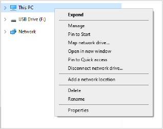
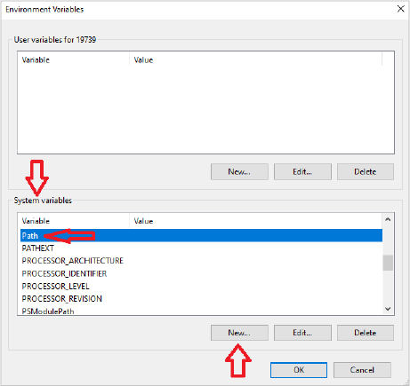

```{eval-rst}
.. _resources-legacy-android:
.. meta::
  :title: Wallet & Database Operations
  :description: Learn how to perform various operations while using various functions to maintain, recover and optimize your wallet.
```

> ***We put our best effort into covering all topics related to Dimecoin. Each section will cover a different category. Not all documentation may be 100% accurate, if you spot an error, please report it or submit a PR request on GitHub.***
>
> ***REMINDER: This documentation is always evolving. If you have not been here for a while, perhaps check again. Things may have been added or updated since your last visit!***

This guide describes how you can use a backup file on a standard PC to recover your Dimecoins from the Android mobile app (v1.1.1).

```{warning}
Be aware some of the steps in this tutorial require handling your private keys in the unencrypted form. Do not expose them to anyone. Whoever knows your private keys can spend your coins on these keys. It’d good practice that after you are finished handling these keys, they should be considered compromised, even if they are not. Make sure your system is free of any malware.
```

We recommend using Ubuntu Linux. You can boot from a Live CD if you want, but if you do, please refrain from sending your coins to a temporary wallet created in that environment, which would be lost e.g. on a power outage or computer failure. Your desired destination wallet should already be set up and you should have one of its receiving addresses or a QR code at hand.

Alternatively, you can also use Windows cmd shell or Powershell. Open Windows Search, search for and start `Command Prompt` or `Windows Powershell`. You will need administrator privledges so make sure you right click `Run as administrator`.

You should be at least a bit familiar with the Linux and shell commands. Commands in `fixed-width font like this` or in a bash window, are meant to be executed as a shell command. Before you execute each command by pressing return, make sure to understand what it does or if will need to adjust some file or directory names. Commands starting with sudo apt will ask for your permission to install software by requiring your Ubuntu user password.

### Linux Recovery Setup

On your PC, or within your Linux shell, install the following Ubuntu packages if missing:

``` bash
sudo apt install openjdk-8-jdk android-tools-adb openssl git gradle
```

### Windows Recovery Setup

If your system does not have it already, you will need to install OpenSSL. Skip to step X if you already have it installed

#### Step 1: Download OpenSSL

Go to the official OpenSSL website or a trusted source to download the Windows version of OpenSSL. One source trusted by Dimecoin Developers is the Win32/Win64 OpenSSL installer provided by Shining Light Productions. Here is a link to their installers: https://slproweb.com/products/Win32OpenSSL.html

Make sure to choose the correct version for your system. If you are not sure about your system information, you can goto the taskbar and input `system information` and hit enter and you will get a dialog box which displays all your system details.

Once you have determined which version you need, download the installer. Make sure to click the download link for the **FULL** version (not the Light version) to ensure all necessary binaries are included.

#### Step 2: Install OpenSSL

Run the Installer: Double-click the downloaded installer to start the installation process.

Accept the License Agreement: Read through and accept the license agreement to continue.

Select Destination Location: You can install OpenSSL in the default directory suggested by the installer or choose a custom location.

```{important}
Remember this location as you will need it to set the path for environment variable in the next step!
```

Copy to Windows System Directory (Optional): The installer may offer an option to copy OpenSSL DLLs to the Windows system directory. This can simplify path configuration but is optional.

Complete the Installation: Follow the rest of the prompts to complete the installation. No special configuration should be necessary. 

#### Step 3: Add OpenSSL to the Windows PATH

Right-click on `This PC` or `My Computer` on your desktop or in File Explorer, then click `Properties`. Alternatively, press `Windows Key + Pause/Break` key on your keyboard.



Click on `Advanced system settings` on the sidebar to open the System Properties dialog.

In the Advanced tab, click on the `Environment Variables...` button is near the bottom.

In the System variables section, scroll down and select the `Path` variable, then click `Edit...`.



Now click `New` and enter the path to the bin directory of your OpenSSL installation. This is typically something like `C:\Program Files\OpenSSL-Win64\bin` or whatever location you chose to install OpenSSL.

Click `OK` to close the edit window, click `OK` again to close the Environment Variables window, and once more click `OK` to close the System Properties window.

#### Step 4: Verify openSSL and PATH are Set Correctly

Open a Command Prompt window. In the search field on the taskbar type: `cmd` and hit enter.

In the Command Prompt window, type the following command and press Enter:

```bash
openssl version
```

If installed correctly, it will relay the version of OpenSSL you installed.

### Step 5: Locate Backup Files

If you followed the app’s guidance, your backup files will be located on a share of the storage access framework, very likely Google Drive or OneDrive. Watch out for filenames starting with `Dimecoin-wallet-keys-`. The date the key was created will be appended to the end of the file name in this format `YYYY-MM-DD`.

Alternatively, the backup can also be saved to your email account (as a file attachment of an email sent to yourself) or on your SD card in the /Download folder. Once located, move the backup file to your PCs desktop.

```{important}
Your backup must be placed on the desktop location of your PC for them to be successfully decrypted with the command in [step 6](#step-6-decrpyting-your-keys) or the [cmd script](#recovery-script-optional). If you move the backup file to a different location you will need to modify the command and script as necessary to match. Additionally, the backup file must use the same naming format (case sensitive) as follows: `Dimecoin-wallet-keys-YYYY-MM-DDDD`. `YYYY-MM-DDDD` will correspond to the date the backup was made.
```

#### Android Device

If your keys are still on your Android device, you will need to extract them.

On your Android device, go to `Settings > Developer Options` and enable `USB debugging`. On most recent devices you will need to first go to `Settings > About` and tap on the device’s `Build Number` multiple times until you see the `You are now a developer` message.

Now you should be able to use your devices File manager to locate your keys. Again, the filename will start with `Dimecoin-wallet-keys-`.

### Step 6: Decrpyting Your Keys

Now that you have located your backup / keys that were used for the Android device. They need to be converted into WIF format so the desktop or electrum-dime wallet can import them by decrypting them.

Place your backup file on your desktop location of your PC. 

Open a Command Prompt window. In the search field on the taskbar type: `cmd` and hit enter.

On Windows copy and paste the following (For Linux, replace *desktop* with the file location of your keys on your system):

``` bash
openssl enc -d -aes-256-cbc -md md5 -a -in desktop/Dimecoin-wallet-keys-YYYY-MM-DD 
```

It will ask you for a decryption password, which is your backup password. If it prints “bad password” you’ve got the wrong password, but if it doesn’t print anything your password might still be wrong. Your keys should print in the command shell if the password is input properly.

If it prints something else or nothing, you likely didn’t get the password right. Passwords are case sensitive, and make sure you didn’t accidentally type a space character in front or after the password.

Upon successful input of your password, it will create a .txt file containing your private keys in WIF format in the same folder or location you placed your backup file.

#### Recovery Script (Optional)

To take the guess work out of decrypting your keys with command line prompt above, here is a cmd script that can be used on Windows. Just copy the script into a blank text file and save it as as a `.cmd` file. Place the script and backup keys on your desktop location of your PC. Then double click to run the `.cmd` script. The script will decrypt your keys and place the output in a .txt file to your desktop.

```bash

@ECHO OFF
setlocal EnableDelayedExpansion
REM set an newline variable :
set LF=^


REM the previous two empty lines are important
for %%f in (%USERPROFILE%\Desktop\Dimecoin-wallet-keys-????-??-??) do (
  set /p val=<%%f
  echo fullname: %%f
  echo name: %%~nf
  echo encrypted contents: !val!
  
  echo !LF!OpenSSL decryption :
  
  set "DIMEKEY="
  FOR /F "tokens=*" %%g IN ('openssl enc -d -aes-256-cbc -md md5 -a -in %%f') do (
    if defined DIMEKEY set "DIMEKEY=!DIMEKEY!!LF!"
    set "DIMEKEY=!DIMEKEY!%%g"
    echo %%g >> %%f-decrypted.txt
  ) 
  
  echo !LF!!DIMEKEY!
  echo !LF!decrypted content in : %%f-decrypted.txt!LF!
 
)

pause
```

### Step 7: Recovering Your Coins and Importing into Desktop Wallet

You’ll see each line contains a key in WIF (wallet import format), technically Base58. The datetime string after each key is the birthdate of that key which you can ignore for the purpose of this one-time recovery.

You can import each individual key into a PC wallet like Windows 64, Linux or Mac using the debug console (located under Tools on the topbar menu).

Using the debug console of the desktop wallet you do the following:

If encrypted, unlock it by entering

```bash 
walletpassphrase "YourPassphrase" 600
```
This will unlock the wallet for 600 seconds (for example). You can input anytime you want (in seconds). Then use the command:

```bash
importprivkey yourprivatekey
```

```{note}
Be sure to replace `yourprivatekey` with one of the private keys you derived from the steps above.
```
A rescan has to occur for your balance to reflect properly, which should occur automatically.

As soon as you see your whole balance again, empty your entire wallet to the desired destination wallet. You will need to import each private key from your Android wallet individually. 


If you are still having issues with your recovering your coins, please do not hesitate to contact us in our [Telegram Support Channel](https://t.me/Dimecoin/163982), or via [email](mailto:support@dimecoinnetwork.com).
