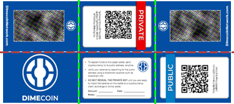
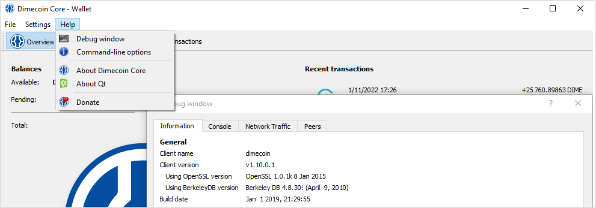

```{eval-rst}
.. _userguide-paper-wallet:
.. meta::
  :title: Dimecoin Paper Wallet
  :description: Learn how to use and operate a paper wallet for dimecoin.
```

> ***We put our best effort into covering all topics related to Dimecoin. Each section will cover a different category. Not all documentation may be 100% accurate, if you spot an error, please report it or submit a PR request on GitHub.***
>
> ***REMINDER: This documentation is always evolving. If you have not been here for a while, perhaps check again. Things may have been added or updated since your last visit!***

## Paper Wallets

### What is a Paper Wallet?


Paper wallets are an offline storage method ([cold storage](../resources/glossary.md#cold-storage)) of storing cryptocurrency. The process includes creating a public and private key, typically stored on a piece of paper kept in a secure place. The keys are printed in the form of QR codes or hexadecimal format, which can be scanned or input for future transactions.

Paper wallets are considered one of, if not the safest way, to store cryptocurrency. Doing so will put you in complete control of your holdings. If all precautions are followed, there is zero possibility of your private keys being compromised. You will not have to worry about hardware crashing, malware, or any hackers.

The guide below will help you set up a paper wallet for the safe and secure storage of your Dimecoin. Once set up, the most important thing to do is to ensure that you keep a record of your private keys. If lost, you will not be able to recover your coins!

### Is a Paper Wallet Necessary?

The answer depends on each user’s situation. If a user regularly trades, then a paper wallet does not make much sense. However, if a user’s long-term goal is holding their coins, it probably makes sense to use a paper wallet. After all, it is considered the safest method of storage.

### Setup

Paper wallets are created by using a program to randomly generate a unique public and private key. Dimecoin Network has provided a generator which can be utilized for this process. Additionally, the generator can be downloaded and used offline to create “air gapped” keys.

**Security Checklist :**

* Your browser is capable of generating cryptographically random keys using window.crypto.getRandomValues
* Are you using a secure operating system guaranteed to be free of spyware and viruses, for example, an Ubuntu LiveCD?
* Do not lose your private key. There is no way to recover your coins if this is lost or damaged.

#### Step 1: Download and Install Generator

First, follow this [link](https://www.dimecoinnetwork.com/wp-content/uploads/2021/03/dimecoin_paper_wallet_creator_1_0_0.zip) to download and install the generator. You will have the option to skip downloading the generator; however, doing so creates a slight increase in having your keys compromised if there is malware or another malicious program on the device used to generate your keys.

Apart from this guide, there are instructions also included with the generator software.

#### Step 2: Generate your Keys

Second, once the generator is running, move your mouse around to add randomness to the key generation. Alternatively, you can input random characters into the textbox. Once enough characters are input, click the `Generate New Address` button.

#### Step 3: Print the Paper Wallet

Next, click the paper wallet tab and print the page on high quality setting. **NEVER** save the page as a PDF file to print it later since a file is more likely to be hacked than a piece of paper.


#### Step 4: Fold the Wallet

Fold your new paper wallet following the lines.



#### Step 5: Share your Public Address

Next, use your public address to receive money from other cryptocurrency users. You can share your public address as much as you want.

#### Step 6: Keep your Private Key Secret

Lastly, the private key is literally the keys to your coins. If someone was to obtain it, they could withdraw the funds currently in the wallet, and any funds that might be deposited in that wallet at any time.

```{tip}
Test spending a small amount before any large payments. You can verify the transaction was successful by using the [block explorer](https://chainz.cryptoid.info/dime/) and searching your public key.
```

### Spending Coins from a Paper Wallet

When you are ready to spend your coins located in your paper wallet and bring them out of cold storage, you will need to import the private key into a supporting wallet.

Any wallet which supports importing Dimecoin’s private keys will work. At the time of publishing this article, the Dimecoin desktop wallet is the wallet you will need to utilize. Once the wallet is downloaded and installed on your PC, it is a fairly simple process. The steps below will help illustrate and outline the procedure. Electrum-DIME will also be able to support importing keys from the paper wallet.

#### Download the Desktop Wallet

First, visit the the wallets page on the website, or go directly to [GitHub](https://github.com/dime-coin/dimecoin/releases/latest), and download the software which meets your requirements.

#### Access the Console

Next, you will need to access the console. The console is located under the `Help` menu and selecting `Debug window`. From there, navigate to the `Console` tab in the window that Debug window that opens.



#### Unlock the Wallet

If you currently have the desktop wallet encrypted, you should, unlock it by inputting the following command:

``` bash
walletpassphrase yourpassphrase 600
```

This will unlock the wallet for 600 seconds, or 10 minutes. Replace `yourpassphrase` with the passphrase which is used to encrypt your desktop wallet.

When the passphrase is input correctly, it will return nothing and the text will be green. If incorrect, the text will be red with a message stating the passphrase was not correct.

#### Import the Private Key

Next, use the following command in the console to import the private key:

``` bash
importprivkey yourprivkey
```

Replace `yourprivkey` with the private key that was obtained when you created the paper wallet.

Finally, once that is done the wallet has to re-scan to reflect your balance. The wallet should do it automatically. Let it finish the re-scan, don’t close it out until it’s complete.
