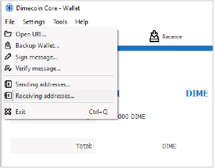
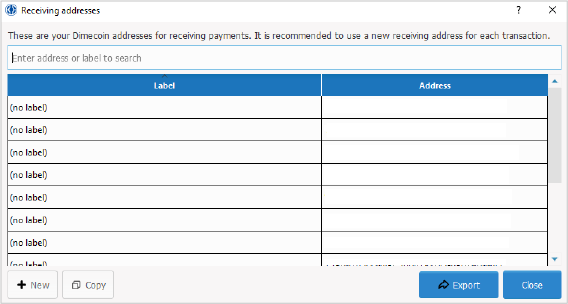
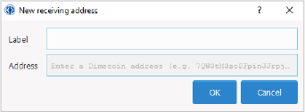
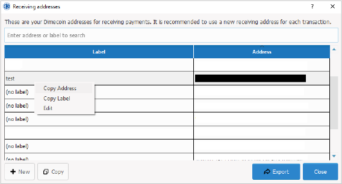

```{eval-rst}
.. _userguide-receiving-coins:
.. meta::
  :title: Receiving Dimecoins
  :description: Learn how to receive or send dimecoins to your wallet.
```

> ***We put our best effort into covering all topics related to Dimecoin. Each section will cover a different category. Not all documentation may be 100% accurate, if you spot an error, please report it or submit a PR request on GitHub.***
>
> ***REMINDER: This documentation is always evolving. If you have not been here for a while, perhaps check again. Things may have been added or updated since your last visit!***

## Receiving Coins with Dimecoin-QT

So you have installed the desktop wallet and it has finished syncing. However, you have not been able to figure out how to generate an address to be able to send coins to your wallet. This guide will show how to generate a `receiving address` in your wallet so you can receive coins.

```{note}
It is recommended, although not required, to generate a new address each time you send coins to the wallet. For a detailed explanation as to why, see the section on [avoiding key reuse](../guide/transactions-avoiding-key-reuse.md#avoiding-key-reuse)
```

### Step 1: Start Dimecoin Core

Once your client has finished loading, open your wallet and navigate to top menu bar and click `File`.

### Step 2: Navigate File Menu

From the File menu, select `Receiving Addresses`.



### Step 3: Generate New Address

Click + `New` (lower left portion of the dialogue box)



### Step 4: Enter Label

This is not required but you can enter a label for reference purposes.



### Step 5: Copy Address

Right click on the newly created address from your address book. Then select, `Copy Address`. This is the public address you will use to send your coins.



### Step 6: Finished

You can now share this address, or use it to send coins to your wallet!
