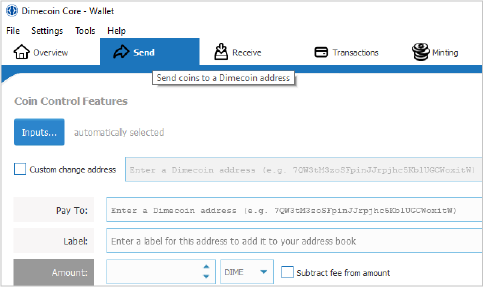

```{eval-rst}
.. _userguide-sending-coins:
.. meta::
  :title: Sending Dimecoins
  :description: Learn how to receive or send dimecoins from your wallet to someone or another address.
```

> ***We put our best effort into covering all topics related to Dimecoin. Each section will cover a different category. Not all documentation may be 100% accurate, if you spot an error, please report it or submit a PR request on GitHub.***
>
> ***REMINDER: This documentation is always evolving. If you have not been here for a while, perhaps check again. Things may have been added or updated since your last visit!***

## Sending Coins with Dimecoin-QT

Sending coins with Dimecoin-qt (the Dimecoin Core graphical user interface) is a straightforward process. Here's a step-by-step guide to help you send coins using Dimecoin-qt. Please note that the steps and interface may slightly vary based on your operating system (Windows, macOS, Linux) and subsequent updates to Dimecoin-qt, but the core process remains consistent.

### Step 1: Open Your Wallet

Launch the Dimecoin-qt application on your computer. Wait for it to fully synchronize the Dimecoin [blockchain](../reference/glossary.md#blockchain) if you have not done so already. This process can take some time, especially if it's the first time you're opening the application or if it has been closed for a while.

### Step 2: Access the Send Coins Interface

Once your wallet is synchronized, navigate to the "Send" tab. You'll find this at the top of the window. Clicking on it will take you to the section of the wallet where you can create a new transaction.



### Step 3: Enter the Recipient's Address

In the "Pay To" field, enter the recipient's Dimecoin address. Double-check this address for accuracy, as transactions cannot be reversed once sent. Some versions of Dimecoin-qt also allow you to select an address from your address book by clicking on the book icon next to the "Pay To" field.

```{note}
It is possible to generate a new address in your wallet, see the [Receiving Coins](../userguide/receiving-coins.md) section for address generation, and send coins to yourself.
```

### Step 4: Label the Transaction (Optional)

You have the option to add a label for the address you're sending coins to. This label is for your reference only and will be saved in your address book. It can help you remember the purpose of the transaction or the recipient's identity.

### Step 5: Enter the Amount

In the "Amount" field, type in the amount of dimecoins you wish to send. Make sure you have enough funds in your wallet to cover the amount you're sending and the transaction fee.

### Step 6: Choose a Transaction Fee

Dimecoin-qt automatically suggests a transaction fee based to ensure your transaction is confirmed in a timely manner. You can adjust this fee, but be aware that setting it too low may delay your transaction. The suggested fee should be adequate.

### Step 7: Review Your Transaction

Before sending, review all the details of your transaction carefully. Ensure that the address and amount are correct.

```{note}
When sending large quantaties it is often wise to send a small test transaction first to ensure you are sending to the correct address. You can use the block explorer to verify your transactions. Here is a link to the [mainnet explorer](https://chainz.cryptoid.info/dime/).
```

### Step 8: Send the Transaction

Once you're satisfied with the transaction details, click the "Send" button. You may be asked to confirm the transaction and/or enter your wallet passphrase if your wallet is encrypted.

### Step 9: Transaction Confirmation

After sending, you'll see a confirmation screen with the transaction details, including a transaction ID (TXID). You can use this ID to track your transaction on a blockchain explorer, see link above.

### Step 10: Wait for Confirmations

The recipient will see the incoming transaction almost immediately, but it will initially appear as "unconfirmed." Transactions typically need at least one confirmation (found in the next mined block) to be considered secure, with more confirmations increasing security. After 6 confirmations, by defualt, the transaction is considered confirmed.

That's it! You've successfully sent Dimecoin using Dimecoin-qt. Remember, the key to a successful transaction is double-checking all details before sending, especially the recipient's address and the amount.
