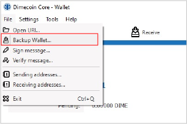

```{eval-rst}
.. _userguide-wallet-backup:
.. meta::
  :title: Wallet Backup Guide
  :description: How to backup the Dimecoin Core Wallet.
```

> ***We put our best effort into covering all topics related to Dimecoin. Each section will cover a different category. Not all documentation may be 100% accurate, if you spot an error, please report it or submit a PR request on GitHub.***
>
> ***REMINDER: This documentation is always evolving. If you have not been here for a while, perhaps check again. Things may have been added or updated since your last visit!***

One of the most important aspects of maintaining a wallet is to keep a proper wallet.dat backup. If anything happens to the PC you are using, you lose a hard-drive, or the PC is damaged where you cannot gain access, this will be the only way you can recover your coins.

Backing up your wallet is easy to do with the desktop wallet. It is recommended you use an external device, such as a USB flash drive or similar device, to store your backup files safely. Make sure to keep your storage devices in a safe place and free from elements that may cause damage.

**Step 1:** Open your wallet and navigate to top menu bar and click `File`.



**Step 2:** Select Backup Wallet. Choose the option `Backup Wallet` (highlighted above).

**Step 3:** Select a storage location. You will be prompted to choose a location to save your wallet backup file.

**Step 4:** Thats it! You have successfully backed up your wallet.
