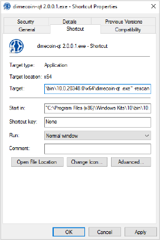
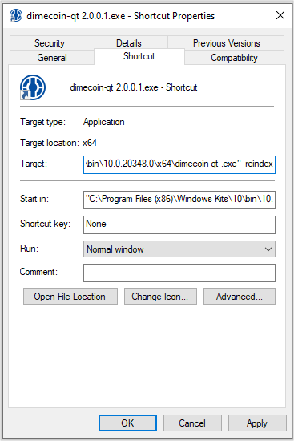
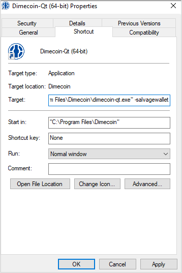
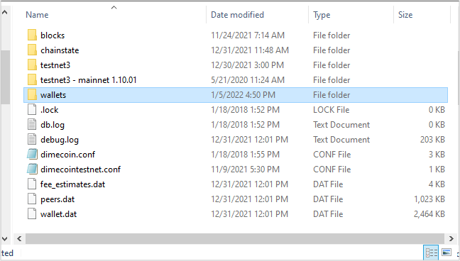

```{eval-rst}
.. _userguide-wallet-operations:
.. meta::
  :title: Wallet & Database Operations
  :description: Learn how to perform various operations while using various functions to maintain, recover and optimize your wallet.
```

> ***We put our best effort into covering all topics related to Dimecoin. Each section will cover a different category. Not all documentation may be 100% accurate, if you spot an error, please report it or submit a PR request on GitHub.***
>
> ***REMINDER: This documentation is always evolving. If you have not been here for a while, perhaps check again. Things may have been added or updated since your last visit!***

Welcome to the Wallet and Database Management section. This section is designed help you navigate through the various operations you might need to perform with your wallet and database while using Dimecoin-qt. Understanding and managing your wallet and its associated database is important. This includes knowing how to recover your wallet in case of corruption or loss, clean your transaction list for clarity, rebuild your database, and more to fix potential issues and improve performance.

## Wallet & Database Operation Quick Reference

* Wallet Recovery: Learn how to recover your wallet in case it becomes corrupted with [salvagewallet](#wallet-recovery-using-salvagewallet), ensuring you can regain access to your dimecoins.
* Cleaning Transactions: Understand how to clear unconfirmed or problematic transactions from your wallet, helping to resolve issues and declutter your transaction history.
* Rescan the Dimecoin Blockchain: Discover how to [rescan](#rescan) the [blockchain](../resources/glossary.md#blockchain) to ensure that your [wallet](../resources/glossary.md#wallet) accurately reflects your transactions and balances.
* Rebuild the Blockchain: Find out how to [reindex](#reindex) the blockchain database, which can be necessary if you encounter database corruption or synchronization problems.

Each of these operations serves a unique purpose and can be instrumental in maintaining the health and accuracy of your wallet. Whether you're a new user encountering these terms for the first time or an experienced user looking to refresh your knowledge, this section will provide you with the detailed, step-by-step guidance.

### Reindex vs Rescan

Running a core wallet/[node](../resources/glossary.md#node) can be somewhat finicky at times. There are two commands a user can use to fix a wide range of wallet-related issues if you encounter problems — rescan and reindex.

Commonly, most issues arise with the core wallet if it does not shut down gracefully. For example, if a user force closes the wallet while it is running, or there is a power failure. A user may apply a change to the data directory while the wallet is running or for many other reasons that lead to the local blockchain database becoming corrupt or broken.

Additionally, there are instances where your balance will not reflect properly, or the wallet will not sync any further. Typically, restarting the wallet will not resolve these issues on its own.

If your wallet is not syncing, you are stuck on the wrong chain, or the balance is not reflecting as expected, you will need to rescan or reindex, depending on your issue.

It is common to misunderstand which command to use in a given scenario. This guide will provide a brief overview of what these commands do and when to use them.

#### Rescan

The `rescan` command ‘rescans’ the local blockchain files and looks for missing transactions in the wallet. This can often occur if you are importing private keys or restoring a wallet backup file (wallet.dat). When you restore backup or import a key, it will not know to associate your wallet with the transactions related to the address or keys being imported.

This command will only be used if you are missing transactions in your wallet or your balance is incorrect. When the `rescan` process starts, it will go through each block and search for transactions associated with the private keys in the local wallet. Upon completion of the scan, the transaction history for the wallet will be rebuilt, and your balance should reflect properly.

##### How-To

```{important}
The first thing you will need to do is backup your wallet! Before performing any sort of maintenance or making changes to your wallets data files, it should always be the first thing you do. Please follow this link to learn how to backup your wallet properly!
```

###### Windows

**Step 1: Create Shortcut**

Locate the wallet folder and right click on the application labeled dimecoin-qt.exe and click `create shortcut`. The default location should be this: “C:\Program Files\Dimecoin”

**Step 2: Add -rescan Flag to Target Parameter**

Right click on the shortcut you just created in step 1 and click `properties`. Under the shortcut tab located the Target field. At the end of the target parameter, after the ", type `-rescan`. Make sure to put a space after the quotation mark. Once the -rescan flag has been added to the end of the target parameter, click `apply and OK`.



Now start the wallet. The rescan process will start, you will see a progress bar come up on your screen. Do not exit the program while it is processing the rescan. Let it completely finish.

```{note}
Don’t forget to remove -rescan from the shortcut once the wallet loads up. If you don’t, the next time you start the wallet it will go through the rescan process again.
```

###### Mac

**Step 1: Run Terminal Application**

Goto your wallet folder and drag the wallet file to the terminal.

**Step 2: Execute Rescan**

Type `-rescan` and hit enter. The rescan process will start, you will see a progress bar come up on your screen. Do not exit the program while it is processing the rescan. Let it completely finish.

###### Linux

**Step 1: Open Terminal**

Using the command line, change directories to your wallet folder. Typically, ./dimecoin.

``` bash
cd ./dimecoin
```

**Step 2: Execute Rescan**

Once in you have changed to the `./dimecoin` directory, execute the command:

```bash
./dimecoin-cli stop
```

 to stop the daemon. Now restart the daemon with the command:

``` bash
./dimecoind -rescan
```

Once the Rescan process is complete, your blockchain database and chainstate will be rebuilt and restored, allowing the wallet to function properly without error.

#### Reindex

Rebuild the blockchain database from scratch.

```{important}
The first thing you will need to do is backup your wallet! Before performing any sort of maintenance or making changes to your wallets data files, it should always be the first thing you do. Please follow this link to learn how to backup your wallet properly!
```

##### Windows

**Step 1: Create Shortcut**

Locate the wallet folder and right click on the application labeled dimecoin-qt.exe and click `create shortcut`. The default location should be this: “C:\Program Files\Dimecoin”

**Step 2: Add -reindex Flag to Target Parameter**

Right click on the shortcut you just created in step 1 and click `properties`. Under the shortcut tab located the Target field. At the end of the target parameter, after the “, type `-reindex`. Make sure to put a space after the quotation mark. Once the `-reindex` flag has been added to the end of the target parameter, click apply and OK.



Now start the wallet. The reindex process will start, you can watch the progress from the information window.

```{note}
Don’t forget to remove -reindex from the shortcut once the wallet loads up. If you don’t, the next time you start the wallet it will go through the rescan process again.
```

##### Mac

**Step 1: Run Terminal Application**

Goto your wallet folder and drag the wallet file to the terminal.

**Step 2: Execute Rescan**

Type `-reindex` and hit enter. The rescan process will start, you will see a progress bar come up on your screen. Do not exit the program while it is processing the rescan. Let it completely finish.

##### Linux

**Step 1: Open Terminal**

Using the command line, change directories to your wallet folder. Typically, ./dimecoin.

``` bash
cd ./dimecoin
```

**Step 2: Execute Rescan**

Once in you have changed to the `./dimecoin` directory, execute the command:

```bash
./dimecoin-cli stop
```

 to stop the daemon. Now restart the daemon with the command:

``` bash
./dimecoind -reindex
```

Once the Reindex process is complete, your blockchain database and chainstate will be rebuilt and restored, allowing the wallet to function properly without error.

The `-reindex` and `-rescan` commands utilize a fair amount of memory resources and disk space. It will take time to perform these tasks. It is important to let the wallet to fully complete these operations. Your balance will not reflect in your wallet until it re-syncs past the block which contains your transaction! If you are still having issues with your wallet, please do not hesitate to contact us in our [Telegram Support Channel](https://t.me/Dimecoin/163982), or via [email](mailto:support@dimecoinnetwork.com).

### Wallet Recovery using SalvageWallet

The salvagewallet function of the wallet is useful for the following scenarios:

* launch issues from a corrupt database
* damaged wallet
* incorrect balance

```{tip}
Remember to ALWAYS backup your wallet before attempting any of the following operations. To learn how-to properly backup your wallet, check out this [guide](../userguide/#backup.md).
```

This tutorial will use Windows 10 as an example. These steps will be similar for the desktop wallet running on other operating systems.

#### Step 1: Locate the Shortcut

First, find the shortcut to the Dimecoin application. If the shortcut is not on your desktop, place a copy there. Be sure the wallet is not running and is fully shut down. See [above](#windows) to learn how to make a shortcut of the application.

#### Step 2: Modify the target parameter

Next, right-click the shortcut, click `Properties`, and then select the `Shortcut` tab. Then add `-salvagewallet` to the end of Target parameter, as illustrated below.



Now, click `OK`. The dialogue box will now close.

Next, double click the shortcut on your desktop. The wallet will now launch and re-index the blocks. This process will take a little bit of time, do not close the wallet while it is processing the blocks.

```{note}
Don’t forget to remove -salvagewallet tag from the shortcut once the wallet loads up. If you don’t, the next time you start the wallet it will go through the rescan process again.
```

Now, take a look at the Dimecoin data directory, type `%APPDATA\Dimecoin` in the search bar menu on the taskbar, you will see the wallet has been backed up to wallets\wallet.<date>.bak. This indicates the wallet is using a new wallet.dat file with clean data.

```{warning}
Be careful not to remove or modify any files under this directory unless you know what you are doing!
```


